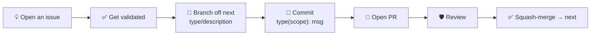

# Contributing to the AIDD Framework

## 👥 How to contribute

One path, open to everyone ([roles](./GOVERNANCE.md#-roles)):



1. **Open an issue** — [🌱 Quick Contribution](https://github.com/ai-driven-dev/framework/issues/new?template=feature_request.yml) or [📋 Detailed Contribution](https://github.com/ai-driven-dev/framework/issues/new?template=roadmap.yml).
2. **Get it validated** — a Certified Member or Maintainer moves it to `Todo`. Green light.
3. **Make your change** → [Set up](#-set-up).
4. **Open your PR** → [Open a pull request](#-open-a-pull-request).

## 🔧 Set up

Requires **Node 22.12+**, **pnpm**, **jq**, **python3**, **pipx**.

```bash
make setup
```

`make` lists every target; `make doctor` checks your environment, `make check` runs the pre-commit checks.

## ✏️ Make your change

- **Test** — run `make reload`, then restart your session.
- **Commit** — `<type>(<scope>): description` → [convention](aidd_docs/memory/vcs.md#commit-convention).

## 🔀 Open a pull request

- **Branch off `next`, target `next`** → [routing table](aidd_docs/memory/vcs.md#types).
- **Fill the PR template.**
- **A Maintainer review gates every merge** → [`GOVERNANCE.md`](./GOVERNANCE.md#-code-decisions).

## 📜 Principles

- **No slop** — read every line before proposing it.
- **Spend tokens like they cost something.**
- **Follow the skill structure** → [`ARCHITECTURE.md`](docs/ARCHITECTURE.md), `/aidd-context:04-skill-generate`.
- **Evolve the memory** → [`aidd_docs/memory/`](aidd_docs/memory/).

## 🐛 Reporting a bug

[Open a Bug report](https://github.com/ai-driven-dev/framework/issues/new/choose). Usage question? → [Discussions](https://github.com/ai-driven-dev/framework/discussions), not an issue.

## 📚 Reference

[`ARCHITECTURE.md`](docs/ARCHITECTURE.md) · [`CREATE_PLUGIN.md`](docs/CREATE_PLUGIN.md) · [`GLOSSARY.md`](docs/GLOSSARY.md)

---

■ [Back to framework](./README.md)
