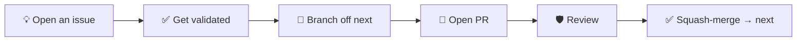

# Contributing to the AIDD Framework

Source of truth for AIDD skills, agents, rules, and templates — authored in Claude Code syntax; the CLI adapts an archive per tool at release. This file covers contributing to **this repository**; the wider community, roles, and training programme live at [ai-driven-dev.fr](https://www.ai-driven-dev.fr/).



## 👥 How to contribute

One path, open to everyone, whatever your role ([`GOVERNANCE.md`](./GOVERNANCE.md#-roles)):

1. **Open an issue** — [🌱 Contribution Rapide](https://github.com/ai-driven-dev/framework/issues/new?template=feature_request.yml) or [📋 Contribution Détaillée](https://github.com/ai-driven-dev/framework/issues/new?template=roadmap.yml). Frames the topic upfront — no code written for nothing, no direction fighting our principles.
2. **Get it validated** — a Certified Member or Maintainer moves it `Ideation` → `Todo` on the [Roadmap board](https://github.com/orgs/ai-driven-dev/projects/8). That's the green light.
3. **Open your PR** — anyone can, once validated → [Set up](#-set-up).
4. **Get reviewed and merged** — see [Open a pull request](#-open-a-pull-request).

No vote, no waiting period for this green light — it's a triage gesture, not a ballot (that's roadmap priority, see [`GOVERNANCE.md`](./GOVERNANCE.md#-roadmap-voting)).

## 🔧 Set up

Requires **Node 22.12+**, **pnpm**, **jq**, **python3**, and **pipx** (`gh` and the Claude/Codex CLI optional).

```bash
make setup   # deps + git hooks, registers a local marketplace, installs plugins into Claude + Codex
```

`make` lists every target; `make doctor` and `make check` verify the environment and run the pre-commit checks (including the Markdown link checker).

## ✏️ Make your change

- **Test locally** — neither tool hot-reloads the checkout (both serve a cached copy). After editing, run `make reload` (or `PLUGIN="aidd-refine aidd-pm"` for a subset), then restart the session — `/reload-plugins` covers a Claude-only edit to an existing skill.
- **Commit** — `<type>(<scope>): description`, one scope per commit (split cross-plugin changes). The types, scopes, and rules live in [`aidd_docs/memory/vcs.md`](aidd_docs/memory/vcs.md#commit-convention) (mirrors `commitlint.config.cjs`); the **type** drives the release → [`RELEASE.md`](./RELEASE.md).

## 📜 Principles

- **No slop** — read every line before proposing it; no generated content that was never checked.
- **Spend tokens like they cost something** — concise prompts and answers, no filler.
- **Follow the skill structure** — anatomy in [`ARCHITECTURE.md`](docs/ARCHITECTURE.md), scaffold with `/aidd-context:04-skill-generate`.
- **Evolve the memory** — your PR changes a convention? Update [`aidd_docs/memory/`](aidd_docs/memory/) with it.

## 🔀 Open a pull request

- **Branch off `next`, target `next`** — only `hotfix/*` branches off `main` for urgent production fixes. The branch prefix alone decides the target → [routing table](aidd_docs/memory/vcs.md#types).
- **Fill the PR template** — explain *what* changed and *how* you solved it; skip re-asserting the conventional title and hooks (CI already enforces them).
- **Label** follows your branch kind (the PR skill applies it automatically); add `security` when relevant.
- **A Maintainer review gates every merge** ([`CODEOWNERS`](./.github/CODEOWNERS)) — no one merges their own PR. PRs squash-merge on the conventional title. Decision rules → [`GOVERNANCE.md`](./GOVERNANCE.md#-code-decisions-merging).

## 🚀 Releases

Weekly `main`/`next` cadence and hotfix flow → [`RELEASE.md`](./RELEASE.md).

## 🐛 Reporting a bug

[Open a Bug report](https://github.com/ai-driven-dev/framework/issues/new/choose) — auto-added to the [Roadmap board](https://github.com/orgs/ai-driven-dev/projects/8). Want to contribute a change instead? Use the flow above. For usage questions use [Discussions](https://github.com/ai-driven-dev/framework/discussions), not issues (see [`SUPPORT.md`](./.github/SUPPORT.md)).

## 📚 Reference

- **Build a plugin** → [`docs/CREATE_PLUGIN.md`](docs/CREATE_PLUGIN.md)
- **Architecture & terms** → [`docs/ARCHITECTURE.md`](docs/ARCHITECTURE.md) · [`docs/GLOSSARY.md`](docs/GLOSSARY.md)
- **Patterns to follow** → a minimal plugin [`aidd-refine`](plugins/aidd-refine/), a router skill [`00-onboard`](plugins/aidd-context/skills/00-onboard/), agents [`aidd-dev/agents`](plugins/aidd-dev/agents/)
- **Per-tool builds** → source files use Claude Code syntax; the `aidd-cli` maps each surface to its per-tool equivalent at release. `name` / `description` / `argument-hint` are universal; other frontmatter keys (`model`, `color`, `paths`, …) are tool-specific and ignored where unsupported.

---

■ [Back to framework](./README.md)
