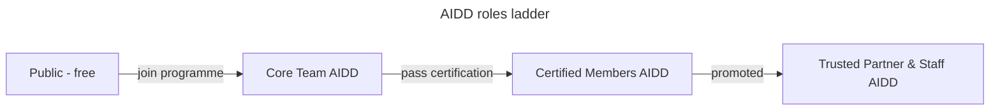

# Governance

How decisions get made in the AI-Driven Dev Framework.

Four roles form a **ladder**, each rung keeps every right of the rungs below and adds its own.

## 👥 Roles

| Tier | How you get there | Adds (on top of the rung below) | Team |
| ---- | ----------------- | ------------------------------- | ---- |
| **Public** | Free, any GitHub account | Open issues, comment, react / upvote ideas (signal only), **open a pull request** once its issue is validated | - |
| **Core Team** | Active [AIDD programme](https://www.ai-driven-dev.fr/) member (training, community, coaching) | A **counted roadmap vote** + voice on direction | [`core-team`](https://github.com/orgs/ai-driven-dev/teams/core-team) |
| **Certified Members** | Pass the [AIDD certification](https://www.ai-driven-dev.fr/) | **Validate contribution issues** (triage: move `Ideation` → `Todo` on the [Roadmap board](https://github.com/orgs/ai-driven-dev/projects/8)) | [`certified-members`](https://github.com/orgs/ai-driven-dev/teams/certified-members) |
| **Maintainer** | Certified member promoted to give AIDD Trainings (**Trusted Partner**), or joining as **AIDD Staff** | **Approve & merge** PRs, **quality veto**, appoint/promote, guard the standard | [`trusted-partners`](https://github.com/orgs/ai-driven-dev/teams/trusted-partners) |

## 📊 Roadmap voting

- **Public** reacts (👍 / upvote). This is a **signal**, not a counted vote; it
  promotes an item to a formal vote.
- **Core Team, Certified, Maintainer** each cast **one equal vote**. The vote is a
  benefit of AIDD membership (the programme is a paid training / community /
  coaching offering), that is what turns a signal into a counted vote.
- **Maintainer** holds the tiebreak and a **quality veto** as the top rung.
- A poll runs **≥ 7 days**. Accepted items land on the
  [AIDD Roadmap board](https://github.com/orgs/ai-driven-dev/projects/8).
- This vote decides **roadmap priority**, not whether a contribution issue can
  move to a PR, that validation is immediate, see [`CONTRIBUTING.md`](CONTRIBUTING.md).

## ✅ Code decisions (merging)

- Merge authority is **Maintainer only**.
- **Lazy consensus** (default): a Maintainer may merge if no other Maintainer objects within 72h, there is ≥1 Maintainer approval, and CI passes.
- **Quality veto**: any Maintainer can block with a `request-changes` review until resolved.
- **Explicit consensus** — for cross-plugin changes, contract changes (skill frontmatter, `marketplace.json`), or licensing/governance changes: ≥2 Maintainer approve, none object.

## 📈 Promotion and inactivity

- **→ Certified Member**: pass the AIDD certification → added to `certified-members`.
- **→ Maintainer (Trusted Partner)**: a Maintainer nominates a Certified Member
  with a track record of merged, standard-consistent work; a majority of
  Maintainers approves → added to `trusted-partners` and `CODEOWNERS`.
  Joining as AIDD Staff skips this nomination step.
- A Core Team / Maintainer member inactive **6 months** may be moved to
  **emeritus** by a Maintainer majority (keeps recognition, loses vote/merge
  until they return).

## 🧩 Plugins, breaking changes, conflicts

- **New plugin**: lands via PR following [`docs/CREATE_PLUGIN.md`](docs/CREATE_PLUGIN.md)
  (description on every skill, registered in
  `marketplace.json` + `release-please-config.json`, a Maintainer owner). Starts
  `experimental` → `release candidate` (one external success) → `stable` (Maintainer
  review).
- **Deprecate/remove**: any Maintainer, with a rationale + migration path; stays
  installable 90 days.
- **Breaking changes**: Conventional Commits `!` suffix; document the migration
  path. Prompt-only behaviour changes also count - flag in the PR and announce on
  Discord.
- **Conflict of interest**: a Maintainer with a stake in a PR discloses it and is
  not the sole approver (a second Maintainer approval becomes mandatory).

## 🔒 Branch protection on `main` and `next`

- **`main`** (production): no direct push, force-push, or deletion. Every change is a PR with ≥1 Maintainer (CODEOWNERS) approval, passing checks (`lefthook (framework-local checks)`, `Commitlint`), and resolved threads. Rules: [`.github/rulesets/main.json`](.github/rulesets/main.json) (enforced once the repo is public / on a paid plan).
- **`next`** (integration): PRs with ≥1 review and passing checks, no direct push or deletion. The release bot bypasses to push the automated back-merge; the `admin` team may merge without a second review. Rules: [`.github/rulesets/next.json`](.github/rulesets/next.json). Release flow: [`RELEASE.md`](RELEASE.md).

## 📜 Code of Conduct & amendments

- All interactions follow the [Code of Conduct](./CODE_OF_CONDUCT.md).
- Changes to this document follow the explicit-consensus rule above.
