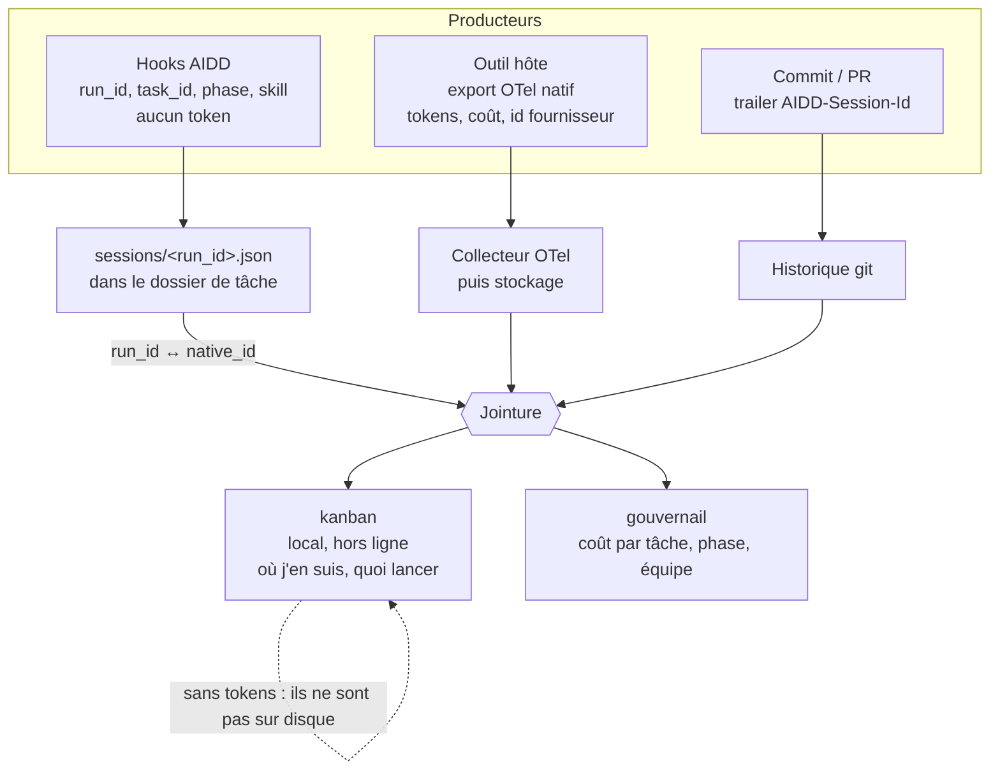

# Couche de télémétrie AIDD

> Brainstorm — 2026-08-13. Cohérence d'ensemble, niveau intention. Pas de plan ni de code.
> Cadre : jalon [#14 « Prove what an AI session costs »](https://github.com/ai-driven-dev/framework/milestone/14), échéance 2026-08-21, trois issues ouvertes (#617, #618, #620).

## L'idée

Répondre à une seule question : **combien a coûté cette feature, et où est parti l'argent dans le cycle de vie**. Les fournisseurs savent dire « ce dev a brûlé X tokens mardi ». Aucun ne sait dire « la story 428 a coûté Y, dont 60 % en phase de spécification ». L'écart entre les deux, c'est exactement ce que le framework possède et qu'eux n'ont pas : la tâche, la phase, la skill, le geste.

La couche de télémétrie n'est donc pas un collecteur. C'est une **jointure**. Le framework n'a pas à mesurer les tokens : les outils le font déjà, mieux, et à la source. Il a à produire l'identifiant qui permet de rattacher leur mesure à son propre découpage du travail, et à garantir que cet identifiant survit au commit, au squash, au worktree parallèle et à la session qui ne produit rien.

## Mesuré, pas lu

Deux sessions réelles sur Claude Code 2.1.232, télémétrie OTLP capturée par un collecteur local le 2026-08-13. Ces lignes ne viennent pas d'une documentation.

| Question | Réponse mesurée |
| --- | --- |
| L'identifiant du hook est-il celui de la télémétrie ? | **oui** — sur Claude Code, Codex et Copilot, une session par outil. sur Cursor les hooks sont prouvés mais l'export exige un compte Enterprise |
| Les tokens portent-ils la skill ? | **oui** — `skill.name` sur `claude_code.token.usage` |
| Le coût aussi ? | **oui** — `skill.name` sur `claude_code.cost.usage`, en USD |
| Le temps passé est-il mesuré ? | **oui** — `claude_code.active_time.total`, en secondes |
| Les sous-agents sont-ils séparables ? | **oui** — `query_source` : `main`, `subagent`, `sdk`, `agent:builtin:<Type>` |
| Le démarrage d'une skill est-il un événement ? | **oui** — `skill_activated`, avec `invocation_trigger` et `prompt.id` |

Les identifiants étant fabriqués côté client, avant tout appel au modèle, **Codex et Copilot se vérifient sans consommer un seul token** : on pointe le fournisseur vers une adresse qui ne répond pas, la session démarre quand même, le hook tire et la télémétrie part. La sonde a donc sa place dans l'intégration continue, pas seulement dans une vérification ponctuelle.

**Aucune sonde n'a fonctionné du premier coup, et toujours pour la même raison : écrire le fichier de hook ne suffit pas, il faut lever un verrou.** Codex exige `--enable hooks` et une confiance persistée ; Copilot ignore `.github/hooks/*.json` dans un dossier non approuvé mais honore le périmètre utilisateur ; Cursor réclame `--trust` ou une approbation interactive ; Claude Code seul n'oppose rien. Un hook posé sans lever le verrou est installé, silencieux, et ne lève aucune erreur — le pire état pour une couche de mesure, puisque la configuration paraît complète et que la donnée n'existe pas. C'est un sujet d'installation à part entière pour #617.

Ce résultat retire l'hypothèse la plus fragile du jalon sur les trois outils testés, et déplace la conception : **sur Claude Code, le journal des étapes est déjà émis par l'outil**. Le framework n'a plus qu'à fournir le rattachement à la tâche. Deux limites mesurées l'accompagnent : `skill.name` est collant, donc il sur-attribue à la dernière skill activée si deux skills s'entrelacent ; et un sous-agent Claude Code n'a pas d'identifiant propre, il partage celui du parent — l'inverse de Cursor.

La conception qui en découle est décrite dans `aidd_docs/specs/2026_08/2026_08_13-work-tracking-linkage.md`.

## Faits qui cadrent la décision

Convention de marquage, reprise de #618 : `[v]` = lu dans la source officielle à la date indiquée, avec la citation reportée en annexe. `[?]` = non documenté à l'endroit lu. Une cellule `[?]` reste `[?]` et n'est jamais comblée par une valeur plausible. Deux passes, 2026-08-13 : la seconde a rouvert Cursor et la documentation Codex, inaccessibles à la première. Sources en fin de document.

### Ce que chaque outil expose réellement

| Outil | Export OTel natif | Tokens | Identifiant de session dans l'export | Coût | Tokens dans un hook |
| --- | --- | --- | --- | --- | --- |
| Claude Code | `[v]` métriques, logs, traces (bêta) | `[v]` `claude_code.token.usage`, unité `tokens` | `[v]` `session.id`, **sur chaque point de métrique et chaque enregistrement d'événement**, réglable par `OTEL_METRICS_INCLUDE_SESSION_ID` (défaut `true`) | `[v]` `claude_code.cost.usage`, unité USD, joignable par `session.id` | `[v]` non pour la session ; une exception étroite documentée, voir plus bas |
| Codex CLI | `[v]` exportateurs séparés `exporter` (logs), `trace_exporter`, `metrics_exporter` dans `[otel]` | `[v]` sur `codex.sse_event`, aux événements `response.completed` | `[v]` identifiant de conversation dans les métadonnées d'événement ; `[v]` (source) **absent des tags de métrique**, qui sont exactement six | `[v]` aucun — ni métrique de coût, ni champ de coût | `[v]` non — payload : `session_id`, `transcript_path`, `cwd`, `hook_event_name`, `model`, `turn_id`, `permission_mode` |
| GitHub Copilot | `[v]` traces et métriques, `otlp-http` ou fichier, activé par `COPILOT_OTEL_ENABLED=true` ou par `OTEL_EXPORTER_OTLP_ENDPOINT` | `[v]` `gen_ai.usage.input_tokens`, `.output_tokens`, `.cache_read.input_tokens`, `.cache_creation.input_tokens` sur les spans `invoke_agent` et `chat` | `[v]` `gen_ai.conversation.id`, décrit « Session identifier », **sur les spans** ; `[?]` non documenté comme dimension de métrique | `[v]` `github.copilot.cost` (« Monetary cost ») et `github.copilot.aiu` en attribut de span ; devise non précisée | `[v]` non — aucun champ de token, d'usage ou de coût dans les payloads de hook |
| Cursor | `[v]` métriques et logs, **OTLP/HTTP protobuf uniquement**, `/v1/metrics` et `/v1/logs` ; réglage d'équipe, **plan Enterprise, en bêta** | `[v]` métrique `cursor.token.usage` (input, output, cache_read, cache_creation) **et** log `cursor.api.request.input_tokens` / `output_tokens` | `[v]` `cursor.conversation.id` **sur les logs seulement** — « Metric datapoints carry no correlation IDs » | `[v]` `cursor.cost.usage`, USD « best-effort », **métrique seulement, donc non joignable à une session** | `[v]` non — payload : `conversation_id`, `generation_id`, `model`, `model_params`, `hook_event_name`, `cursor_version`, `workspace_roots`, `user_email`, `transcript_path` |
| OpenCode | `[v]` aucun — zéro occurrence de « otel », « opentelemetry », « otlp » ou « telemetry » dans les pages plugins, config, cli et server | `[?]` hors export | sans objet | `[?]` hors export | `[v]` non — aucun des événements de plugin listés n'expose d'usage |

### Quatre conséquences qui décident de l'architecture

- **Aucun hook n'expose la consommation de la session.** Vérifié sur les cinq outils, payload par payload. L'unique exception documentée est sur Claude Code : le `PostToolUse` d'un appel d'agent au premier plan reçoit `totalTokens` et `usage` dans `tool_response` — mais la documentation précise que ces champs « cover the final request only » et renvoie explicitement aux compteurs de métriques pour tout cumul. Un journal de tokens écrit par les hooks reste structurellement faux, et l'exception ne le sauve pas.
- **Quatre outils sur cinq gardent délibérément les identifiants hors des métriques.** Cursor l'écrit noir sur blanc — « Metric datapoints carry no correlation IDs » — et documente la conséquence : il faut sommer `cursor.api.request.input_tokens` groupé par `cursor.conversation.id`, ce qui « gives per-session token totals, which metrics can't provide ». Codex borne ses tags de métrique à six, sans identifiant de conversation. Copilot ne documente `gen_ai.conversation.id` que sur les spans. **Claude Code est le seul à permettre la jointure au grain métrique**, et c'est une exception réglable par variable d'environnement, pas un modèle. Un collecteur qui n'ingère que les métriques donnera une réponse juste pour Claude Code et vide pour les quatre autres, sans lever d'erreur.
- **Le coût par session n'est pas calculable partout.** Claude Code le donne en USD joignable par `session.id`. Copilot le donne en attribut de span, sans devise documentée. Cursor a bien `cursor.cost.usage` mais **en métrique, donc sans identifiant** : le coût par session y est structurellement hors de portée, seuls les tokens le sont. Codex ne donne aucun coût. Un indicateur « coût » homogène entre outils est donc faux par construction ; un indicateur « tokens » est atteignable sur quatre outils.
- **Les noms d'identifiant divergent entre le hook et l'export, et personne ne documente l'égalité des valeurs.** Codex nomme le champ `session_id` côté hook et l'identifiant de conversation côté événement. Claude Code nomme `session_id` côté hook et `session.id` côté télémétrie. Cursor est le seul à garder le même mot des deux côtés (`conversation_id` / `cursor.conversation.id`). Aucun des cinq n'affirme que la valeur est la même. C'est l'hypothèse porteuse de tout l'édifice et elle n'est adossée à rien.

### Deux pièges de configuration repérés à la vérification

- **Codex exporte ses métriques vers Statsig par défaut.** `otel.metrics_exporter` a pour valeur par défaut `statsig`, et non `none`. Activer la télémétrie Codex sans toucher cette clé envoie donc des métriques à un tiers. La CLI doit la poser explicitement, et le `status` doit la lire.
- **Cursor est instrumentable en ligne de commande, c'est mesuré.** `cursor-agent` lit bien `.cursor/hooks.json`, alors que la documentation ne décrit que des moments de l'éditeur — le doute est levé. Reste que son export est un réglage d'équipe en plan Enterprise, en bêta : une démarche d'administrateur, pas une case que la CLI coche. Et son payload porte trois identifiants là où la documentation n'en décrit qu'un, égaux sur une session à un tour, ce qui n'autorise pas à les croire interchangeables.

### Ce que le dépôt a déjà tranché

- Standard OpenTelemetry, puits = collecteur OTel, pas de SaaS (#297, décision de fond).
- Opt-in explicite, jamais de contenu de prompt ni de code, identifiants anonymisés (#297).
- Désactivé par défaut sur les dépôts publics, opt-in par dépôt (#617, #620).
- Le nom de dossier de tâche `aidd_docs/tasks/<mois>/<date>_<slug>/` est déjà l'identifiant de la feature : daté, unique, greppable, créé avant la première ligne de code.
- La CLI possède l'installation et la vérification du pipeline ; une skill ne peut pas en être responsable, parce qu'elle doit s'en souvenir et qu'elle ne connaît pas de façon fiable son propre identifiant de session (#617).
- Le kanban lit et ne produit rien ; sa fiche produit déclare explicitement « journal des exécutions » et « tokens par phase » comme manquants, à demander à qui possède le pipeline d'exécution.

## La forme retenue

**Trois producteurs, un point de jointure, deux consommateurs.**

### 1. Le framework ne collecte pas les tokens, il les fait émettre et les rejoint

La CLI configure l'export natif de chaque outil (variables d'environnement pour Claude Code et Copilot, table `[otel]` du `config.toml` pour Codex) vers un collecteur choisi par le projet. Elle n'écrit pas de collecteur maison. Le corollaire est que la couche AIDD n'a aucun chemin réseau au moment du commit, donc rien qui puisse bloquer ou ralentir.

### 2. Le framework possède son propre identifiant, et le fait vivre à côté de celui du fournisseur

Un `run_id` engendré par AIDD au démarrage de session, stocké avec l'identifiant natif **et son espèce**, parce que les quatre outils supportés nomment la chose de quatre façons. L'attribution tâche → exécution ne doit alors rien à un fournisseur ; seule la jointure de coût reste empruntée, et reste explicite. C'est déjà la position de #620 et elle tient.

### 3. Deux façons de tenir la jointure — un arbitrage qui n'est écrit nulle part

| | A. Table de correspondance (position actuelle de #620) | B. Injection dans l'export |
| --- | --- | --- |
| Mécanisme | le hook de démarrage écrit `run_id` ↔ `native_id` sur disque ; l'aval joint sur l'id natif | poser `OTEL_RESOURCE_ATTRIBUTES=aidd.run_id=…` avant le démarrage ; le `run_id` est **dans** la télémétrie, aucune jointure |
| Dépend de | l'égalité entre l'id du hook et l'id de l'export — non documentée nulle part | de pouvoir fixer une variable d'environnement avant le démarrage du processus |
| Portée vérifiée | quatre outils sur cinq exposent un identifiant dans le payload de leurs hooks ; OpenCode n'en expose aucun | `[v]` Claude Code : « attaches these values as attributes on every metric datapoint and event record ». `[v]` Copilot : `OTEL_RESOURCE_ATTRIBUTES` documenté. `[v]` Codex (source) : `[otel.span_attributes]` s'applique aux **spans** seulement, donc pas aux événements qui portent les tokens. `[?]` Cursor : aucun mécanisme d'attribut personnalisé documenté, et l'export se règle côté équipe et non côté poste, donc B y est probablement hors d'atteinte |
| Coût | une jointure de plus, et une hypothèse à re-vérifier à chaque version d'outil | la variable doit exister avant le processus, ce qui n'est pas le cas d'un identifiant engendré par un hook de démarrage |

Deux précisions vérifiées changent l'arbitrage.

- **La moitié statique de B est gratuite, aujourd'hui, sans lanceur.** Claude Code lit un bloc `env` de `settings.json` « applied to every session », donc `aidd.project_id`, le dépôt ou l'équipe entrent dans la télémétrie par simple fichier de configuration posé par la CLI. Cela couvre déjà la découpe par projet et par équipe.
- **La moitié par session ne l'est pas.** Un `run_id` change à chaque session, alors qu'un fichier de configuration est statique et qu'une variable d'environnement est figée au démarrage du processus. L'obtenir suppose que quelque chose lance l'outil — la documentation de Claude Code nomme d'ailleurs le « launch wrapper » comme la façon d'attacher une identité par utilisateur. C'est un changement de nature pour la CLI, qui installe aujourd'hui et ne lance pas.

Les deux voies ne s'excluent donc pas, et l'arbitrage n'est pas « A ou B » mais **A comme socle, B statique tout de suite, B par session seulement si un lanceur est décidé**. A reste nécessaire quoi qu'il arrive : un attribut de ressource est figé au démarrage alors que la phase et la tâche changent en cours de session, donc les intervalles ne peuvent pas y vivre.

### 4. Le fichier de métadonnées : deux fichiers, pas un

L'intention d'un fichier de métadonnées dans le dossier de tâche est juste, mais elle recouvre deux objets dont les propriétés d'écriture sont opposées.

| | Identité de la tâche | Journal des sessions |
| --- | --- | --- |
| Contenu | type (feature, bug, spike), ticket d'origine, spec, plan, epic / story | `run_id`, `native_id` et son espèce, outil, `parent_run_id`, intervalles phase / date |
| Écrivain | une skill, au moment du cadrage | un hook, à chaque démarrage et à chaque fin de tour |
| Fréquence | quelques écritures sur la vie de la tâche | continue, concurrente, potentiellement depuis plusieurs worktrees |
| Conflit de fusion | possible, et résoluble par un humain | structurellement impossible **si et seulement si** un fichier par session |

Les mettre dans un même fichier réintroduit le conflit de fusion que le découpage un-fichier-par-session de #620 avait précisément éliminé. Ils restent séparés.

Sur l'identité de la tâche, la position minimale se défend mieux que le nouveau fichier : **le dossier est déjà l'identifiant**, et `plan.md` porte déjà un frontmatter que le kanban lit. Ajouter un `metadata.json` crée une deuxième source de vérité à synchroniser avec le frontmatter, pour un gain limité au parsing. Le format JSON ne se justifie que le jour où un écrivain machine touche ce fichier — ce qui n'est pas prévu. Recommandation : étendre le frontmatter existant, n'introduire comme nouveauté que le répertoire `sessions/`. À trancher, c'est une décision produit et pas technique.

### 5. Cardinalité : les identifiants ne montent pas sur les métriques

`run_id`, `task_id` et `session.id` sont non bornés. Posés en attributs de métrique, ils font exploser la cardinalité du stockage. Ce n'est pas une précaution théorique : trois fournisseurs sur quatre l'ont tranché avant nous, et dans le même sens.

- Cursor l'énonce et l'assume : « Metric datapoints carry no correlation IDs », sans `conversation.id`, sans `request.id`, sans `usage_event.id`. La documentation enchaîne sur la marche à suivre — sommer les tokens des logs groupés par `cursor.conversation.id`, « which metrics can't provide ».
- Codex borne ses tags dans le code : six tags de métrique exactement, et une fonction dédiée qui replie tout `originator` inconnu sur la valeur `other`.
- Claude Code documente le risque et fournit l'échappatoire : « Each custom key becomes a label on every metric series, so high-cardinality values increase storage cost in your metrics backend », avec `OTEL_METRICS_INCLUDE_RESOURCE_ATTRIBUTES=false` pour n'envoyer les attributs personnalisés que dans le bloc de ressource.

La règle qui en découle : les identifiants vivent sur les logs et les spans, les métriques restent à faible cardinalité, la jointure se fait au moment de la requête. Claude Code, qui met `session.id` sur ses points de métrique, est l'exception commode et non le modèle — et c'est précisément l'exception qu'un réglage peut retirer, ce que le `status` de #617 prévoit déjà de détecter.

### 6. Ce que la couverture par outil vaut réellement

Une fois les cinq outils vérifiés, la promesse « multi-outils » se hiérarchise, et le `status` de #617 doit dire cette hiérarchie plutôt qu'un oui ou un non.

| Outil | Tokens par session | Coût par session | Ce que la CLI peut installer |
| --- | --- | --- | --- |
| Claude Code | oui, au grain métrique comme au grain événement | oui, en USD | tout : hooks, variables d'export, attributs statiques |
| GitHub Copilot | oui, par les spans | oui, sans devise documentée | tout : hooks, variables d'export, attributs statiques |
| Cursor | oui, par les logs | **non** — le coût est métrique et les métriques n'ont pas d'identifiant | les hooks seulement ; l'export est un réglage d'équipe en plan Enterprise |
| Codex CLI | oui, par les événements | **non** — aucun coût exporté, il faudrait une table de prix maison | hooks et bloc `[otel]`, en pensant à neutraliser l'export de métriques par défaut |
| OpenCode | non | non | rien : ni hook déclaratif, ni export, ni identifiant |

La lecture utile : **les tokens par session sont atteignables sur quatre outils, le coût par session sur deux.** Un tableau de bord qui affiche un coût homogène entre outils affichera donc une valeur fabriquée pour la moitié d'entre eux. Soit le gouvernail assume une table de prix maison et le dit, soit il montre des tokens et laisse le coût aux deux outils qui le donnent.

### 7. Répartition entre les deux consommateurs

Elle découle du support, pas d'un choix : **le kanban lit des fichiers locaux, donc il ne verra jamais de tokens** — ils ne sont pas sur le disque. Il montre les sessions, les intervalles, la phase en cours, le prochain geste. **Le gouvernail lit le stockage de télémétrie et le dépôt**, donc lui seul peut calculer un coût par tâche, par phase, par personne. Le journal de sessions lu depuis le dépôt lui donne au passage une seconde source, indépendante du flux OTel, qui doit se réconcilier avec lui : une divergence devient un signal d'intégrité au lieu d'un mystère.

## Contraintes non négociables

- **Échouer ouvert.** Un hook de télémétrie qui plante, expire ou ne trouve rien sort en `0` et se tait. Il ne bloque, ne retarde et ne modifie jamais un commit. Sur Copilot, un `preToolUse` qui sort non-zéro **refuse l'appel d'outil** : la sémantique d'échec est par outil et se vérifie avant écriture.
- **Aucun contenu ne quitte la machine.** Ni prompt, ni code, ni diff. Le trailer porte un identifiant opaque et rien d'autre. Le risque de fuite ne vient pas d'AIDD mais de l'utilisateur qui active `OTEL_LOG_USER_PROMPTS` chez le fournisseur ; la CLI doit le détecter et le dire, pas l'ignorer.
- **Une installation complète qui ne produit rien doit se lire comme cassée.** C'est la ligne utile du `status` de #617 : hooks posés, export configuré, et malgré tout `session.id` absent parce que `OTEL_METRICS_INCLUDE_SESSION_ID=false`. La part de commits estampillés sur sept jours est le seul contrôle qui prouve que le pipeline produit de la donnée plutôt qu'il existe.
- **Une session qui ne produit aucun commit doit rester comptée.** Planifier, explorer, déboguer, répondre à une revue : ce sont les sessions les plus chères et elles ne commitent pas. Une attribution fondée sur les seuls commits sous-compte, et sous-compte le plus là où le chiffre doit être juste.

## Incohérences et manques repérés dans le jalon

- **#617 se contredit avec lui-même.** La section « Scope » fait écrire au marqueur `PreToolUse` « the `session_id` from the event payload », alors que la décision du 2026-08-12 pose que le trailer porte le `run_id` AIDD et non un identifiant fournisseur. Deux valeurs différentes pour un même trailer.
- **#617 dépend de #620 et aucune des deux ne le dit.** Le `run_id` que le trailer transporte est engendré par le mécanisme de #620. Les relations déclarées des deux issues ne portent que `blocked-by #585`. Dans l'ordre du jalon, #620 passe avant #617.
- **Personne ne possède la configuration de l'export fournisseur.** #617 mentionne « optional OTLP endpoint » dans le bloc de configuration, mais poser les variables et les blocs par outil, et vérifier qu'ils sont actifs, n'est le périmètre déclaré d'aucune des trois issues. Sans cela le jalon produit des identifiants qui ne joignent rien.
- **Personne ne possède le puits.** Collecteur, stockage, rétention : hors périmètre des trois issues, et #297 le porte encore à l'état d'intention.
- **L'émission des événements de phase et de skill est explicitement remise à plus tard** par #617. C'est pourtant la seule chose que le framework sait et que les fournisseurs ignorent, donc la seule raison d'exister de la couche. À planifier tôt, sinon le jalon livre une jointure sans le contenu qui la rend intéressante.
- **OpenCode n'a aucun chemin.** Ni export, ni identifiant dans le contexte de plugin, ni usage dans les événements. Le dire dans `status` comme le prévoit #617 est la bonne réponse ; toute autre voie serait de la rétro-ingénierie à maintenir.
- **Cursor n'est pas installable par la CLI.** L'export est un réglage d'équipe réservé au plan Enterprise, en bêta. La CLI peut au mieux vérifier qu'il est actif et le dire ; elle ne peut pas le poser. Le traiter comme les autres outils dans #617 produirait un `status` qui ment.
- **La correction Codex de #618 est confirmée, et le trou est plus large qu'une case.** `SessionEnd` existe bien, avec un délai d'une seconde par défaut, trois au maximum, et il ne se déclenche pas pour les sous-agents. La documentation liste en plus trois moments absents de `tool-paths.md` : `PermissionRequest`, `PostCompact` et `SubagentStart`. Le tableau des moments par outil est donc incomplet, pas seulement faux sur une ligne.

## Ce que le PRD proposé change, et pourquoi il ne tient pas tel quel

Le PRD reçu décrit une collecte maison : hooks qui écrivent un `runtime.jsonl` global par utilisateur, démon de lecture, envoi vers un SaaS. Trois raisons de ne pas partir là-dessus.

- **Les hooks ne portent pas la consommation de la session.** Le `runtime.jsonl` de F1/F2 ne peut structurellement pas contenir la mesure qui est l'objet du produit. La seule exception vérifiée, les tokens de la dernière requête d'un sous-agent Claude Code, est explicitement présentée par le fournisseur comme non cumulable.
- **Le SaaS contredit une décision de fond du dépôt** (#297 : puits OTel, pas de SaaS). Le débat peut se rouvrir, mais alors explicitement et pas par un document parallèle.
- **Recollecter ce que les fournisseurs exportent déjà** achète de la dette pour une donnée de moins bonne qualité, alors que la valeur propre du framework est ailleurs : la phase, la skill, la tâche.

Ce que le PRD apporte et qu'il faut garder : la vue locale pour le développeur, la rétention bornée, et le fait de poser la question de la facturation. Reformulé sur l'architecture ci-dessus, `runtime.jsonl` devient un cache local du flux OTel, pas une source concurrente.

## Assumptions ouvertes

- **L'identifiant vu par un hook est-il celui de l'export ?** Aucune documentation ne l'affirme, sur aucun des cinq. Tout repose dessus. Se vérifie empiriquement en une session par outil, et une documentation ne suffira jamais : c'est une propriété d'exécution.
- **Un sous-agent propage-t-il l'identifiant du parent ?** Sur Cursor la réponse est connue et défavorable : « Subagents get their own conversation id ». Codex tranche à sa façon en ne déclenchant pas `SessionEnd` pour eux, tout en exposant `SubagentStart` et `SubagentStop`. Un commit parti d'un sous-agent détache donc une part du coût de la feature, sauf à capturer explicitement le lien parent-enfant — ce que `parent_run_id` de #620 prévoit, et qu'il faut donc alimenter par hook, pas espérer du fournisseur.
- **L'identifiant survit-il à une reprise, un `clear`, une compaction, un fork ?** Aucun des cinq ne le documente (#618).
- **Le lanceur de B existe-t-il, et le voulons-nous ?** Aujourd'hui la CLI installe, elle ne lance pas. C'est un changement de nature.
- **Où vit le puits par défaut** pour un utilisateur solo qui ne veut pas monter un collecteur, et comment il obtient une vue sans rien exposer.
- **Ce que la vue locale doit montrer** au minimum pour valoir le déplacement, sachant qu'elle ne peut pas montrer de tokens sans le puits.

## Prochaine étape

Un **spike d'égalité d'identifiants**, avant toute écriture de code : une session réelle par outil, l'identifiant vu par le hook et le `session.id` de l'export relevés côte à côte et consignés. C'est déjà le troisième critère d'acceptation de #617, mais il y est traité comme une case à cocher en fin de parcours alors qu'il est l'hypothèse qui décide de la forme. S'il tombe, la voie B cesse d'être un durcissement et devient l'unique chemin.

Ensuite, dans cet ordre : #618 (les faits, dont dépendent les deux autres), #620 (le journal, qui engendre le `run_id`), #617 (le trailer, qui le transporte). Et une décision explicite sur qui possède la configuration de l'export fournisseur, faute de quoi le jalon livre une jointure sans rien à joindre.

## Sources

Deux passes le 2026-08-13. La première s'est heurtée à un blocage réseau sur trois hôtes ; la seconde, depuis un poste sans ce blocage, a rouvert Cursor et la documentation Codex. Une affirmation marquée `[v]` plus haut renvoie à une de ces lignes.

| Source | Ce qu'elle établit |
| --- | --- |
| `https://code.claude.com/docs/en/monitoring-usage.md` | `session.id` sur les métriques et les événements, réglé par `OTEL_METRICS_INCLUDE_SESSION_ID` (défaut `true`) ; `claude_code.token.usage` (tokens) et `claude_code.cost.usage` (USD) ; `OTEL_RESOURCE_ATTRIBUTES` « attaches these values as attributes on every metric datapoint and event record » ; avertissement de cardinalité et `OTEL_METRICS_INCLUDE_RESOURCE_ATTRIBUTES=false` ; « launch wrapper » nommé comme la voie d'attachement d'identité par utilisateur |
| `https://code.claude.com/docs/en/hooks.md` | `session_id` en champ commun des payloads ; aucun champ d'usage sur `Stop`, `SubagentStop` ou `SessionEnd` ; `PostToolUse` d'un appel d'agent au premier plan porte `totalTokens` et `usage`, « cover the final request only » |
| `https://code.claude.com/docs/en/settings.md` | Bloc `env` « applied to every session and to subprocesses », donc injection statique possible sans lanceur |
| `https://raw.githubusercontent.com/github/docs/main/content/copilot/reference/copilot-cli-reference/cli-command-reference.md` | Source de rendu de `docs.github.com`. Activation par `COPILOT_OTEL_ENABLED` ou `OTEL_EXPORTER_OTLP_ENDPOINT` ; `OTEL_RESOURCE_ATTRIBUTES` supporté ; `gen_ai.conversation.id` « Session identifier » sur `invoke_agent` et `chat` ; `gen_ai.usage.*` sur les spans ; `github.copilot.cost` « Monetary cost » et `github.copilot.aiu` ; métrique `gen_ai.client.token.usage` « by type (input/output) », sans dimension de conversation |
| `https://raw.githubusercontent.com/github/docs/main/content/copilot/reference/hooks-reference.md` | `sessionId` sur chaque événement de hook ; aucun champ de token, d'usage ou de coût dans aucun payload |
| `https://raw.githubusercontent.com/github/copilot-sdk/main/docs/observability/opentelemetry.md` | `TelemetryConfig` du SDK (`otlpEndpoint`, `exporterType`, `captureContent`), propagation W3C ; renvoie à l'événement `assistant.usage` pour l'attribution de coût |
| `https://raw.githubusercontent.com/openai/codex/main/codex-rs/otel/README.md` | Exportateurs séparés logs / traces / métriques ; `[otel.span_attributes]` « applied to exported trace spans and propagated trace context », donc pas aux événements |
| `https://raw.githubusercontent.com/openai/codex/main/codex-rs/otel/src/metrics/names.rs` | `codex.turn.token_usage`, `codex.sse_event`, `codex.api_request` et le reste des noms de métrique ; aucune métrique de coût |
| `https://raw.githubusercontent.com/openai/codex/main/codex-rs/otel/src/metrics/tags.rs` | Six tags de métrique exactement (`app.version`, `auth_mode`, `model`, `originator`, `service_name`, `session_source`), sans identifiant de conversation ; repli sur `other` pour borner la cardinalité |
| `https://raw.githubusercontent.com/openai/codex/main/codex-rs/otel/src/events/session_telemetry.rs` | `conversation_id` porté par `SessionTelemetry` sur les événements |
| `https://raw.githubusercontent.com/sst/opencode/dev/packages/web/src/content/docs/{plugins,config,cli,server}.mdx` | Zéro occurrence de « otel », « opentelemetry », « otlp », « telemetry » ; catalogue complet des événements de plugin, sans champ d'usage |
| `https://cursor.com/docs/enterprise/opentelemetry-export` | Réglage d'équipe, plan Enterprise, bêta ; OTLP/HTTP protobuf sur `/v1/metrics` et `/v1/logs` ; métriques `cursor.token.usage`, `cursor.tool.calls`, `cursor.cost.usage` ; « Metric datapoints carry no correlation IDs » ; logs `cursor.api.request` et suivants, portant `cursor.conversation.id`, `cursor.usage_event.id`, `cursor.request.id` ; sommer `cursor.api.request.input_tokens` par `cursor.conversation.id` donne le total par session, « which metrics can't provide » ; « Subagents get their own conversation id » |
| `https://cursor.com/docs/agent/hooks` | Payload commun `conversation_id` (« Stable ID of the conversation across many turns »), `generation_id`, `model`, `user_email`, `transcript_path` ; sortie `0` succès, `2` bloque, autre code échoue ouvert ; option `failClosed` |
| `https://learn.chatgpt.com/docs/hooks` (depuis `developers.openai.com/codex/hooks`, redirection 308) | Onze moments dont `SessionEnd` (défaut 1 s, 3 s au maximum, « It won't run for subagents »), `PermissionRequest`, `PostCompact`, `SubagentStart` ; payload `session_id`, `transcript_path`, `cwd`, `hook_event_name`, `model`, `turn_id`, `permission_mode` ; aucun champ d'usage |
| `https://learn.chatgpt.com/docs/config-file/config-reference.md` | Clés `[otel]` : `environment`, `exporter`, `trace_exporter`, `metrics_exporter`, `log_user_prompt` ; **`metrics_exporter` vaut `statsig` par défaut** ; variantes `none`, `otlp-http`, `otlp-grpc` avec `endpoint`, `protocol`, `headers`, TLS |
| `https://learn.chatgpt.com/docs/config-file/config-advanced` | Événements `codex.conversation_starts`, `codex.api_request`, `codex.sse_event`, `codex.websocket_*`, `codex.user_prompt`, `codex.tool_decision`, `codex.tool_result` ; métadonnées communes dont l'identifiant de conversation ; tokens sur `codex.sse_event` aux événements `response.completed` |

Les résultats de moteur de recherche ne comptent pas comme sources ici. Ils ont servi à localiser deux pages, rien de plus : aucune affirmation du document ne repose dessus.
