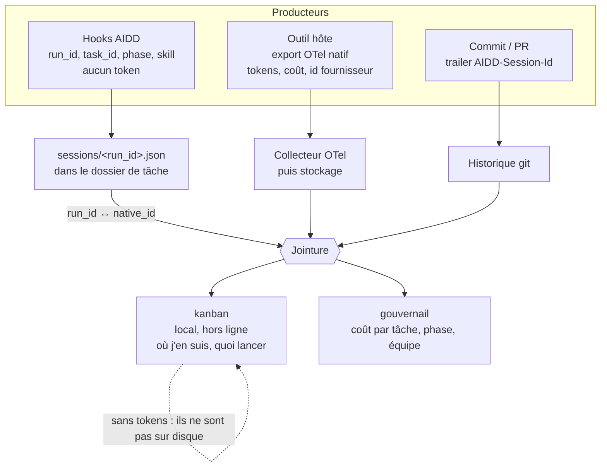

# Couche de télémétrie AIDD

> Brainstorm — 2026-08-13. Cohérence d'ensemble, niveau intention. Pas de plan ni de code.
> Cadre : jalon [#14 « Prove what an AI session costs »](https://github.com/ai-driven-dev/framework/milestone/14), échéance 2026-08-21, trois issues ouvertes (#617, #618, #620).

## L'idée

Répondre à une seule question : **combien a coûté cette feature, et où est parti l'argent dans le cycle de vie**. Les fournisseurs savent dire « ce dev a brûlé X tokens mardi ». Aucun ne sait dire « la story 428 a coûté Y, dont 60 % en phase de spécification ». L'écart entre les deux, c'est exactement ce que le framework possède et qu'eux n'ont pas : la tâche, la phase, la skill, le geste.

La couche de télémétrie n'est donc pas un collecteur. C'est une **jointure**. Le framework n'a pas à mesurer les tokens : les outils le font déjà, mieux, et à la source. Il a à produire l'identifiant qui permet de rattacher leur mesure à son propre découpage du travail, et à garantir que cet identifiant survit au commit, au squash, au worktree parallèle et à la session qui ne produit rien.

## Faits qui cadrent la décision

Vérifiés sur les documentations officielles des cinq outils, le 2026-08-13. Les cellules non vérifiables sont marquées comme telles et ne doivent pas être comblées par une valeur plausible (règle posée par #618).

### Ce que chaque outil expose réellement

| Outil | Export OTel natif | Tokens | Identifiant de session dans l'export | Coût | Tokens dans un hook |
| --- | --- | --- | --- | --- | --- |
| Claude Code | oui — métriques, logs, traces (bêta) | `claude_code.token.usage`, séparé input / output / cacheRead / cacheCreation | `session.id`, **sur les métriques et les événements**, réglable par `OTEL_METRICS_INCLUDE_SESSION_ID` (vrai par défaut) | oui, `claude_code.cost.usage` en USD | non — mais la ligne de statut reçoit coût et fenêtre de contexte sur stdin |
| Codex CLI | oui, logs, opt-in par `[otel]` dans `config.toml` | sur `codex.sse_event` : input, output, cache, raisonnement | `conversation.id` sur **les événements de log** ; absent des tags de métrique | non | non — `notify` ne porte ni token ni coût |
| GitHub Copilot | oui, traces et métriques, OTLP HTTP seulement | attributs `gen_ai.usage.*` sur les **spans** | `gen_ai.conversation.id` sur les spans ; non documenté sur les métriques | oui, en attribut de span (`github.copilot.cost`, `aiu`), devise non précisée | non pour les hooks CLI ; oui via l'événement `assistant.usage` du SDK |
| Cursor | **non vérifié** — documentation inaccessible depuis cet environnement (403 sur `cursor.com`, `docs.cursor.com`, `cursor.sh`) | non vérifié | non vérifié | non vérifié | non vérifié |
| OpenCode | aucun — zéro occurrence de « otel », « telemetry » ou « otlp » dans les 35 pages de documentation | hors export : la commande `opencode stats` | sans objet | hors export | non — aucun événement de plugin documenté ne porte d'usage |

### Trois conséquences qui décident de l'architecture

- **Aucun hook, sur aucun outil, ne porte de token ni de coût.** Un journal écrit par les hooks du framework ne pourra donc jamais contenir de mesure de consommation, quelle que soit sa forme. Toute conception qui fait des hooks la source des tokens est morte à l'écriture.
- **Le type de signal qui porte la jointure diffère par outil** : métriques chez Claude Code, logs chez Codex, spans chez Copilot. Un pipeline qui n'ingère que les métriques donnera une réponse juste pour Claude Code et vide pour les trois autres, sans erreur visible.
- **Aucun des cinq outils ne documente que l'identifiant vu par un hook est celui de son export de télémétrie.** C'est l'hypothèse porteuse de tout l'édifice, et elle n'est adossée à rien. Le constat est déjà écrit dans #620 ; il n'en est pas moins la première chose à traiter.

### Ce que le dépôt a déjà tranché

- Standard OpenTelemetry, puits = collecteur OTel, pas de SaaS (#297, décision de fond).
- Opt-in explicite, jamais de contenu de prompt ni de code, identifiants anonymisés (#297).
- Désactivé par défaut sur les dépôts publics, opt-in par dépôt (#617, #620).
- Le nom de dossier de tâche `aidd_docs/tasks/<mois>/<date>_<slug>/` est déjà l'identifiant de la feature : daté, unique, greppable, créé avant la première ligne de code.
- La CLI possède l'installation et la vérification du pipeline ; une skill ne peut pas en être responsable, parce qu'elle doit s'en souvenir et qu'elle ne connaît pas de façon fiable son propre identifiant de session (#617).
- Le kanban lit et ne produit rien ; sa fiche produit déclare explicitement « journal des exécutions » et « tokens par phase » comme manquants, à demander à qui possède le pipeline d'exécution.

## La forme retenue

**Trois producteurs, un point de jointure, deux consommateurs.**

### 1. Le framework ne collecte pas les tokens, il les fait émettre et les rejoint

La CLI configure l'export natif de chaque outil (variables d'environnement pour Claude Code et Copilot, table `[otel]` du `config.toml` pour Codex) vers un collecteur choisi par le projet. Elle n'écrit pas de collecteur maison. Le corollaire est que la couche AIDD n'a aucun chemin réseau au moment du commit, donc rien qui puisse bloquer ou ralentir.

### 2. Le framework possède son propre identifiant, et le fait vivre à côté de celui du fournisseur

Un `run_id` engendré par AIDD au démarrage de session, stocké avec l'identifiant natif **et son espèce**, parce que les quatre outils supportés nomment la chose de quatre façons. L'attribution tâche → exécution ne doit alors rien à un fournisseur ; seule la jointure de coût reste empruntée, et reste explicite. C'est déjà la position de #620 et elle tient.

### 3. Deux façons de tenir la jointure — un arbitrage qui n'est écrit nulle part

| | A. Table de correspondance (position actuelle de #620) | B. Injection dans l'export |
| --- | --- | --- |
| Mécanisme | le hook de démarrage écrit `run_id` ↔ `native_id` sur disque ; l'aval joint sur l'id natif | la CLI lance l'outil et pose `OTEL_RESOURCE_ATTRIBUTES=aidd.run_id=…` ; le `run_id` est **dans** la télémétrie |
| Dépend de | l'égalité entre l'id du hook et l'id de l'export — non documentée, sur les cinq outils | qu'AIDD possède le lancement du processus, ce qui n'est pas le cas aujourd'hui |
| Portée | les quatre outils qui exposent un id dans leurs hooks | Claude Code et Copilot lisent `OTEL_RESOURCE_ATTRIBUTES` ; Codex a `span_attributes` en configuration, pas en variable d'environnement |
| Coût | une jointure de plus, et une hypothèse à re-vérifier à chaque version d'outil | un lanceur, et une adhérence nouvelle au cycle de vie du processus |

Les deux ne s'excluent pas et il ne faut pas choisir entre elles : **B supprime la fragilité de la jointure d'identifiant, A reste nécessaire de toute façon**. Un attribut de ressource est figé au lancement du processus, alors que la phase et la tâche changent en cours de session — les intervalles ne peuvent pas y vivre. La forme utile est donc A comme socle, B comme durcissement là où un lanceur existe.

### 4. Le fichier de métadonnées : deux fichiers, pas un

L'intention d'un fichier de métadonnées dans le dossier de tâche est juste, mais elle recouvre deux objets dont les propriétés d'écriture sont opposées.

| | Identité de la tâche | Journal des sessions |
| --- | --- | --- |
| Contenu | type (feature, bug, spike), ticket d'origine, spec, plan, epic / story | `run_id`, `native_id` et son espèce, outil, `parent_run_id`, intervalles phase / date |
| Écrivain | une skill, au moment du cadrage | un hook, à chaque démarrage et à chaque fin de tour |
| Fréquence | quelques écritures sur la vie de la tâche | continue, concurrente, potentiellement depuis plusieurs worktrees |
| Conflit de fusion | possible, et résoluble par un humain | structurellement impossible **si et seulement si** un fichier par session |

Les mettre dans un même fichier réintroduit le conflit de fusion que le découpage un-fichier-par-session de #620 avait précisément éliminé. Ils restent séparés.

Sur l'identité de la tâche, la position minimale se défend mieux que le nouveau fichier : **le dossier est déjà l'identifiant**, et `plan.md` porte déjà un frontmatter que le kanban lit. Ajouter un `metadata.json` crée une deuxième source de vérité à synchroniser avec le frontmatter, pour un gain limité au parsing. Le format JSON ne se justifie que le jour où un écrivain machine touche ce fichier — ce qui n'est pas prévu. Recommandation : étendre le frontmatter existant, n'introduire comme nouveauté que le répertoire `sessions/`. À trancher, c'est une décision produit et pas technique.

### 5. Cardinalité : les identifiants ne montent pas sur les métriques

`run_id`, `task_id` et `session.id` sont non bornés. Posés en attributs de métrique, ils font exploser la cardinalité du stockage — c'est le mode de panne classique de ce type de projet, et vraisemblablement la raison pour laquelle Cursor retirerait ces identifiants de ses points de métrique. La règle : les identifiants vivent sur les logs et les spans, les métriques restent à faible cardinalité, la jointure se fait au moment de la requête. Claude Code, qui met `session.id` sur ses métriques, est l'exception commode et non le modèle.

### 6. Répartition entre les deux consommateurs

Elle découle du support, pas d'un choix : **le kanban lit des fichiers locaux, donc il ne verra jamais de tokens** — ils ne sont pas sur le disque. Il montre les sessions, les intervalles, la phase en cours, le prochain geste. **Le gouvernail lit le stockage de télémétrie et le dépôt**, donc lui seul peut calculer un coût par tâche, par phase, par personne. Le journal de sessions lu depuis le dépôt lui donne au passage une seconde source, indépendante du flux OTel, qui doit se réconcilier avec lui : une divergence devient un signal d'intégrité au lieu d'un mystère.

## Contraintes non négociables

- **Échouer ouvert.** Un hook de télémétrie qui plante, expire ou ne trouve rien sort en `0` et se tait. Il ne bloque, ne retarde et ne modifie jamais un commit. Sur Copilot, un `preToolUse` qui sort non-zéro **refuse l'appel d'outil** : la sémantique d'échec est par outil et se vérifie avant écriture.
- **Aucun contenu ne quitte la machine.** Ni prompt, ni code, ni diff. Le trailer porte un identifiant opaque et rien d'autre. Le risque de fuite ne vient pas d'AIDD mais de l'utilisateur qui active `OTEL_LOG_USER_PROMPTS` chez le fournisseur ; la CLI doit le détecter et le dire, pas l'ignorer.
- **Une installation complète qui ne produit rien doit se lire comme cassée.** C'est la ligne utile du `status` de #617 : hooks posés, export configuré, et malgré tout `session.id` absent parce que `OTEL_METRICS_INCLUDE_SESSION_ID=false`. La part de commits estampillés sur sept jours est le seul contrôle qui prouve que le pipeline produit de la donnée plutôt qu'il existe.
- **Une session qui ne produit aucun commit doit rester comptée.** Planifier, explorer, déboguer, répondre à une revue : ce sont les sessions les plus chères et elles ne commitent pas. Une attribution fondée sur les seuls commits sous-compte, et sous-compte le plus là où le chiffre doit être juste.

## Incohérences et manques repérés dans le jalon

- **#617 se contredit avec lui-même.** La section « Scope » fait écrire au marqueur `PreToolUse` « the `session_id` from the event payload », alors que la décision du 2026-08-12 pose que le trailer porte le `run_id` AIDD et non un identifiant fournisseur. Deux valeurs différentes pour un même trailer.
- **#617 dépend de #620 et aucune des deux ne le dit.** Le `run_id` que le trailer transporte est engendré par le mécanisme de #620. Les relations déclarées des deux issues ne portent que `blocked-by #585`. Dans l'ordre du jalon, #620 passe avant #617.
- **Personne ne possède la configuration de l'export fournisseur.** #617 mentionne « optional OTLP endpoint » dans le bloc de configuration, mais poser les variables et les blocs par outil, et vérifier qu'ils sont actifs, n'est le périmètre déclaré d'aucune des trois issues. Sans cela le jalon produit des identifiants qui ne joignent rien.
- **Personne ne possède le puits.** Collecteur, stockage, rétention : hors périmètre des trois issues, et #297 le porte encore à l'état d'intention.
- **L'émission des événements de phase et de skill est explicitement remise à plus tard** par #617. C'est pourtant la seule chose que le framework sait et que les fournisseurs ignorent, donc la seule raison d'exister de la couche. À planifier tôt, sinon le jalon livre une jointure sans le contenu qui la rend intéressante.
- **OpenCode n'a aucun chemin.** Ni export, ni identifiant dans le contexte de plugin, ni usage dans les événements. Le dire dans `status` comme le prévoit #617 est la bonne réponse ; toute autre voie serait de la rétro-ingénierie à maintenir.
- **Cursor est un trou de connaissance, pas une absence de fonctionnalité.** La documentation est inaccessible depuis cet environnement. Selon la règle de #618, la ligne reste `[?]` et aucune décision ne s'y appuie tant que quelqu'un n'a pas ouvert la page.

## Ce que le PRD proposé change, et pourquoi il ne tient pas tel quel

Le PRD reçu décrit une collecte maison : hooks qui écrivent un `runtime.jsonl` global par utilisateur, démon de lecture, envoi vers un SaaS. Trois raisons de ne pas partir là-dessus.

- **Les hooks ne portent pas de tokens**, sur aucun des cinq outils. Le `runtime.jsonl` de F1/F2 ne peut structurellement pas contenir la mesure qui est l'objet du produit.
- **Le SaaS contredit une décision de fond du dépôt** (#297 : puits OTel, pas de SaaS). Le débat peut se rouvrir, mais alors explicitement et pas par un document parallèle.
- **Recollecter ce que les fournisseurs exportent déjà** achète de la dette pour une donnée de moins bonne qualité, alors que la valeur propre du framework est ailleurs : la phase, la skill, la tâche.

Ce que le PRD apporte et qu'il faut garder : la vue locale pour le développeur, la rétention bornée, et le fait de poser la question de la facturation. Reformulé sur l'architecture ci-dessus, `runtime.jsonl` devient un cache local du flux OTel, pas une source concurrente.

## Assumptions ouvertes

- **L'identifiant vu par un hook est-il celui de l'export ?** Non documenté sur les cinq outils. Tout repose dessus. Se vérifie empiriquement en une session par outil.
- **Un sous-agent propage-t-il le `session_id` du parent ?** Si un commit part d'un sous-agent avec son propre identifiant, une part du coût se détache de la feature.
- **L'identifiant survit-il à une reprise, un `clear`, une compaction, un fork ?** Aucun des cinq ne le documente (#618).
- **Le lanceur de B existe-t-il, et le voulons-nous ?** Aujourd'hui la CLI installe, elle ne lance pas. C'est un changement de nature.
- **Où vit le puits par défaut** pour un utilisateur solo qui ne veut pas monter un collecteur, et comment il obtient une vue sans rien exposer.
- **Ce que la vue locale doit montrer** au minimum pour valoir le déplacement, sachant qu'elle ne peut pas montrer de tokens sans le puits.

## Prochaine étape

Un **spike d'égalité d'identifiants**, avant toute écriture de code : une session réelle par outil, l'identifiant vu par le hook et le `session.id` de l'export relevés côte à côte et consignés. C'est déjà le troisième critère d'acceptation de #617, mais il y est traité comme une case à cocher en fin de parcours alors qu'il est l'hypothèse qui décide de la forme. S'il tombe, la voie B cesse d'être un durcissement et devient l'unique chemin.

Ensuite, dans cet ordre : #618 (les faits, dont dépendent les deux autres), #620 (le journal, qui engendre le `run_id`), #617 (le trailer, qui le transporte). Et une décision explicite sur qui possède la configuration de l'export fournisseur, faute de quoi le jalon livre une jointure sans rien à joindre.
