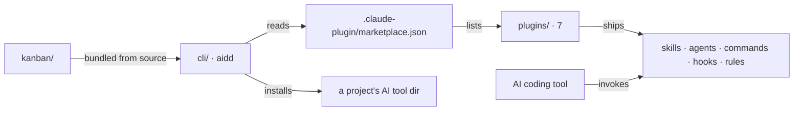

# Architecture

The macro technical shape: the stack, how the pieces fit, and the decisions behind them. Point to the code, do not restate it.

> CLI internals (layers, domain models, install flows, adapters) live in [`cli/aidd_docs/memory/architecture.md`](../../cli/aidd_docs/memory/architecture.md).

## Stack

| Part | What |
| --- | --- |
| Product | markdown — skills, agents, rules, templates. No framework runtime; an LLM interprets them. |
| Delivery | Node `>=22.12`, pnpm. `cli/` (the `aidd` binary) and `kanban/` (bundled into it from source). |
| Manifest | `.claude-plugin/marketplace.json`, 7 plugins, versioned per plugin. |

## How it fits together

`cli/` and `kanban/` are workspaces of this repo, not outside consumers: type-checked, tested and released here.

## Key decisions

| Decision | Why |
| --- | --- |
| Knowledge and execution separated by a firewall | knowledge plugins produce artifacts you read, never write or run application source |
| Concern decides placement, not existence | a missing capability goes to the plugin whose concern owns it; the caller delegates |
| A skill is a router | `SKILL.md` dispatches to actions or protocols; the only place a capability is addressed by name |
| Recipe skills discover providers at runtime | by description matching. Only agent permission lists and orchestration references name a provider |
| `kanban/` never imports `cli/` | the host injects through `KanbanCommandDeps` (`kanban/src/presentation/kanban-deps.ts`) |

The concern-to-plugin taxonomy is canonical in [`docs/ARCHITECTURE.md`](../../docs/ARCHITECTURE.md).

## Gotchas

- A plugin never contains its own tests — `hooks/` ships recursively into user projects.
- A skill never links outside itself: the tree ships both flat and as a marketplace, so no relative path survives both.
- Bundled hooks run Node. No `node` on `PATH`, no memory refresh.
- `cli/` reaches into `kanban/src/` by relative path, so `kanban/`'s deps must be installed before any `cli` typecheck, test or build.
