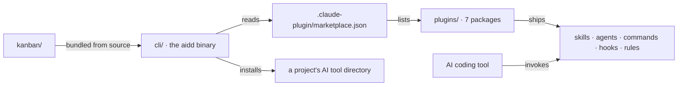

# Architecture

The macro technical shape: the stack, how the pieces fit, and the decisions behind them. Point to the code, do not restate it.

## Stack

- Markdown is the product. Skills, agents, rules and memory templates are interpreted by an LLM at runtime; there is no framework runtime to execute them.
- Node.js `>=22.12` with pnpm, for the two TypeScript workspaces that deliver the markdown: `cli/` (the `aidd` binary) and `kanban/` (bundled into it at build time).
- Commander for the CLI surface, Ink and React for the terminal views, `gray-matter` for task frontmatter, `smol-toml` and `js-yaml` for the tool configuration formats.

## How it fits together

The CLI is a workspace of this repo, not an outside consumer: `cli/` and `kanban/` are type-checked, tested and released here.

## Key decisions

- **Knowledge and execution are separated by a firewall.** Knowledge plugins produce artifacts you read; they never write or run application source. The full concern-to-plugin taxonomy is canonical in [`docs/ARCHITECTURE.md`](../../docs/ARCHITECTURE.md).
- **Concern decides placement, not existence.** A missing capability goes to the plugin whose concern owns it, and the caller delegates. It is never reimplemented in the calling plugin because the right home lacks it today.
- **A skill is a router.** Its `SKILL.md` dispatches to local actions or, for an orchestrator, to numbered reference protocols. The router is the only place a capability is addressed by name.
- **Recipe skills discover providers at runtime** by description matching, never by hardcoding a sibling. Only agent permission lists and orchestration references name a provider, since those are auditable responsibility maps.
- **Both TypeScript workspaces layer `domain/`, `application/`, `infrastructure/`**, dependencies pointing inward. `kanban/` never imports from `cli/`; the host injects everything through `KanbanCommandDeps` (`kanban/src/presentation/kanban-deps.ts`).

## Gotchas

- **A plugin never contains its own tests.** The build copies `hooks/` recursively into every user project, so a test folder there would ship to them. Tests for a bundled script live in `scripts/__tests__/`.
- **A skill never links outside itself.** The same tree ships flat, with the skill folder renamed `<plugin>-<skill>`, and as a marketplace, so no relative path survives both. A bundled script is named plugin-relative in backticks, never linked.
- **Bundled hooks run Node**, so a user without `node` on their `PATH` gets no memory refresh.
- **The CLI reaches into `kanban/src/` by relative path**, so `kanban/`'s dependencies must be installed before any `cli` typecheck, test or build.
