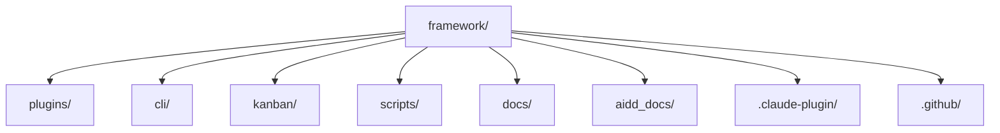

# Codebase Map

The macro layout: the top-level areas and what each holds. A map to navigate, not the full tree.

## Areas

- `plugins/`: the product. One directory per plugin, each holding `skills/`, and optionally `agents/`, `commands/`, `hooks/` and `rules/`. The anatomy is in [`docs/ARCHITECTURE.md`](../../docs/ARCHITECTURE.md).
- `cli/`: the `aidd` binary, TypeScript, layered `domain/` · `application/` · `infrastructure/`.
- `kanban/`: the task board, same layering plus `presentation/`. Bundled into the CLI from source, never published on its own.
- `scripts/`: the repository's own checks and generators, run by lefthook and CI. Their tests live in `scripts/__tests__/`.
- `docs/`: the durable documentation a contributor reads — architecture, plugin authoring, glossary, maintainer runbook.
- `aidd_docs/`: this memory bank, plus the task documents (plans, specs, reviews) that `aidd kanban` reads.
- `.claude-plugin/`: `marketplace.json`, the version manifest listing every plugin.
- `.github/`: workflows, issue templates and rulesets.

## Entry points

- `cli/src/cli.ts`: the binary's entry, published as `dist/cli.js` under the `aidd` bin name.
- `plugins/<plugin>/skills/<NN>-<name>/SKILL.md`: where an AI tool enters a workflow.
- `plugins/aidd-context/hooks/update_memory.js`: runs on `SessionStart` to refresh the memory block in each AI context file.

## Packages

- `cli` (`@ai-driven-dev/cli`): published to npm, the only released package.
- `kanban`: private, compiled into the CLI. It depends on npm packages only, never on `cli/`.
