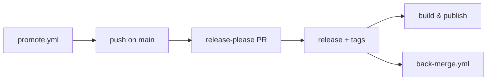

# Deployment

Where the project runs and how it ships: CI/CD, environments, and release.

> CLI build, publish and self-update detail: [`cli/aidd_docs/memory/deployment.md`](../../cli/aidd_docs/memory/deployment.md).

## Pipeline

| Workflow | Runs |
| --- | --- |
| `ci.yml` | commitlint on PRs, release-please on `main`, then the release jobs |
| `cli-ci.yml` | typecheck, lint, test, build with its bundle budget, knip on `cli/` |
| `validate.yml` | plugin and marketplace manifests against their schemas |
| `codeql.yml` | code scanning |
| `promote.yml` | opens the `next` to `main` promote PR, merge auto-merge |
| `back-merge.yml` | folds `main` back into `next` after each release |
| `dependabot-auto-merge.yml` | merges dependency PRs that pass |
| `close-finished-milestones.yml` | closes a milestone once its issues are |

Automatic on a push to `main`. `promote.yml` is the only manual entry.

## Environments

None — no server, no container, no IaC. What ships are release assets and published packages.

| Target | Where |
| --- | --- |
| Repository | <https://github.com/ai-driven-dev/framework> |
| npm | `@ai-driven-dev/cli`, OIDC trusted publishing, no token |
| Archives | GitHub Releases and GitHub Packages |

## Release

Branch model in `vcs.md`, cadence and safety rules in [`RELEASE.md`](../../RELEASE.md).

1. release-please opens the Release PR, bumping `marketplace.json` and each `plugin.json`. CI auto-merges it, so `main` never holds merged but unversioned code.
2. Merging creates the release and its tags — per plugin, `include-component-in-tag: true`, shaped `<plugin>-v<semver>`.
3. Release jobs: `build-and-attach` (marketplace bundle), `build-per-tool` (nine distributions, CLI at a **pinned** version), `build-plugin` (one archive per released path), `publish-cli`.
4. Archives are staged outside the repo tree, uploaded with `gh release upload --clobber`.
5. `back-merge.yml` folds `main` into `next`.

Config: `release-please-config.json`. Manifest: `.release-please-manifest.json`.

## Monitoring

None. Failures surface as a red run; `back-merge.yml` opens a tracking issue when it cannot push, so drift is never silent.
