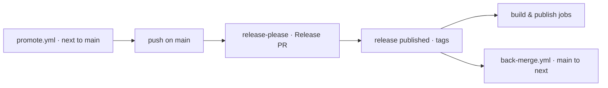

# Deployment

Where the project runs and how it ships: CI/CD, environments, and release.

## Pipeline

| Workflow | Runs |
| --- | --- |
| `ci.yml` | commitlint on PRs, release-please on `main`, then the release jobs below |
| `cli-ci.yml` | typecheck, lint, test, build with its bundle budget, and knip on `cli/` |
| `validate.yml` | the plugin and marketplace manifests against their schemas |
| `codeql.yml` | code scanning |
| `promote.yml` | opens the `next` to `main` promote PR and merge auto-merges it |
| `back-merge.yml` | brings `main` back into `next` after each release |
| `dependabot-auto-merge.yml` | merges dependency PRs that pass |
| `close-finished-milestones.yml` | closes a milestone once its issues are |

Triggered automatically by a push to `main`; `promote.yml` is the only manual entry, to send `next` to `main` outside the weekly cadence.

## Environments

None. No server, no container, no infrastructure as code: what ships are release assets and published packages.

- Repository: <https://github.com/ai-driven-dev/framework>
- npm: `@ai-driven-dev/cli`, published through OIDC trusted publishing, no token.
- GitHub Packages and GitHub Releases for the archives.

## Release

The branch model is in `vcs.md`, the cadence and the two safety rules in [`RELEASE.md`](../../RELEASE.md). What happens on a release:

1. release-please opens the Release PR, bumping `marketplace.json` and each `plugin.json`. CI auto-merges it with the bot App token, so `main` never holds merged but unversioned code.
2. Merging it creates the release and its tags. Versioning is per plugin, `include-component-in-tag: true`, tags shaped `<plugin>-v<semver>`.
3. The release triggers the build jobs: `build-and-attach` (a clean marketplace bundle), `build-per-tool` (nine target-native distributions, each built by the CLI at a **pinned** version so a CLI release never silently changes the output), `build-plugin` (one archive per released plugin path), and `publish-cli`.
4. Every archive is staged outside the repo tree and uploaded with `gh release upload --clobber`.
5. `back-merge.yml` folds `main` back into `next` so the changelog, manifest and versions do not drift.

`kanban/`'s dependencies install before any `cli` job, since the CLI bundles that folder from source.

Config: `release-please-config.json`, manifest: `.release-please-manifest.json`.

## Monitoring

None. Failures surface as a red workflow run; `back-merge.yml` opens a tracking issue when it cannot push, so a drift is never silent.
