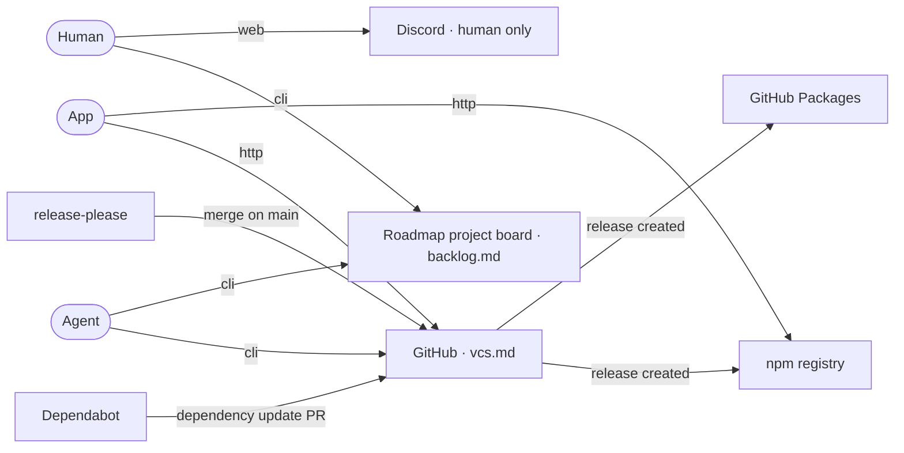

# Ecosystem

```mermaid
flowchart LR
  Human([Human])
  Agent([Agent])
  App([App])
  GitHub["GitHub · vcs.md"]
  Board["Roadmap project board · backlog.md"]
  Npm["npm registry"]
  Packages["GitHub Packages"]
  Discord["Discord · human only"]
  ReleasePlease["release-please"]
  Dependabot["Dependabot"]

  Agent -- cli --> GitHub
  Agent -- cli --> Board
  Human -- cli --> Board
  App -- http --> GitHub
  App -- http --> Npm
  Human -- web --> Discord

  Dependabot -- "dependency update PR" --> GitHub
  ReleasePlease -- "merge on main" --> GitHub
  GitHub -- "release created" --> Npm
  GitHub -- "release created" --> Packages
```
