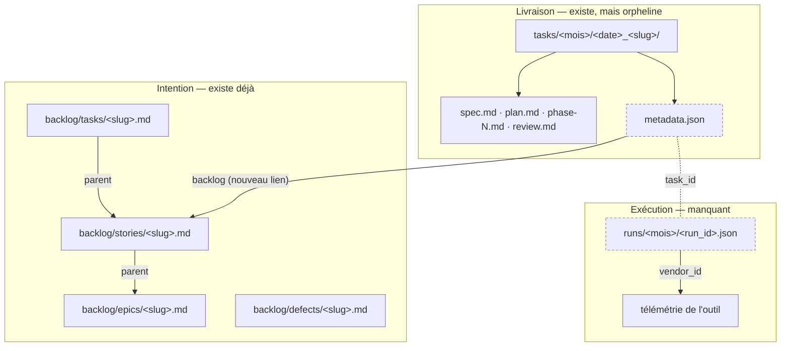
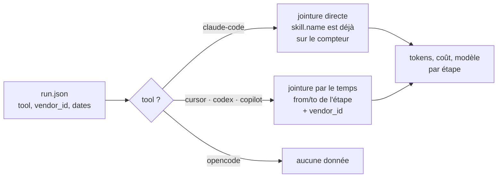

# Suivre un travail de bout en bout

Comment relier l'intention, la livraison et l'exécution d'un travail — dans le flux habituel comme en dehors — sans dupliquer une seule information, et sans dépendre de l'outil utilisé.

## Target

Depuis n'importe quel outil supporté, retrouver pour un travail donné : d'où il vient, quels fichiers il a produits, quelles étapes ont réellement tourné, combien de temps, combien de tokens, sur quel modèle, et pour quel coût.

## Ce qui est prouvé, mesuré le 2026-08-13

Deux sessions réelles sur Claude Code 2.1.232, télémétrie OTLP capturée par un collecteur local. Les valeurs ci-dessous sont relevées, pas lues dans une documentation.

### L'égalité d'identifiant, sur trois outils

C'est l'hypothèse qui porte tout le montage : l'identifiant qu'un hook voit est-il celui que la télémétrie exporte ? Aucun fournisseur ne le documente. Mesuré directement, une session par outil.

| Outil | Champ côté hook | Attribut côté export | Même valeur | Coût du test |
| --- | --- | --- | --- | --- |
| Claude Code | `session_id` | `session.id` sur métriques et événements | **oui**, sur deux sessions indépendantes | deux sessions réelles |
| Codex CLI | `session_id` | `conversation.id` sur `codex.sse_event` | **oui** | **zéro token** |
| GitHub Copilot | `sessionId` | `gen_ai.conversation.id` sur le span `invoke_agent` | **oui** | **zéro crédit** |
| Cursor | `conversation_id`, plus `session_id` et `generation_id` | `cursor.conversation.id` sur les logs | hooks prouvés, **export non mesurable** | un tour réel : Cursor valide tout avant d'ouvrir la session |
| OpenCode | aucun | aucun | sans objet | rien à tester |

Les identifiants sont fabriqués côté client, avant tout appel au modèle. Un appel qui échoue produit donc quand même le démarrage de session, l'invocation du hook et l'événement de télémétrie : **Codex et Copilot se testent sans consommer de quota**, en pointant le fournisseur vers une adresse qui ne répond pas. C'est la méthode à retenir pour la vérification continue.

### Cursor est instrumentable en ligne de commande

C'était la question de périmètre du jalon, et la sonde y répond : **`cursor-agent` lit bien `.cursor/hooks.json`.** La documentation ne décrivant que des moments de l'éditeur, jusqu'à `workspaceOpen`, le doute était légitime ; il est levé sur données réelles. Cursor peut donc figurer dans une couche installée par une CLI.

Trois refus successifs ont dû être franchis avant d'y arriver, et chacun est une information : Cursor valide la clé d'API, puis le nom du modèle, puis la confiance de l'espace de travail — **avant** d'ouvrir la session. C'est pourquoi l'astuce qui rend les tests Codex et Copilot gratuits ne s'applique pas ici : chez eux la session démarre puis l'appel échoue, chez Cursor rien ne démarre tant que tout n'est pas valide. Vérifier Cursor coûte donc un vrai tour de modèle.

Ce que le payload contient, relevé et non lu :

```txt
session_id           7059918f-ce9d-49ed-a33f-0f1906a79f27
conversation_id      7059918f-ce9d-49ed-a33f-0f1906a79f27
generation_id        7059918f-ce9d-49ed-a33f-0f1906a79f27
model, user_email, workspace_roots, transcript_path,
cursor_version, is_background_agent, hook_event_name
sessionEnd ajoute    final_status, duration_ms
```

**Trois identifiants, pas un**, là où la documentation n'en décrit qu'un. Sur une session à un seul tour ils portent la même valeur, ce qui est un piège : rien ne dit qu'ils restent égaux sur plusieurs tours, et `generation_id` est précisément le genre de nom qui change à chaque génération. Le journal doit donc stocker `conversation_id`, le seul que la documentation qualifie de « stable across many turns », et non le premier des trois qui passe. Une sonde à deux tours reste à faire pour confirmer que les deux autres divergent.

Il reste que l'export OpenTelemetry de Cursor est un réglage d'équipe en plan Enterprise, en bêta : l'égalité d'identifiant entre le hook et l'export n'est toujours pas mesurable, faute d'un compte de ce type.

### Les quatre outils verrouillent leurs hooks, chacun à sa façon

Trouvé en faisant tirer les sondes, jamais dans une documentation. Aucune sonde n'a fonctionné du premier coup, et le motif est le même partout : **écrire le fichier de hook ne suffit pas, il faut aussi lever un verrou.** C'est un sujet d'installation à part entière, et exactement l'état que le `status` de #617 doit signaler comme cassé plutôt que sain.

| Outil | Verrou | Levée |
| --- | --- | --- |
| Codex | drapeau de fonctionnalité **et** confiance persistée | `--enable hooks` et `--dangerously-bypass-hook-trust` |
| Copilot | confiance du dossier pour `.github/hooks/*.json` | périmètre utilisateur sous `$COPILOT_HOME/hooks/`, qui n'est pas soumis à la confiance |
| Cursor | confiance de l'espace de travail | `--trust`, ou une approbation interactive |
| Claude Code | aucun | — |

Un hook posé sans lever le verrou est installé, silencieux, et ne produit aucune erreur. C'est le pire état possible pour une couche de mesure : la configuration paraît complète et la donnée n'existe pas.

### Le reste, mesuré sur Claude Code

| Question | Réponse mesurée |
| --- | --- |
| Les tokens sont-ils rattachés à la skill ? | **Oui.** `skill.name` est présent sur `claude_code.token.usage` |
| Le coût aussi ? | **Oui.** `skill.name` est présent sur `claude_code.cost.usage`, en USD |
| Le temps passé est-il mesuré ? | **Oui.** `claude_code.active_time.total`, en secondes, par session |
| Le travail des sous-agents est-il séparable ? | **Oui.** `query_source` vaut `main`, `subagent`, `sdk`, ou `agent:builtin:<Type>` |
| Le démarrage d'une skill est-il un événement ? | **Oui.** `skill_activated`, avec `skill.name`, `skill.source`, `invocation_trigger`, `prompt.id` |
| La fin d'un sous-agent ? | **Oui.** `subagent_completed`, avec `total_tokens`, `duration_ms`, `agent_type`, `model`, `model_swapped` |

Conséquence directe : **sur Claude Code, le journal des étapes est déjà émis par l'outil.** Le framework n'a pas à le fabriquer. Ce qu'il doit fournir est beaucoup plus étroit qu'anticipé.

Deux limites à retenir, également mesurées :

- **`skill.name` est collant.** Une fois une skill activée, les points de métrique suivants la portent, y compris ceux des sous-agents lancés ensuite. Ce n'est pas une portée stricte, c'est « la dernière skill activée ». L'attribution est donc juste pour des étapes qui se succèdent, et fausse pour des skills entrelacées.
- **Un sous-agent n'a pas d'identifiant de session propre** sur Claude Code : il partage celui du parent et se distingue par `query_source`. Cursor documente l'inverse pour lui — ses sous-agents reçoivent leur propre identifiant de conversation. Le modèle doit accepter les deux.

## Hard constraints

- **Une information, un écrivain, un endroit.** Aucun champ n'est écrit à deux endroits. Ce qui peut se déduire ne se stocke pas.
- **Les liens vont vers le haut, jamais vers le bas.** Règle déjà posée par `plugins/aidd-pm/skills/*/references/relations.md` : « Store each relation once, on its owner. Inverse links are never stored. Readers derive them. »
- **L'étape est la skill.** Aucune énumération d'étapes en parallèle du catalogue de skills : le nom de l'étape est l'identifiant de la skill. Une skill nouvelle est tracée sans rien modifier.
- **Un fichier, un écrivain.** Tout fichier écrit à chaque tour est écrit par un seul processus, pour qu'un conflit de fusion soit structurellement impossible.
- **Aucun token, aucun coût, aucun modèle dans un fichier commité.** Ces valeurs changent en cours de session ; elles viennent de la télémétrie et se recollent après coup.
- **Le travail hors flux compte autant.** Un debug sans dossier de tâche doit rester mesurable, sinon on annonce une mesure complète en mesurant deux tiers.

## Les trois niveaux



Aujourd'hui les deux premiers niveaux existent et **ne se touchent pas** : rien dans un dossier de livraison ne dit de quel artefact de backlog il vient. Le troisième niveau n'existe pas du tout.

## Organisation des dossiers

```txt
aidd_docs/
├── backlog/                          intention — inchangé
│   ├── epics/<slug>.md
│   ├── stories/<slug>.md
│   ├── tasks/<slug>.md
│   ├── spikes/<slug>.md
│   └── defects/<slug>.md
│
├── tasks/                            livraison — inchangé, plus un fichier
│   └── 2026_08/
│       └── 2026_08_13_telemetry-layer/
│           ├── metadata.json         NOUVEAU — identité, liens, provenance, étapes
│           ├── brainstorm.md
│           ├── spec.md
│           ├── plan.md
│           ├── phase-1.md
│           └── review.md
│
└── runs/                             NOUVEAU — exécution, un fichier par session
    └── 2026_08/
        ├── 01J9X4M2K7QRVB.json       task_id renseigné   → travail rattaché
        └── 01J9XZP4T8WNMC.json       task_id nul         → travail hors flux
```

**Pourquoi `runs/` est global et non dans le dossier de tâche.** Un journal par tâche ne sait pas où mettre le travail hors flux — le debug de dix minutes sans dossier, l'exploration, la question rapide. Un emplacement unique traite les deux cas à l'identique : le rattachement est un champ, pas un chemin. C'est ce qui rend la mesure honnête, puisqu'elle peut alors dire « 61 % du temps rattaché, 39 % hors tâche » au lieu d'ignorer la seconde moitié.

Un fichier par session préserve la propriété qui compte : un seul écrivain, donc aucun conflit de fusion, quels que soient les worktrees parallèles et les branches longues. La liste des sessions d'une tâche est une recherche sur `task_id`, pas une liste à maintenir.

## `metadata.json`

L'index du travail. Écrit par les skills, aux frontières d'étape — quelques écritures sur la vie d'une tâche, donc lisible et corrigeable à la main.

Un seul lien vers le haut : `backlog`. Ni le type de travail, ni le ticket d'origine ne sont répétés ici — l'artefact de backlog les porte déjà, dans `type`, `work_kind` et `source`. Les répéter créerait deux vérités qui divergeraient.

```json
{
  "schema_version": 1,
  "aidd_id": "01J9X4M2K7QRVB",
  "task_id": "2026_08_13_telemetry-layer",

  "backlog": "backlog/stories/telemetry-layer.md",
  "branch": "feat/telemetry-layer",
  "pull_request": "ai-driven-dev/framework#631",

  "opened_at": "2026-08-13T08:40:12Z",
  "closed_at": null,

  "steps": [
    {
      "skill": "aidd-refine:01-brainstorm",
      "from": "2026-08-13T08:40:12Z",
      "to": "2026-08-13T09:02:44Z",
      "produced": ["brainstorm.md"]
    },
    {
      "skill": "aidd-pm:04-spec",
      "from": "2026-08-13T09:02:44Z",
      "to": "2026-08-13T09:35:10Z",
      "produced": ["spec.md"]
    },
    {
      "skill": "aidd-dev:01-plan",
      "from": "2026-08-13T10:10:02Z",
      "to": "2026-08-13T11:05:20Z",
      "produced": ["plan.md", "phase-1.md"]
    },
    {
      "skill": "aidd-dev:08-debug",
      "from": "2026-08-14T14:22:00Z",
      "to": "2026-08-14T15:01:37Z",
      "produced": []
    },
    {
      "skill": "aidd-dev:02-implement",
      "from": "2026-08-14T15:01:37Z",
      "to": "2026-08-14T17:48:09Z",
      "produced": [],
      "commits": ["a3f9c2e", "7b1d044"]
    }
  ]
}
```

Ce que le fichier **ne** contient **pas**, et pourquoi :

| Absent | Qui le possède |
| --- | --- |
| le type de travail | l'artefact de backlog, dans `type` et `work_kind` |
| le ticket d'origine | l'artefact de backlog, dans `source` |
| l'epic, la story, le defect au-dessus | l'artefact de backlog, dans `parent` |
| `status` de chaque étape | le frontmatter de l'artefact ; une étape avec un `to` est finie, c'est déductible |
| la liste des fichiers du dossier | le listing du dossier ; `produced` n'est pas un inventaire mais une provenance, que personne d'autre ne connaît |
| les titres | le `.md` lui-même |
| tokens, coût, modèle, durée | la télémétrie ; ils changent en cours de session |
| la liste des sessions | une recherche sur `task_id` dans `runs/` |

Cas dégénéré, à accepter comme normal : un dossier de livraison sans artefact de backlog, quand quelqu'un lance directement un plan depuis une demande orale. Alors `backlog` est nul, et seulement dans ce cas le fichier porte lui-même un `source` et un `type`. Ce n'est pas une exception au principe : c'est le fichier qui devient propriétaire de l'information faute d'artefact au-dessus.

`steps` est un **journal**, pas une liste de cases à cocher : ça s'ajoute, ça se répète, ça arrive dans le désordre. Trois `aidd-dev:08-debug` au milieu de l'implémentation donnent trois entrées. Le flux se lit après coup, il ne se contraint pas avant.

## `runs/<mois>/<run_id>.json`

Écrit par un hook, jamais par le modèle. Créé au démarrage de session, `ended_at` rafraîchi au dernier tour observé — pas à un événement de fin de session, que Codex n'accorde qu'une seconde et ne déclenche pas pour les sous-agents, et qu'OpenCode n'a pas.

```json
{
  "schema_version": 1,
  "run_id": "01J9X4M2K7QRVB",
  "task_id": "2026_08_13_telemetry-layer",
  "tool": "claude-code",
  "vendor_id": "79041f53-35b0-4924-8855-e43e9de72431",
  "vendor_field": "session.id",
  "parent_run_id": null,
  "started_at": "2026-08-13T10:08:44Z",
  "ended_at": "2026-08-13T11:05:20Z"
}
```

`vendor_field` porte le nom du champ chez l'outil, parce qu'il diffère partout : `session.id` chez Claude Code, `conversation_id` chez Cursor, `sessionId` chez Copilot, `session_id` chez Codex. Le lecteur en aval sait ainsi quoi interroger, sans table codée en dur.

`task_id` à `null` est un état normal, pas une anomalie : c'est le travail hors flux.

## La chaîne complète, du run à l'epic

Chaque flèche est un champ déjà défini, sur son unique propriétaire. Aucune n'est inventée par cette spec, sauf `task_id` et `backlog`.

```txt
runs/2026_08/01J9X4M2K7.json
    │ task_id
    ▼
tasks/2026_08/2026_08_13_telemetry-layer/metadata.json
    │ backlog
    ▼
backlog/tasks/fix-token-join.md          type: task · work_kind: technical
    │ parent                             source: ai-driven-dev/framework#620
    ▼
backlog/defects/token-join-broken.md     type: defect
    │ related_to                         source: rapport utilisateur
    ▼
backlog/stories/telemetry-layer.md       type: story
    │ parent
    ▼
backlog/epics/prove-session-cost.md      type: epic · goal: brief produit
```

Le modèle existant couvre déjà tous les cas de figure, y compris ceux auxquels je ne m'attendais pas :

| Travail | Comment il se rattache |
| --- | --- |
| une feature | dossier → `backlog/stories/*.md` → `parent` → epic |
| un bug | dossier → `backlog/tasks/*.md` → `parent` → `backlog/defects/*.md`. `relations.md` du defect le dit : « It has no `parent`: resolution work is a Task whose `parent` is the Defect » |
| le defect et la story qu'il casse | `related_to` du defect, décrit comme « the affected artifacts » |
| une tâche technique | `backlog/tasks/*.md`, `work_kind: technical`, `parent` facultatif |
| un spike | `backlog/spikes/*.md`, `parents` au pluriel : les artefacts que l'incertitude bloque |
| une issue GitHub ou Jira | `source` de l'artefact de backlog, jamais ailleurs |
| un debug hors flux | `run.json` avec `task_id` nul. Rattachable après coup : le fichier de run est à nous, on y écrit le `task_id` le jour où le sujet devient une tâche |

**Rien ne pointe vers le bas, et il ne faut rien ajouter qui le fasse.** Un artefact de backlog ne connaît pas ses dossiers de livraison : le lecteur indexe `tasks/*/*/metadata.json` et regroupe par `backlog`. C'est exactement ce que `relations.md` prescrit — « Inverse links are never stored. Readers derive them. » Une story livrée en deux fois donne deux dossiers pointant vers elle, sans qu'elle ait à le savoir.

D'où la question « combien a coûté cet epic » se répond en descendant les liens dérivés : epic → stories dont `parent` vaut l'epic → dossiers dont `backlog` vaut ces stories → runs dont `task_id` vaut ces dossiers → télémétrie de ces sessions.

## Comment les tokens rejoignent une étape

Deux chemins, choisis par le champ `tool` du run. C'est le seul endroit du système qui dépend de l'outil.



**Chemin direct, Claude Code.** La télémétrie porte déjà `skill.name` sur `token.usage` et `cost.usage`. Rien à calculer : on filtre. Le `metadata.json` ne sert alors qu'à savoir de quelle *tâche* il s'agit — la seule chose que l'outil ne peut pas savoir.

**Chemin temporel, les trois autres.** L'étape a couru de 10h10 à 11h05 sur la session `vendor_id` : on somme les tokens de cette fenêtre. C'est pour cette raison que les `from` et `to` de chaque étape ne sont pas décoratifs — sur trois outils sur quatre, **ce sont eux qui portent l'attribution**. Précision moindre, mécanisme identique.

Un nouvel outil ajouté au framework, c'est une ligne dans ce branchement, et rien d'autre à toucher.

## Le vocabulaire à ajouter à OpenTelemetry

Quatre attributs, et pas un de plus. Tout le reste existe déjà chez les fournisseurs.

| Attribut | Valeur | Pourquoi il n'existe pas déjà |
| --- | --- | --- |
| `aidd.id` | l'identifiant chapeau | aucun outil ne connaît notre unité de travail |
| `aidd.task_id` | le dossier de livraison | idem |
| `aidd.type` | `feature`, `bug`, `spike`, `chore` | idem |
| `aidd.step` | l'identifiant de skill | Claude Code émet déjà `skill.name` ; les autres non |

Là où l'outil accepte des attributs personnalisés, ils partent dans la télémétrie et la jointure disparaît. Mesuré : Claude Code lit un bloc `env` de `settings.json` « applied to every session » et attache ces valeurs « on every metric datapoint and event record ». Donc `aidd.task_id` par projet est acquis sans rien lancer. Un `aidd.id` qui change à chaque session demanderait un lanceur, ce que la CLI n'est pas aujourd'hui — d'où le `runs/` qui tient la correspondance en attendant.

## Ce qui manque dans les templates existants

Relevé sur les fichiers du dépôt. Les artefacts de backlog sont complets ; les artefacts de livraison sont muets.

| Fichier | Frontmatter aujourd'hui | À ajouter | Conséquence de l'absence |
| --- | --- | --- | --- |
| `backlog/epics/*.md` | `type`, `status`, relations | rien | — |
| `backlog/stories/*.md` | `type`, `status`, relations | rien | — |
| `backlog/tasks/*.md` | `type`, `status`, relations | rien | — |
| `backlog/spikes/*.md` | `type`, `status`, relations | rien | — |
| `backlog/defects/*.md` | `type`, `status`, relations | rien | — |
| `plan.md` | `objective`, `status` | `type: plan` | le `--type` du kanban ne retourne rien, sa propre fiche produit le constate |
| `phase-N.md` | `status` | `type: phase` | invisible au filtrage |
| `spec.md` | **aucun** | `type: spec`, `status` | totalement invisible au kanban |
| `review.md` | **aucun** | `type: review`, `status` | idem |
| document de brainstorm | **aucun** | `type: brainstorm`, `status` | idem |
| PRD | **aucun** | `type: prd`, `status` | idem |

Un seul champ nouveau par fichier. Le `task_id` n'est répété nulle part : **le nom du dossier est déjà l'identifiant**, et le lien vers le backlog est écrit une fois, dans `metadata.json`.

## Qui écrit quoi

| Écrivain | Écrit | Quand | Fréquence |
| --- | --- | --- | --- |
| la skill qui crée le dossier | `metadata.json`, identité et lien vers le backlog | à la création | une fois |
| chaque skill de livraison | son entrée dans `steps`, et son propre frontmatter | en fin d'étape | quelques fois |
| hook de démarrage | `runs/<mois>/<run_id>.json` | au démarrage de session | une fois par session |
| hook de fin de tour | `ended_at` du run courant | à chaque tour | souvent, sur un fichier à un seul écrivain |
| hook de commit | le trailer `AIDD-Session-Id` | au commit | une fois par commit |
| personne | tokens, coût, modèle, durée | — | vient de la télémétrie |

## Ce que les deux lecteurs en tirent

**Le kanban** lit le dépôt, hors ligne, sans compte. Il donne l'état, la chronologie des étapes, les fichiers produits, le prochain geste. Il ne montre pas de tokens : ils ne sont pas sur le disque.

**Le gouvernail** lit le dépôt *et* la télémétrie. Lui seul peut croiser.

```txt
Marie — semaine 33
  3 features, 2 bugs, 1 spike
  temps actif           11 h 40        (claude_code.active_time.total)
  tokens                2,1 M          dont 34 % de cache
  coût                  47 €
  rattaché à une tâche  61 %           hors tâche 39 %, dont /debug 22 %
  par étape             implement 61 % · review 19 % · plan 12 % · reste 8 %
  par modèle            opus 78 % du coût pour 31 % des appels
  skill la plus chère   aidd-dev:02-implement, 29 €
```

Chaque ligne est calculable avec ce qui précède. Aucune n'exige un format maison.

## Non-goals

- Le collecteur, son stockage et sa rétention. Le framework configure l'export, il n'héberge rien.
- Le calcul de coût pour Codex et Cursor, qui n'exportent pas de montant : il faudra une table de prix, et elle n'est pas dans ce périmètre.
- OpenCode, qui n'expose ni export, ni identifiant, ni usage documenté. Déclaré non couvert.
- L'installation de l'export Cursor : c'est un réglage d'équipe en plan Enterprise, la CLI peut le vérifier mais pas le poser.
- Rattraper les tâches et sessions antérieures à la fonctionnalité.

## Ce qui reste non vérifié

- L'égalité d'identifiant est prouvée sur Claude Code, Codex et Copilot. **Sur Cursor elle reste ouverte** : ses hooks fonctionnent bien en ligne de commande, mais son export exige un compte Enterprise avec la diffusion d'équipe activée, donc il n'y a rien à comparer.
- **Lequel des trois identifiants Cursor est celui de l'export.** Ils coïncident sur une session à un tour ; une sonde à deux tours dirait si `generation_id` et `session_id` s'en détachent.
- L'égalité est prouvée par une session, pas par construction. Elle peut se rompre à une mise à jour d'outil. La sonde étant gratuite sur Codex et Copilot, elle a sa place dans l'intégration continue plutôt que dans une vérification ponctuelle.
- La survie de l'identifiant à une reprise, un `clear`, une compaction ou un fork. Aucun outil ne le documente, et le banc de test actuel ne la couvre pas.
- Le coût réel du frottement : un run réécrit à chaque tour salit l'arbre de travail. À trancher entre écrire hors du dépôt pendant la session et matérialiser au commit, ou assumer le bruit.
- La tension entre l'anonymat inscrit dans #297 et les statistiques par personne attendues du gouvernail. Ce sont deux promesses incompatibles, et l'arbitrage dépasse l'équipe technique.
