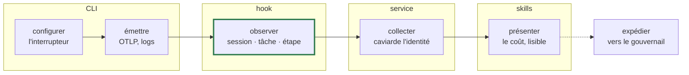

# Mesurer une fonctionnalité, de bout en bout

Les six étapes, ce que chacune écrit, par quelle technique. Une seule question tient tout : **combien a coûté ce travail, et où est passé l'argent ?**

## La chaîne



Une seule étape est construite : **observer**. Elle produit la clé de jointure ; l'export et le collecteur sont la serrure. L'expédition est délibérément la dernière — la V1 est locale, fiable et complète avant que quoi que ce soit ne quitte la machine.

| Étape | Technique | Artefact | Ticket |
| --- | --- | --- | --- |
| configurer | CLI | `.aidd/config.json` | #646 |
| émettre | CLI écrit, l'outil émet | `.claude/settings.local.json` | #646 |
| observer | hook | `aidd_docs/runs/<id>.json` | **#620 fait** |
| observer les étapes | hook | frontières d'étape | #663 |
| collecter | service | le collecteur | #647 |
| présenter | skill | le rapport | #629 |
| expédier | à décider | — | #662, #655 |

## Ce que la sonde a tranché, le 18 août

Une vraie session payée, 0,61 $, deux skills du marketplace.

### Le coût par étape marche, sans compromis de vie privée

```txt
pré-étape                        0.401955
étape 1  aidd-ui:01-hello        0.054666
étape 2  aidd-context:11-explore 0.157919
                                 ────────
                                 0.614540   ← total annoncé par l'outil : 0.61454
```

Réconcilié à la cinquième décimale. On croyait devoir choisir entre voir le coût d'une étape et ne pas journaliser les commandes Bash. C'est faux : `OTEL_LOG_TOOL_DETAILS` ne servait qu'au **nom**, et le nom, le hook l'a déjà en clair.

| Fait mesuré | Conséquence |
| --- | --- |
| Chaque `api_request` porte son `cost_usd`, delta et non cumulatif | le coût se découpe sans différenciation |
| Deux skills différentes lisent `"third-party"` à l'identique dans l'export | le nom vient du hook, jamais de l'export |
| `PreToolUse` déclenche sur `Skill`, avec `aidd-ui:01-hello` en clair | une étape a un début **et** une fin observables |
| À 60 s d'intervalle, plusieurs tours fusionnent en un point de métrique | **construire sur les logs, pas les métriques** |
| `query_source` vaut `"main"` sur la métrique et `"sdk"` sur le log | inutilisable comme clé de jointure |
| `unit: "USD"` n'existe que sur le descripteur de métrique | le log est auto-descriptif : `cost_usd` |
| L'export porte `user.email`, y compris sur `cost.usage` | le caviardage au collecteur est obligatoire dès le premier point |

### L'erreur qui justifie #663

Un `api_request` tombé **59 ms avant** le démarrage de l'étape suivante — le tour qui finit l'une et décide l'autre — a été rattaché à la mauvaise. Il pesait **47,7 % du coût de cette étape**.

Ce n'est pas du bruit, c'est structurel. Une frontière émise par le framework sait de quel côté du tour elle se trouve ; un horodatage, non.

## Un écrivain par fichier

| Artefact | Écrit par | Contient |
| --- | --- | --- |
| `.aidd/config.json` | CLI | l'interrupteur AIDD, l'endpoint |
| `.claude/settings.local.json` | CLI | les variables OTEL |
| `aidd_docs/runs/<id>.json` | hook | session ↔ tâche ↔ créneaux |
| frontières d'étape | hook | nom réel · début · fin · `run_id` |
| `metadata.json` | skills | livraison ↔ backlog |
| le collecteur | service | `cost_usd` par appel, identité salée |

AIDD n'a ni serveur ni démon : **chaque jointure est un fichier**. Donc le contrat n'est pas du code partagé, c'est un schéma versionné dans un dossier `schemas/`, publiable comme Claude publie les siens. Le hook reste bête et sans dépendance : il n'importe rien, il écrit du JSON conforme, et un test confronte sa *sortie réelle* au schéma.

## Les jointures

| De | Vers | Clé | Pourquoi |
| --- | --- | --- | --- |
| run | dossier de livraison | `task_id` | exact, déjà construit |
| étape | session | `run_id` | deux agents peuvent partager une tâche **et** un créneau |
| étape | tokens et coût | `session.id` + fenêtre | l'heure ne sert qu'à découper *dans* une session |
| coût | personne | `user.email` → étiquette salée | caviardé à l'entrée, jamais écrit chez nous |

**L'heure ne choisit jamais une session.** Les horodatages sont déjà tous en UTC — le fuseau n'a jamais été le problème. La concurrence, si.

## Ce qui reste ouvert

- **Les skills s'imbriquent-elles ou se suivent-elles ?** La seconde skill mesurée portait `invocation_trigger: "nested-skill"`. Si elles s'imbriquent, découper le coût à plat est un choix de modèle et non un fait. Périmètre de #663.
- **Un projet finit-il avec deux fichiers de config ?** #585 prévoyait du YAML pour la politique humaine ; la télémétrie impose du JSON, parce qu'un hook sans dépendance ne lit pas de YAML. Un seul format et on perd les commentaires, ou deux et on perd la règle.
- **Les fiches quittent-elles la machine, et par où ?** Commitées dans git, ou expédiées. L'une est irréversible et lisible par quiconque clone, l'autre est révocable.
- **Anonyme ou nommé ?** Reporté, et sans risque : la fiche ne porte jamais de champ auteur, et l'identité du fournisseur est remplacée par une étiquette salée dès l'entrée. Tant qu'aucun nom n'est écrit, les deux modes restent ouverts.

## Une limite de la sonde, dite plutôt que masquée

L'isolation complète du `CLAUDE_CONFIG_DIR` n'a pas été possible : l'authentification vit dans le trousseau macOS, et extraire le jeton OAuth a été refusé par l'environnement. La session a donc tourné sur la configuration réelle, avec seulement le projet et la capture isolés. Les deux skills invoquées venaient bien du marketplace, donc le chemin « tierce partie » testé est le bon.
