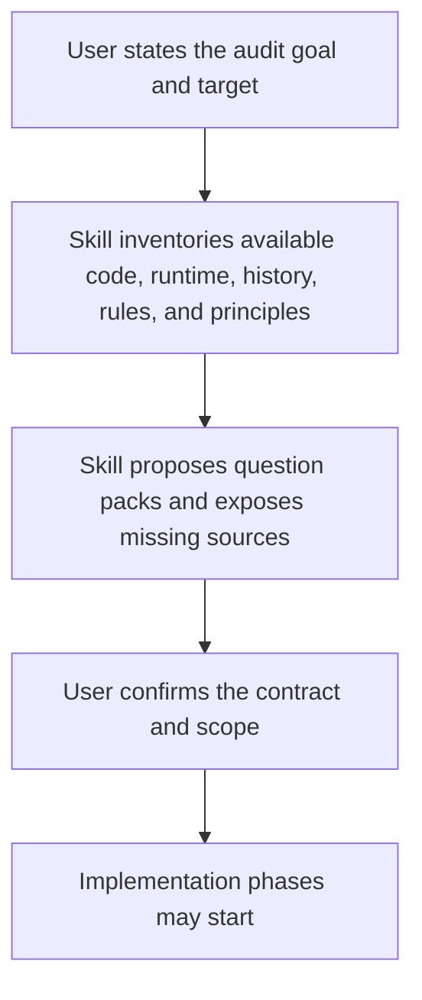
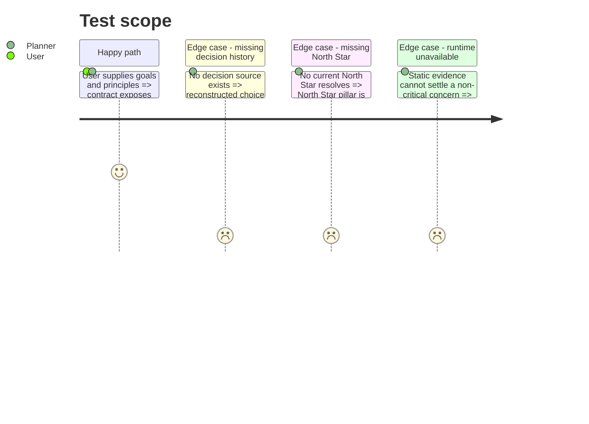

<!-- Fill or omit these sections; never add, rename, or reorder one. -->

# Instruction: Agree the V2 contract

## Architecture projection

> Tree of the final files. ✅ create · ✏️ modify · ❌ delete

```txt
plugins/aidd-dev/skills/04-audit/
└── references/
    ├── audit-contract.md                 ✅ canonical inputs, states, outputs, invariants, and failure modes
    ├── question-protocol.md              ✅ question -> hypothesis -> investigation -> verdict protocol
    ├── question-packs.md                 ✅ core prompts plus project-supplied principle packs
    └── report-contract.md                ✅ numbered files, ownership, cross-links, freshness, and document assembly
```

## User Journey



## Test Scope



## Tasks to do

### `1)` Define the audit state machine

> Make introspection useful without turning model sentiment into a verdict.

1. Define six states: `question`, `impression`, `hypothesis`, `investigation`, `finding`, and `unknown`.
2. Require every impression to name what evidence would confirm or refute it.
3. Permit promotion to `finding` only after evidence is inspected.
4. Route unsupported concerns to `unknown`; never silently discard or present them as facts.
5. Label reconstructed implementation decisions as inference unless history, ADRs, tickets, or source comments establish them.
6. Let decision quality determine inspection depth: underspecified, low-confidence, local-only, or irreversible choices receive deeper inspection.
7. Define runtime inputs as optional target path, scope, North Star sources, rule sources, memory path, current architecture sources, and budget.
8. Default the target to the current repository; discover source candidates there and record what resolved.
9. A missing source degrades only its dependent pillar to `unknown` or `skipped`; it never blocks unrelated pillars.

### `2)` Define the question contract

> Ask uncomfortable questions that reveal hidden assumptions and regrettable decisions.

1. Include pride and discomfort: “Would you defend this code?”, “What feels clever rather than clear?”, “What would embarrass you during an incident?”
2. Include blindness: “What can you not know from the available context?”, “Which assumptions have no validating observation?”
3. Include regret and counterfactuals: “Which decision was expedient but suboptimal?”, “What would you not choose again?”, “What became harder because of it?”
4. Include choice provenance: “Which choices came from the plan?”, “Which choices did the agent make because the work was underspecified?”, “Which choices are only inferred after the fact?”
5. Include generality: “Did this solve the class of problem or only the observed example?”, “Which local constant, buffer, threshold, or special case hides an unresolved cause?”
6. Include coherence: “Which two parts tell different stories?”, “Which rule is followed literally but violated in spirit?”
7. Include user and operational harm: “Where can the dashboard mislead?”, “Which failure looks like success?”, “What breaks silently?”
8. Include test value: “Which tests can pass while the product is broken?”, “Which tests protect no meaningful risk?”, “What important behavior has no witness?”
9. Include automation leverage: “Will this class recur?”, “What permanent guardrail would prevent it?”, “Could a fresh agent make the right choice from repository context alone?”
10. Allow a project to add questions sourced from AIDD rules, golden principles, architecture decisions, or domain constraints.
11. Exclude style preference, harmless drift, and low-impact completeness work from the default profile.

### `3)` Define the evidence and verdict contract

> Make every conclusion traceable and reproducible.

1. Accept evidence from code locations, runtime observations, screenshots, logs, commands, traces, coverage, git history, tickets, and normative documents.
2. Record criterion, observation, interpretation, confidence, impact, likelihood, reach, reproduction, and suggested next action.
3. Distinguish `pass`, `partial`, `fail`, `unknown`, and `disputed` control outcomes.
4. Replace the current health shortcut with a risk summary that cannot be “good” solely because no critical finding exists.
5. Define duplicate and contradiction rules before parallel execution is designed.
6. Set runtime policy to static-first: no general E2E; allow one bounded, read-only runtime probe only for a plausible critical defect that static evidence cannot settle.
7. For every decision, record provenance, confidence, alternatives, assumptions, scope, generality, reversibility, affected surfaces, and verification evidence.
8. Prefer a decision log captured by the implementing context; when absent, reconstruct from plans, history, code, and tickets and label every reconstructed choice.
9. For every recurring issue, select the strongest suitable infrastructure target:
   - executable invariant => type, schema, lint, static analysis, test, or CI;
   - domain or architectural guidance => rule, skill, memory, code comment, or canonical documentation;
   - runtime behavior => assertion, telemetry, alert, or operational check.
10. Keep E2E as a possible remediation recommendation when it is the right permanent guardrail, while preserving the audit's no-general-E2E execution policy.
11. Use this source hierarchy:
    - current code, configuration, schemas, lockfiles, and tests as implementation truth;
    - user-confirmed North Star sources as product truth;
    - active host rules and instructions as behavioral constraints;
    - `aidd_docs/memory/**` as maintained project knowledge to verify against code;
    - explicitly current architecture records as intended structure.
12. Exclude `aidd_docs/tasks/**`, old plans, past reviews, and other historical artifacts unless the user names one as a current normative source.
13. Limit each pillar to its five highest-impact confirmed findings; record material uncertainty, but omit cosmetic nits and exhaustive low-value inventories.

### `4)` Define the report package

> One folder, many small owned files, one deterministic reading order.

1. Require `aidd_docs/tasks/<yyyy_mm>/<yyyy_mm_dd>_audit_<scope>/`.
2. Reserve `00-summary.md` for the executive view and `01` to `14` for scope, nine core pillars, challenge, synthesis, actions, and coverage.
3. Give every file one exclusive owner role, stable finding IDs, source dependencies, and a last-verified marker.
4. Cross-link canonical findings instead of copying them between pillar, summary, and action files.
5. Define deterministic concatenation order so the folder can become one document without rewriting its contents.
6. Allow one pillar file to be refreshed without invalidating unrelated files; mark dependent synthesis files stale until regenerated.

### `5)` Hold the contract gate

> No audit implementation before the human agrees on what a valid audit means.

1. Present the question packs, evidence rules, report schema, and unresolved tradeoffs.
2. Ask for corrections to tone, rigor, project customisation, and acceptable runtime cost.
3. Revise the four reference files until the user explicitly approves the contract.

## Test acceptance criteria

| Task | Acceptance criteria                                                                                                                                          |
| ---- | ------------------------------------------------------------------------------------------------------------------------------------------------------------ |
| 1    | Runtime inputs are discovered from the current repository; missing sources degrade only dependent pillars and unsupported impressions remain unknown.     |
| 2    | The contract covers pride, blind spots, regret, choice provenance, generality, rules, memory truth, code hotspots, test value, and automation leverage.      |
| 3    | Findings accept static and runtime evidence, carry confidence and risk dimensions, and controls can remain unknown or disputed.                             |
| 4    | The report contract defines `00` to `14`, exclusive ownership, stable links, independent refresh, and deterministic document assembly.                      |
| 5    | The contract files are treated as unapproved until the user explicitly accepts them; phases 2 to 4 do not start before that gate.                           |
