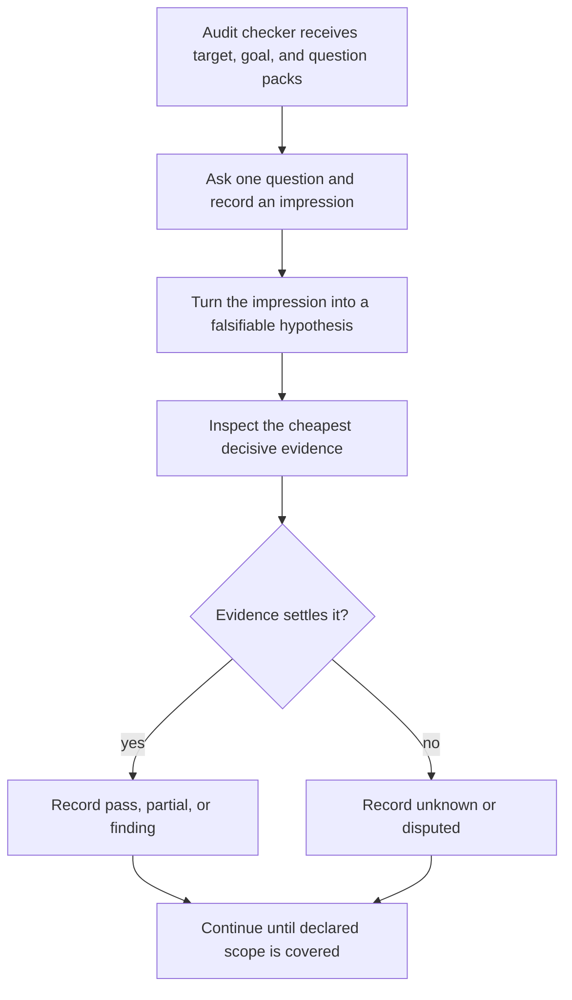
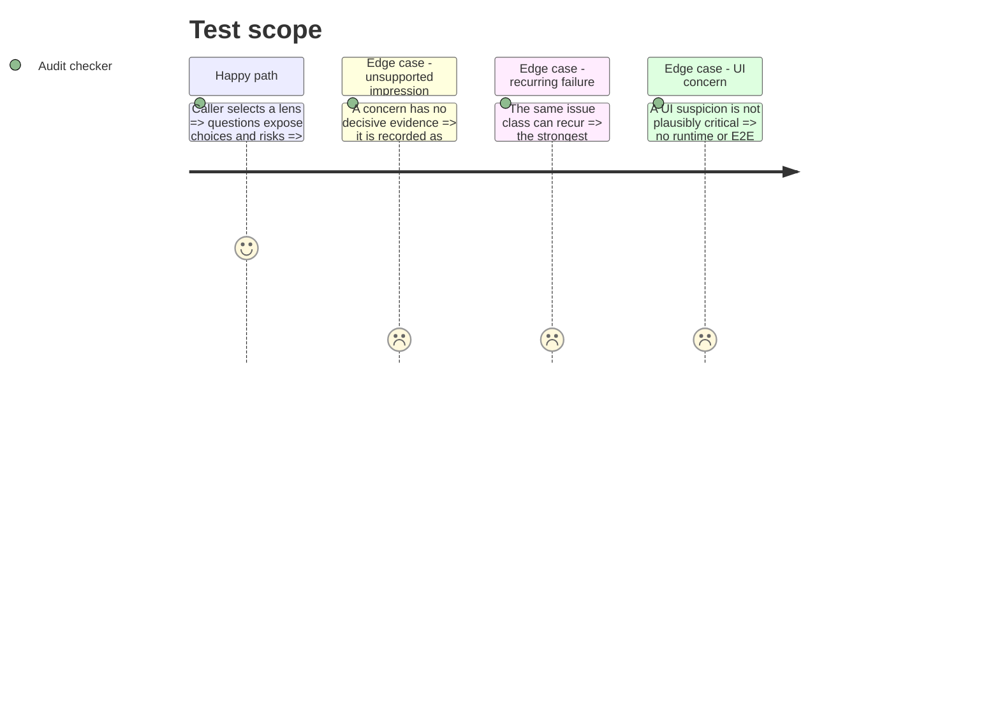

<!-- Fill or omit these sections; never add, rename, or reorder one. -->

# Instruction: Rebuild the audit recipe

## Architecture projection

> Tree of the final files. ✅ create · ✏️ modify · ❌ delete

```txt
plugins/aidd-dev/
├── README.md                                           ✏️ describe question-led, evidence-gated audits
└── skills/04-audit/
    ├── SKILL.md                                        ✏️ route profiles and enforce the approved V2 contract
    ├── actions/
    │   ├── 00-core.md                                  ✅ run and assemble the standalone 80/20 report
    │   ├── 01-code-quality.md                          ✏️ replace flat scan with lens-specific questions and probes
    │   ├── 02-architecture.md                          ✏️ add decision regret, drift, and counterfactual probes
    │   ├── 03-security.md                              ✏️ add threat assumptions and unknown-boundary probes
    │   ├── 04-dependencies.md                          ❌ remove non-core lens
    │   ├── 05-performance.md                           ✏️ add budget, measurement, and silent-degradation probes
    │   ├── 06-tests.md                                 ✏️ audit defect-detection value, assertions, realism, and cost
    │   ├── 07-ui.md                                    ❌ remove non-core lens
    │   ├── 08-north-star.md                            ✅ audit code against current product intent and critical outcomes
    │   ├── 09-rules-and-principles.md                  ✅ evaluate supplied rules and principles in letter and spirit
    │   ├── 10-memory-and-documentation.md              ✅ audit knowledge completeness, freshness, and code alignment
    │   ├── 11-decisions.md                             ✅ audit provenance, confidence, generality, and reversibility
    │   └── 12-automation.md                            ✅ convert recurring risks and tacit knowledge into infrastructure
    ├── assets/
    │   ├── audit-actions-template.md                   ✅ prioritised remediation sequence
    │   ├── audit-challenge-template.md                 ✅ accepted, rejected, merged, and disputed candidates
    │   ├── audit-coverage-template.md                  ✅ scanned, skipped, stale, inaccessible, and unknown
    │   ├── audit-template.md                           ✏️ render one owned pillar shard
    │   ├── audit-index-template.md                     ✅ ordered links, owners, status, and freshness
    │   ├── audit-scope-template.md                     ✅ target, resolved sources, exclusions, budget, and policy
    │   ├── audit-synthesis-template.md                 ✅ systemic patterns and canonical finding links
    │   └── audit-validator.yml                         ✅ closed report schema and required fields
    └── references/
        ├── audit-contract.md                           ✏️ only if implementation exposes an approved ambiguity
        ├── evidence-rubric.md                          ✅ evidence strength, confidence, risk, and promotion rules
        ├── question-protocol.md                        ✏️ connect the approved protocol to action execution
        └── question-packs.md                           ✏️ define the nine-pillar 80/20 profile plus optional lenses
```

## User Journey



## Test Scope



## Tasks to do

### `1)` Make the router profile-driven

> Preserve the useful pillars while allowing project-specific inquiry.

1. Accept the complete nine-pillar `core`, one named core pillar, or a custom question pack mapped to core pillars.
2. Resolve the target from arguments or the current repository, then discover North Star candidates, active host instructions, scoped project rules, memory, current architecture records, and user-supplied principles.
3. Show source conflicts and precedence uncertainty; never invent a canonical source.
4. Keep the recipe read-only and caller-agnostic; do not spawn agents here.
5. Require the audit contract and relevant action file to be read before scanning.

### `2)` Convert each action to inquiry plus verification

> The model should reason broadly, then prove narrowly.

1. Give every lens opening questions, likely probes, decisive evidence, and explicit non-goals.
2. Replace generic “scan for” instructions with the approved state machine.
3. Upgrade the tests lens from coverage counting to risk protection and defect-detection value.
   - Map each meaningful test group to the user or system risk it protects.
   - Ask which plausible regression or mutation would make the test fail.
   - Compare signal quality with runtime, flakiness, fixture complexity, duplication, and maintenance cost.
   - Classify it as `protective`, `redundant`, `brittle`, `ceremonial`, or `misleading`.
   - Recommend `keep`, `rewrite`, `merge`, or `delete`; recommend deletion only when no distinct protected risk remains.
4. Prohibit a general E2E pass; permit one targeted runtime probe only for a plausible critical defect that static evidence cannot settle.
5. Make performance conclusions depend on a stated budget or measurement; otherwise retain them as hypotheses or unknowns.
6. Add conformance checks that cite the exact normative statement and distinguish literal compliance from intent compliance.
7. Audit choices before implementation detail: inventory specified, agent-made, and retrospectively inferred choices; deepen inspection around low-confidence, local-only, or irreversible choices.
8. Audit automation leverage: treat repeated review feedback, tribal knowledge, recurring fixes, and extra prompting as candidates for permanent repository infrastructure.
9. Make the default profile ignore historical task artifacts, skip cosmetic findings, stop each pillar at five high-impact findings, and expose no non-core lens.

### `3)` Replace the report contract

> Preserve the audit's reasoning, not just its conclusions.

1. Give controls and findings stable IDs.
2. Record the originating question, criterion, evidence kind, evidence reference, interpretation, confidence, impact, likelihood, reach, reproduction, next action, and effort.
3. Add separate sections for confirmed findings, passed controls, unknowns, disputes, systemic patterns, coverage, and top actions.
4. Validate the report against a closed schema without requiring every proof to be a `file:line`.
5. Keep the report concise by linking evidence rather than pasting logs or duplicating source text.
6. Add a decision table with provenance, confidence, alternatives, assumptions, generality, reversibility, evidence, and verdict.
7. Add an automation-candidate table with recurrence, current human or token cost, proposed enforcement layer, leverage, false-positive risk, and owner.

## Test acceptance criteria

| Task | Acceptance criteria                                                                                                                                      |
| ---- | -------------------------------------------------------------------------------------------------------------------------------------------------------- |
| 1    | A caller can run the complete nine-pillar core, one named core pillar, or a custom question pack mapped to core pillars; the recipe never spawns an agent. |
| 1    | With no explicit paths, the skill audits the current repository, records discovered sources, and skips only pillars whose required source is absent.      |
| 2    | Every lens follows question → hypothesis → evidence → verdict, and conformance checks cite both the rule and implementation evidence.                    |
| 2    | Choice review leads implementation inspection but never replaces targeted verification of undeclared choices, drift, correctness, or security.          |
| 2    | A repeated issue yields an automation candidate at the strongest suitable layer, while one-off preferences do not become permanent machinery.           |
| 2    | The default profile ignores old plans, caps each pillar at five consequential findings, and emits no cosmetic style nits.                               |
| 3    | Test findings name the protected risk, plausible regression, signal quality, and cost; coverage percentage alone is never a finding.                    |
| 3    | A delete recommendation proves that the test protects no distinct risk beyond another cheaper test; uncertainty never becomes a deletion recommendation. |
| 3    | Runtime-only conclusions cite runtime evidence, unsupported concerns remain unknown, and the rendered report passes its schema validator.               |
