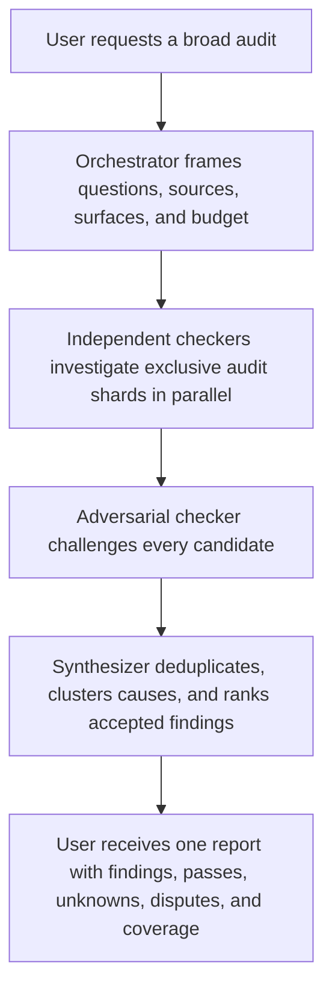
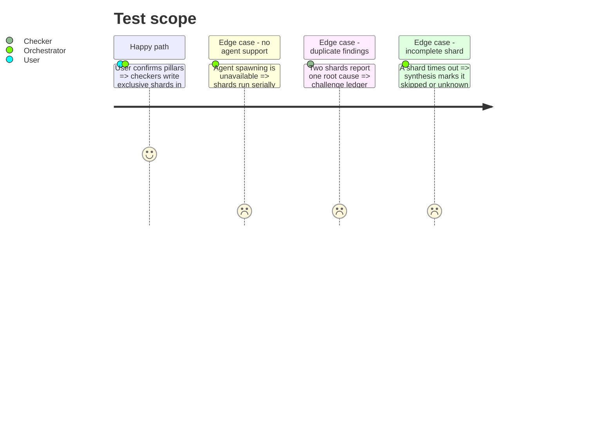

<!-- Fill or omit these sections; never add, rename, or reorder one. -->

# Instruction: Orchestrate independent audit checkers

## Architecture projection

> Tree of the final files. ✅ create · ✏️ modify · ❌ delete

```txt
plugins/aidd-orchestrator/
├── .claude-plugin/plugin.json                         ✏️ register the audit orchestration skill
├── README.md                                          ✏️ document the audit use case and portability behavior
├── CATALOG.md                                         ✏️ regenerate the plugin catalog
└── skills/01-audit/
    ├── SKILL.md                                       ✅ frame → fan-out → challenge → synthesize router
    ├── actions/
    │   ├── 01-frame.md                                ✅ inventory surfaces, sources, questions, budget, and shards
    │   ├── 02-fan-out.md                              ✅ one isolated checker per non-overlapping audit shard
    │   ├── 03-challenge.md                            ✅ reject weak, duplicate, and contradictory candidate findings
    │   └── 04-synthesize.md                           ✅ write the sole merged report from accepted shards
    └── references/
        ├── orchestration-contract.md                  ✅ ownership, concurrency, fallback, and stop conditions
        └── synthesis-rubric.md                        ✅ deduplication, conflict handling, ranking, and completeness
aidd_docs/tasks/<yyyy_mm>/<yyyy_mm_dd>_audit_<scope>/
├── 00-summary.md                                      ✅ synthesizer: executive view and ordered contents
├── 01-scope-and-system-map.md                         ✅ framer: target, surfaces, sources, exclusions, budgets
├── 02-north-star.md                                   ✅ checker instance: current product intent, critical outcomes, code divergence
├── 03-rules.md                                        ✅ checker instance: active rules, violations, letter and spirit
├── 04-memory.md                                       ✅ checker instance: memory claims versus current code and usage
├── 05-architecture-and-decisions.md                   ✅ checker instance: boundaries, divergence, uncertainty, generality
├── 06-code-hotspots.md                                ✅ checker instance: oversized, complex, duplicated, dead, or risky code
├── 07-tests-value.md                                  ✅ checker instance: protected risk, assertions, redundancy, flake, cost
├── 08-security-and-data.md                            ✅ checker instance: auth, privacy, integrity, unsafe boundaries
├── 09-performance-and-reliability.md                  ✅ checker instance: slow paths, heavy files, failure modes, observability
├── 10-automation-and-knowledge-infrastructure.md      ✅ checker instance: recurring work, tacit knowledge, permanent guardrails
├── 11-challenge-ledger.md                             ✅ checker: accepted, rejected, duplicate, disputed candidates
├── 12-systemic-findings.md                            ✅ synthesizer: cross-pillar causes and canonical finding links
├── 13-prioritized-actions.md                          ✅ synthesizer: highest-leverage fixes and automation investments
└── 14-coverage-and-unknowns.md                        ✅ synthesizer: examined, skipped, stale, inaccessible, uncertain
```

## User Journey



## Test Scope



## Tasks to do

### `1)` Frame a bounded audit

> Parallelism begins only after scope and ownership are deterministic.

1. Inventory current code surfaces, North Stars, active rules, memory, data boundaries, and only the history needed to establish a material architectural decision.
2. Resolve the target from the user's argument or current repository; treat every other source path as an optional runtime discovery result.
3. Select question packs based on the stated audit goal, using files `02` to `10` as the default 80/20 pillar set.
4. Let the user add, remove, split, merge, or reorder pillars before spawning; filenames become stable after confirmation.
5. Split by independent lens or surface; give each shard an identifier, exclusive output file, and explicit exclusions.
6. Set agent count, concurrency cap, tool/time budget, runtime access, and stop conditions.
7. Ask one blocking question only when unresolved precedence would materially change a high-impact verdict; otherwise mark the dependent pillar unknown or skipped.
8. Set `runtime-policy: static-first`; never schedule a broad E2E pass as an audit shard.

### `2)` Fan out without contaminating evidence

> Independent contexts should create independent judgments.

1. Spawn one existing `checker` instance per pillar shard and brief it to invoke the audit recipe.
2. Discover the audit recipe by capability, never by a hard-coded sibling plugin name.
3. Give each checker the approved contract, target, question pack, normative sources, exclusions, evidence budget, stop conditions, and unique shard path.
4. Prevent agents from editing application code or the merged report.
5. Run more pillars than available concurrency in waves; do not reduce the pillar set to the host's slot count.
6. When agents are unavailable, run shards serially and mark independence as unavailable.

### `3)` Challenge candidate findings

> Treat eloquent self-critique as guilty until proven.

1. Spawn fresh checker instances over non-overlapping groups of completed shards; give them findings and evidence, not originating hidden reasoning.
2. Reject findings that lack a criterion, decisive evidence, reproducibility, or a plausible impact.
3. Merge duplicates only when they share the same underlying cause.
4. Mark incompatible interpretations as disputed; do not average them into certainty.
5. Write every challenge decision to `11-challenge-ledger.md`; preserve rejected candidates with the rejection reason outside final findings.

### `4)` Synthesize one risk-ranked report

> One owner converts shards into a coherent system view.

1. Validate every shard against the V2 report schema and its exclusive owner.
2. Cluster accepted findings into systemic causes and isolated symptoms.
3. Rank by impact, likelihood, reach, confidence, and remediation effort.
4. Report positive controls, unknowns, disputes, skipped surfaces, runtime limitations, and independence level.
5. Write `00` and `12` to `14` only after every shard is completed, skipped with reason, or timed out.
6. Assemble a transferable document by concatenating `00` to `14`; never maintain a second copy of the prose.

## Test acceptance criteria

| Task | Acceptance criteria                                                                                                                                       |
| ---- | --------------------------------------------------------------------------------------------------------------------------------------------------------- |
| 1    | The user can confirm the default `02` to `10` pillar set, and every confirmed surface belongs to one named shard or is explicitly skipped with a reason.   |
| 2    | One checker instance owns each pillar file and runs the audit recipe in parallel waves; unavailable agent support produces a disclosed serial run.       |
| 3    | Speculative, duplicate, and contradictory candidates are respectively rejected, merged by cause, or marked disputed with the challenge decision retained. |
| 4    | `00` to `14` form one ordered, cross-linked report package that can be refreshed per shard and concatenated without duplicate source prose.                |
