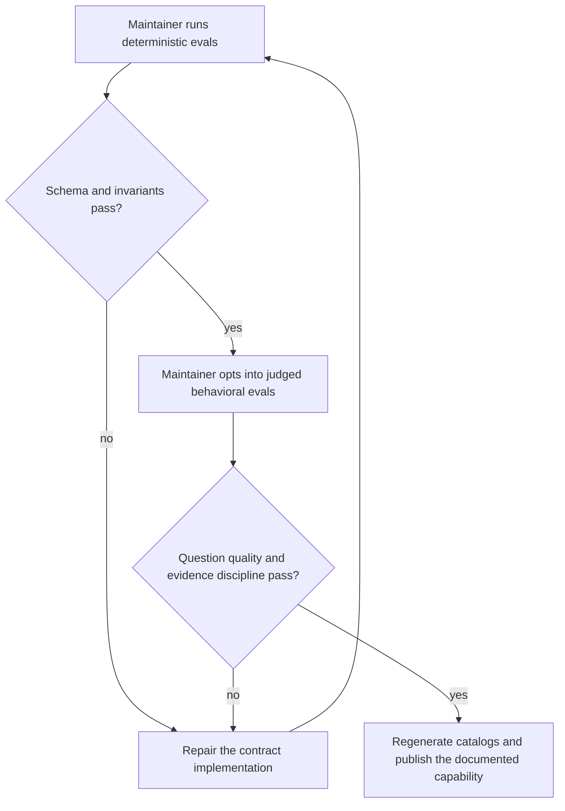
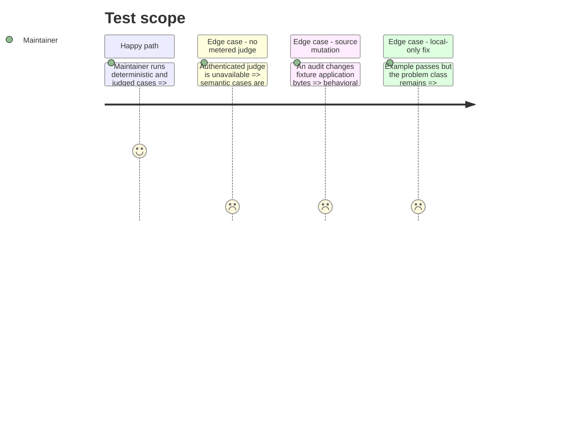

<!-- Fill or omit these sections; never add, rename, or reorder one. -->

# Instruction: Prove behavior and publish

## Architecture projection

> Tree of the final files. ✅ create · ✏️ modify · ❌ delete

```txt
scripts/
├── skill-eval.mjs                                    ✏️ accept cases from skills outside aidd-refine
└── skill-eval/
    ├── README.md                                      ✏️ document audit and orchestration evals
    └── cases.json                                     ✏️ add deterministic and judged V2 audit cases
plugins/
├── aidd-dev/CATALOG.md                               ✏️ regenerate entries for the V2 files
└── aidd-orchestrator/CATALOG.md                      ✏️ regenerate entries for the audit orchestrator
README.md                                             ✏️ sync plugin skill counts if generated checks require it
```

## User Journey



## Test Scope



## Tasks to do

### `1)` Generalise the behavioral harness

> Test the worktree skill, never a globally installed copy.

1. Let each case identify its source plugin and skill folder.
2. Preserve unique temporary skill names and isolated project settings.
3. Add deterministic assertions for files, closed sections, statuses, evidence references, and forbidden unsupported findings.
4. Keep semantic quality behind the explicit metered judge mode.

### `2)` Add adversarial audit cases

> Test failure modes, not only the happy report shape.

1. A “not proud” impression without evidence remains an unknown.
2. A documented rule plus violating code produces a conformance finding citing both.
3. A high coverage suite with weak assertions produces a test-value finding without treating coverage itself as the problem.
4. Two audit checkers reporting one root cause produce one merged finding.
5. Conflicting interpretations remain disputed.
6. Missing runtime or agent support is disclosed and never fabricated.
7. A screenshot, log, or runtime observation is accepted as evidence without a fake `file:line`.
8. A normal UI audit performs no E2E; only a plausible critical suspicion can trigger one bounded runtime probe with its escalation reason recorded.
9. A declared high-confidence decision narrows inspection but cannot suppress contradictory implementation evidence.
10. A local fix that passes its example while leaving the general cause intact is rejected as non-general.
11. Repeated review feedback produces a concrete knowledge-infrastructure candidate; a one-off preference does not.
12. Historical plans containing obsolete statements do not produce findings unless explicitly declared current.
13. A stale memory claim contradicted by current code produces a memory finding.
14. A pillar with more than five valid issues reports only its five highest-impact findings and records the prioritisation boundary.
15. With no target argument, the current repository is audited.
16. With no North Star source, only the North Star pillar is skipped and every source-independent pillar still completes.

### `3)` Run structural and behavioral validation

> Prove portability, report validity, and question-to-evidence discipline.

1. Run Markdown link, JSON/YAML, frontmatter, argument-hint, and catalog checks.
2. Run deterministic audit evals.
3. Run judged evals when an authenticated headless model is available; report metered checks as skipped otherwise.
4. Execute one fixture audit across at least three lenses and inspect its merged report.
5. Verify the application fixture remains byte-for-byte unchanged.

### `4)` Publish the new contract

> Make the feature discoverable without duplicating its canonical rules.

1. Update the two plugin landing pages with their distinct responsibilities.
2. Link documentation to the canonical audit contract and orchestration contract.
3. Regenerate catalogs and derived counts.
4. Record known limitations: model variance, runtime access, historical intent inference, cost, and host agent support.

## Test acceptance criteria

| Task | Acceptance criteria                                                                                                                                      |
| ---- | -------------------------------------------------------------------------------------------------------------------------------------------------------- |
| 1    | Eval cases can load both development and orchestration skills from the worktree under unique temporary names.                                           |
| 2    | The suite catches unsupported sentiment-as-fact, duplicated roots, hidden disagreement, fabricated runtime evidence, and undisclosed serial fallback.   |
| 3    | Structural checks and deterministic evals pass; metered judged eval status is reported; the fixture source is unchanged after a full audit.              |
| 4    | Plugin documentation exposes the V2 capability and its limitations while linking, rather than copying, the canonical contracts.                          |
