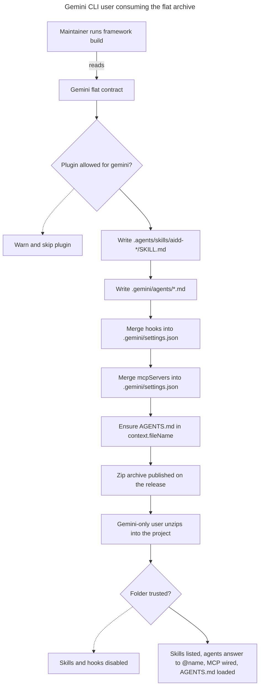

# Instruction: Gemini CLI flat build target

## Feature

- **Summary**: Register `gemini` as the sixth AI tool and give it a flat framework-build contract, so a single archive materializes skills, agents, MCP servers, hooks and the `AGENTS.md` context wiring into a Gemini CLI project.
- **Stack**: `Node.js >= 22.12`, `TypeScript (ESM, relative .js imports)`, `vitest`, `biome`, `tsup`, `pnpm`, `Gemini CLI >= 0.28.0 (verified against 0.52.0)`
- **Branch name**: `feat/511-gemini-flat-build-target`
- **Parent Plan**: `./2026_07_27-511-gemini-cli-tool-master.md`
- **Sequence**: `1 of 4`
- Confidence: 9/10
- Time to implement: one session

## Architecture projection

### Files to modify

- `cli/src/domain/models/tool-ids.ts` - add `"gemini"` to the `AiToolId` union and `AI_TOOL_IDS`; this also appends `.gemini.md` to the derived `ALL_TOOL_SUFFIXES` of three capabilities
- `cli/src/domain/models/framework-build.ts` - add `"gemini"` to `FrameworkBuildTarget`
- `cli/src/domain/models/framework.ts` - add the config-name constant for the gemini settings source, if a framework-sourced config is used
- `cli/src/domain/tools/build-contract.ts` - add the optional plugin-exclusion field consumed by the build strategies
- `cli/src/application/use-cases/framework/strategies/build-output-strategy.ts` - add `shouldBuildPlugin(name)` to the strategy interface
- `cli/src/application/use-cases/framework/strategies/flat-build-strategy.ts` - implement `shouldBuildPlugin` from the contract
- `cli/src/application/use-cases/framework/strategies/marketplace-build-strategy.ts` - implement `shouldBuildPlugin` as always true
- `cli/src/application/use-cases/framework/framework-build-use-case.ts` - skip plugins the strategy rejects, in the plugin loop
- `cli/src/application/use-cases/framework/strategies/tool-contracts.ts` - add `buildGeminiFlatContract()` declaring all six artifact kinds
- `cli/src/infrastructure/deps.ts` - side-effect import of the gemini tool module, import of the contract builder, and the `gemini:flat` registry row
- `cli/src/infrastructure/assets/asset-loader.ts` - `CONFIG_ASSETS` is an exhaustive `Record<ToolId, ...>`; the gemini entry is mandatory or the build fails to compile
- `cli/src/application/commands/framework.ts` - `SUPPORTED_TARGETS` and the `--target` help text
- `cli/src/application/commands/ai.ts` - the `ai` command description
- `cli/src/application/use-cases/menu-use-case.ts` - the interactive tool prompt hint
- `cli/src/domain/formats/flat-hooks-merge.ts` - generalize the existing settings-hooks merge and add the Claude to Gemini event mapping
- `cli/src/domain/formats/flat-paths.ts` - the header comment enumerating five tools
- `cli/biome.json` - add `!.gemini` to the ignore list
- `cli/package.json` - add the `gemini` keyword
- `cli/tests/golden/framework-build-golden.e2e.test.ts` - add `"gemini"` to `FLAT_TARGETS`, retitle the matrix from 9 to 10 cells
- `cli/tests/golden/snapshots/framework-build/golden.json` - additive regeneration: exactly one new `gemini:flat` key, the nine existing keys byte-identical
- `cli/tests/domain/models/tool-config.unit.test.ts` - the two exact-array assertions
- `cli/tests/domain/models/tool-ids.unit.test.ts` - `isAiToolId("gemini")`
- `cli/tests/application/use-cases/helpers.ts` - side-effect import so `getToolConfig("gemini")` resolves
- `cli/tests/helpers/ports/build-unit-deps.ts` - same side-effect import
- `cli/tests/infrastructure/assets/asset-loader.unit.test.ts` - a gemini `loadConfigAsset` block
- `cli/tests/application/use-cases/framework/flat-build-strategy.integration.test.ts` - a `.gemini/settings.json` emission block and the hooks-then-mcp write-order assertion
- `cli/tests/e2e/framework-build.e2e.test.ts` - `--target gemini --flat` succeeds, `--target gemini` without `--flat` exits 1
- `.github/workflows/ci.yml` - add the `{ tool: gemini, mode: flat, flag: "--flat" }` matrix row and update the 9-cell comment

### Files to create

- `cli/src/domain/tools/ai/gemini.ts` - the `AiTool` definition and its `registerTool` call
- `cli/src/domain/formats/gemini-settings-merge.ts` - the single authority on `.gemini/settings.json`: additive `mcpServers`, additive `hooks`, and an idempotent array union guaranteeing `AGENTS.md` in `context.fileName`
- `cli/assets/configs/gemini/settings.json` - the greenfield settings seed carrying the nested `context.fileName`
- `cli/tests/domain/tools/ai/gemini.unit.test.ts` - mirror of the codex tool test
- `cli/tests/domain/formats/gemini-settings-merge.unit.test.ts` - merge, idempotence, user-prime, array-union and triple-writer coverage
- `cli/tests/application/use-cases/framework/gemini-plugin-exclusion.integration.test.ts` - the excluded plugin is absent from the gemini output and present in every other target

### Files to delete

None. Two dead surfaces were identified and are deliberately left alone as out of scope: `detectUserFileSectionKey` (five implementations, zero callers in `src/`) and the `contentSections` branch (always empty in production).

## Applicable rules

| Tool   | Name                     | Path                                                                    | Why it applies |
| ------ | ------------------------ | ----------------------------------------------------------------------- | -------------- |
| claude | 0-hexagonal              | `cli/.claude/rules/00-architecture/0-hexagonal.md`                      | The tool definition belongs in `domain/tools/ai/`, the merge in `domain/formats/` |
| claude | 0-layer-responsibilities | `cli/.claude/rules/00-architecture/0-layer-responsibilities.md`         | The contract stays domain; no tool logic enters the use-cases |
| claude | 0-error-handling         | `cli/.claude/rules/00-architecture/0-error-handling.md`                 | The three-writer collision on one settings file must raise a typed error, never be swallowed |
| claude | 0-deps-wiring            | `cli/.claude/rules/00-architecture/0-deps-wiring.md`                    | `deps.ts` and `commands/framework.ts` are both modified |
| claude | 1-exports                | `cli/.claude/rules/01-standards/1-exports.md`                           | Named exports only, no barrel file |
| claude | 1-naming                 | `cli/.claude/rules/01-standards/1-naming.md`                            | `gemini.ts`, `*.unit.test.ts`, `*.integration.test.ts`, `*.e2e.test.ts` |
| claude | 2-typescript             | `cli/.claude/rules/02-programming-languages/2-typescript.md`            | Relative `.js` imports, `import type`, no `any` |
| claude | 3-cli-lifecycle          | `cli/.claude/rules/03-frameworks-and-libraries/3-cli-lifecycle.md`     | `SUPPORTED_TARGETS` and the `--target` flag surface change |
| claude | 3-cli-output             | `cli/.claude/rules/03-frameworks-and-libraries/3-cli-output.md`        | An unmapped hook event and an excluded plugin are `warn`, never `error` |
| claude | 4-biome                  | `cli/.claude/rules/04-tooling/4-biome.md`                               | `biome.json` is modified and all new TypeScript must pass `biome check` |
| claude | 6-method-size            | `cli/.claude/rules/06-design-patterns/6-method-size.md`                 | The contract builder and the merge functions must stay at or under 20 lines per method |
| claude | 7-clean-code             | `cli/.claude/rules/07-quality/7-clean-code.md`                          | No placeholder artifact kinds, no stub reserved for a later part |

Not selected: `4-git-hooks` (`lefthook.yml` untouched) and `7-auth` (no auth path touched).

The project's own `tool` skill (`cli/.claude/skills/tool/`) is the sanctioned entry point: run actions 01 through 05. Use `format` for the merge module, `capability` only if a capability constructor changes, and `test` for every new suite.

## User Journey

## Risk register

| Risk | Impact | Mitigation |
| --- | --- | --- |
| `context.fileName` is an array and user-prime merge keeps the user's value | `AGENTS.md` never loaded, success criterion silently fails | The merge module performs an idempotent, order-preserving array union and never removes an entry; a unit test covers a pre-existing user list |
| Three writers on `.gemini/settings.json` | One writer clobbers another's key | All three delegate to the one authority module; write order is hooks then mcp per plugin, then the settings seed; an integration test asserts all three keys survive |
| Adding `gemini` to `AI_TOOL_IDS` appends `.gemini.md` to every other tool's suffix exclusion list | Silent behaviour change for the five existing tools | The golden test is the guard: the nine existing cells must stay byte-identical, so any leakage fails the build |
| Skills rendering diverges from codex on the shared tree | Two tools write different bytes to one path, permanent drift downstream | Gemini reuses codex's skills artifact contract verbatim; a test asserts gemini's `.agents/skills/**` is a byte-identical subset of codex's |
| Adding a `gemini:marketplace` row by reflex | An unsupported mode appears to work | The row is deliberately absent; an e2e test asserts `--target gemini` without `--flat` exits 1 |
| Gemini CLI below 0.28.0 | The archive lands but no skill is ever discovered | Documented as a prerequisite in part 4; nothing in the build can detect it |

## Implementation phases

### Phase 1: Register the tool identity

> Make `gemini` a known tool id everywhere the type system demands it, with nothing behavioural yet.

#### Tasks

1. Extend the `AiToolId` union and `AI_TOOL_IDS`.
2. Extend `FrameworkBuildTarget`.
3. Add the mandatory `CONFIG_ASSETS` entry and the settings seed asset it loads.
4. Fix the two exact-array test assertions and the `isAiToolId` test.
5. Add the side-effect imports to both test helper modules (plus `deps.ts`, so production registration lands atomically too).
6. 🤖 Write `domain/tools/ai/gemini.ts` (`AiTool<HasAgents & HasSkills & HasMcp & HasPlugins>`, `registerTool` at module bottom) — pulled forward from Phase 4. See Amendments.

#### Acceptance criteria

- [x] `pnpm typecheck` exits 0 with no `Record<ToolId, ...>` exhaustiveness error
- [x] `pnpm test:unit` exits 0
- [x] The nine existing golden cells are unchanged (`pnpm test:e2e` on the golden suite exits 0 without regeneration)

### Phase 2: Own the settings file

> One module becomes the single authority on `.gemini/settings.json`, before any writer uses it.

#### Tasks

1. ~~Generalize the existing settings-hooks merge helper~~ — new module `domain/formats/gemini-settings-merge.ts` (Gemini's event vocabulary and settings shape are distinct enough from Claude/Cursor/Codex's that a parallel `mergeGeminiSettingsHooks` was clearer than threading a fourth branch through `flat-hooks-merge.ts`; still a pure function following the exact same `(existing, incoming) => {content, warnings}` contract).
2. Add the Claude to Gemini hook event mapping (`GEMINI_HOOK_EVENT_MAP`), verified against the shipped `gemini-cli` 0.52.0 bundle's own `gemini hooks migrate --from-claude` table.
3. 🤖 The additive `mcpServers` merge needs no new code: gemini's shape is byte-identical to `.mcp.json`'s (verified), so Phase 4 reuses `mergeVscodeMcp(existing, incoming, force, "mcpServers")` directly — the tool skill's own rule ("generalize a helper rather than reimplement it").
4. Implement the idempotent `context.fileName` array union (`mergeGeminiSettingsSeed`).
5. Emit a `warn` for any source hook event with no Gemini equivalent, and drop it rather than write an invalid event name.
6. Write the unit suite: empty file, user keys preserved, idempotence, pre-existing user `context.fileName` list (array and string forms), unmapped event.

#### Acceptance criteria

- [x] Merging twice produces identical bytes
- [x] A pre-existing user `context.fileName` array retains its entries and gains `AGENTS.md`
- [x] A user-authored unrelated key in the settings file survives every merge
- [x] An unmapped hook event produces a warning and no output entry

### Phase 3: Add the plugin-exclusion mechanism

> Let a build contract exclude a plugin, with zero per-tool branching in the orchestrators.

#### Tasks

1. Add the optional exclusion field to the tool build contract.
2. Add the predicate to the build-output strategy interface.
3. Implement it in both strategies: contract-driven for flat, always true for marketplace.
4. Skip rejected plugins in the build use-case plugin loop, emitting one `warn` per skip.
5. 🤖 Write the integration test proving the mechanism (excluded plugin absent, other plugin present, skip reported, excluded from returned results) — named `plugin-exclusion.integration.test.ts`, not `gemini-plugin-exclusion...`, since gemini's real contract (excluding `aidd-orchestrator`) doesn't exist until Phase 4; tested here against a synthetic codex-contract override instead. See Amendments.

#### Acceptance criteria

- [x] The build use-case contains no tool-name literal
- [x] A grep for `if (tool === ` and `if (kind === "agents")` in both orchestrators returns nothing
- [x] Skipping a plugin is reported on stderr, and no skip is silent

### Phase 4: Declare the gemini flat contract

> The build contract, reusing codex's skills rendering verbatim. The tool definition itself
> (`domain/tools/ai/gemini.ts`) landed in Phase 1 — see its Amendments entry.

#### Tasks

1. ~~Write the tool definition~~ — done in Phase 1 (`agents`, `skills`, `mcp`, `plugins: unsupported`; no `configOutputPaths`). `hooks` and `settings` capabilities (install-mode fidelity) are deliberately not on gemini's `AiTool` yet — they need real per-tool merge logic (Claude→Gemini hook event translation, `context.fileName` array union) that today's generic install pipeline can't express without a capability-class change. Out of this part's objective (`aidd framework build`, not `aidd install`); tracked for Part 3 (registry citizen).
2. Write the flat contract declaring all six artifact kinds, with rules and commands explicitly unsupported, and `excludedPlugins: ["aidd-orchestrator"]` (Phase 3's mechanism, applied for real).
3. Reuse codex's skills path and transform without copying them; extract a shared helper if needed.
4. Wire the contract and the module import into the dependency graph, and add the target to the command surface and its help text.
5. Add the CI matrix row.
6. Add `gemini-plugin-exclusion.integration.test.ts` — the real gemini contract excludes `aidd-orchestrator` and builds every other plugin (Phase 3's test covered the generic mechanism only, against a synthetic contract).

#### Acceptance criteria

- [x] All six artifact kinds are declared; none is omitted
- [x] No `gemini:marketplace` row exists, and `--target gemini` without `--flat` exits 1
- [x] Skills, agents, MCP and hooks all land at the mapped paths in a real build
- [x] `.gemini/settings.json` contains `mcpServers`, `hooks` and `context.fileName` simultaneously

### Phase 5: Prove it against the real binary

> Green tests prove the output shape, not that Gemini consumes it. Verify empirically, as the project's testing memory requires.

#### Tasks

1. Build the archive into a fresh `/tmp` directory, never the repo root.
2. `git init` the directory and trust it, using a sandboxed home so the real user configuration is untouched.
3. Run `gemini skills list --all` and confirm the AIDD skills are discovered and enabled.
4. Confirm the agents directory parses: no `AgentLoadError`, given the strict frontmatter schema.
5. Confirm `AGENTS.md` is picked up as context.
6. Regenerate the golden snapshot additively and diff the nine existing keys.

#### Acceptance criteria

- [x] `gemini skills list --all` lists every published AIDD skill from `.agents/skills/`
- [x] No agent file is rejected by the strict frontmatter schema
- [x] The nine pre-existing golden keys are byte-identical to the pre-change baseline
- [x] `cd cli && pnpm typecheck && pnpm lint && pnpm test` exits 0 — modulo 2 pre-existing, environment-coupled failures; see Amendments

## Amendments

<!-- AI-initiated changes during implementation. Each entry is prefixed with 🤖. -->

🤖 `pnpm test`'s two failures (`self-update --check`, `auth status`) are pre-existing and environment-coupled, not caused by this work: both assert an *unauthenticated* exit code/message, but this dev machine has `gh auth login` active, so the CLI's real auth-detection correctly reports authenticated — the opposite of what the test hard-codes. Confirmed unrelated to gemini: same 2 failures were already present in Phase 1's baseline run, before any gemini-specific code existed beyond tool-id registration, and CI runners (no local `gh` session) don't carry this state. Left as-is; not in this plan's scope to fix a local-environment test assumption.

🤖 Phase 1/Phase 4 boundary was unsound as originally scoped: adding `"gemini"` to `AI_TOOL_IDS` (Phase 1) without also calling `registerTool(gemini)` (originally Phase 4 task 1) broke every existing test that spreads `AI_TOOL_IDS` as "install all tools" (`tests/application/use-cases/setup-use-case.unit.test.ts`, 3 failures — `UnregisteredToolError: Tool 'gemini' is not registered.`), because `AI_TOOL_IDS` is the real runtime source of truth for "which AI tools does `all` install," not just a type-level list. This would have shipped a crash in the real CLI (`aidd setup --tools all`) had Phase 1 landed alone. Flagged to the user; resolved by pulling the tool-definition write (`domain/tools/ai/gemini.ts`) into Phase 1, atomic with the id registration. Phase 4 shrinks accordingly (its task 1 is struck).

🤖 Extracted `AGENTS_SKILLS_PREFIX` (`.agents/skills/`) from tool-contracts.ts's module-private `CODEX_SKILLS_PREFIX` into `domain/formats/flat-paths.ts` as a shared, exported constant, and pointed gemini's flat skill path at the same constant — the actual "extract a shared helper" the plan's Phase 4 task 3 asked for, satisfying the byte-identical-subset requirement by construction (same prefix, same `genericFlatSkillPath` primitive, same `rewriteSkillName: true`) rather than by convention alone.

🤖 Gemini's flat agent transform rebuilds frontmatter from scratch as `{ name, description }` only (dropping everything else, including `tools`), because Gemini's real agent schema (confirmed against the shipped `gemini-cli` 0.52.0 bundle) is a Zod `.strict()` schema — any surviving unknown key throws `AgentLoadError`. This mirrors the codebase's own established pattern (claude/cursor/opencode's flat-agent transforms already rebuild frontmatter rather than pass it through) rather than inventing a new one, and avoids the unresolved question of mapping AIDD/Claude tool names (`Edit`, `Bash`, ...) to Gemini's own tool identifiers (`replace`, `run_shell_command`, ...) — real, but out of this part's scope; Phase 5's real-binary check is what actually proves no agent gets rejected.

🤖 `gemini-plugin-exclusion.integration.test.ts` (real contract) and the e2e gemini test both had to work around `tests/fixtures/framework`'s single-plugin marketplace: the shared fixture carries no `aidd-orchestrator` entry (adding one would perturb every other target's golden output, since all nine existing build-target tests iterate the same fixture marketplace). The integration test overlays a synthetic `aidd-orchestrator` plugin directly into the in-memory fs (same pattern as Phase 3's generic test); the e2e test drops the orchestrator-exclusion assertion entirely and only proves the real CLI invocation succeeds with the expected `.gemini/settings.json` shape, deferring to the integration test for the exclusion proof itself.

🤖 Phase 3's integration test is generic (`plugin-exclusion.integration.test.ts`, spreading `{ ...buildCodexFlatContract(), excludedPlugins: [...] }`), not gemini-specific, because gemini's own flat contract doesn't exist yet at this point in the phase order — it lands in Phase 4. Phase 4 gets its own task to add the plan's originally-named `gemini-plugin-exclusion.integration.test.ts` against the real contract excluding `aidd-orchestrator`.

🤖 gemini's `AiTool` capability intersection is `HasAgents & HasSkills & HasMcp & HasPlugins` — narrower than codex/opencode. Deliberately omitted: `hooks` (Claude→Gemini event-name translation has no expression point in the current `HooksCapability`/generic install pipeline — content passes through untransformed) and `settings` (the idempotent `context.fileName` array union needs custom merge logic; `SettingsCapability` only supports generic `MergeStrategy` enums or static content, not a custom merge function). `plugins` is `{ mode: "unsupported" }` (no marketplace, no native activation, per the master plan). None of this blocks this part's objective — `aidd framework build` never reads `AiTool.capabilities` (`FlatBuildStrategy`/`ToolBuildContract` are fully standalone) — so the gap is real install-mode functionality deferred to Part 3, not a stub masking Phase 1/4 work.

🤖 Rebasing this branch onto a `main` that had moved 76 commits ahead replayed it over three exhaustive registry guards that did not exist when the acceptance criteria above were verified, and `gemini` was in none of them. `FRAMEWORK_BUILD_TARGET_MODES` (`domain/models/framework-build.ts`) had replaced framework build's hardcoded target list, so `gemini` needed an entry there or `--target gemini` was rejected outright by the command. `tests/domain/tools/registry-conformance.unit.test.ts` arrived carrying its own side-effect registration list, which `gemini` had to join. That suite's marketplace-probe assertion fired on the mere presence of a plugins capability; `gemini` is the first and only tool to declare `mode: "unsupported"`, so the guard was narrowed to the modes that actually have a marketplace, rather than given a probe entry describing a marketplace format Gemini CLI does not have. Every acceptance criterion above was re-verified after the rebase against a bundle built in the same run — the e2e suite executes `dist/cli.js`, and a stale bundle silently reports on code that is not the code under test. Planned and carried out in `aidd_docs/tasks/2026_08/2026_08_12_gemini-branch-rebase-repair/`.

## Log

<!-- APPEND ONLY. One entry per step attempt. Never rewrite. -->

- Phase 1: `AiToolId`/`AI_TOOL_IDS`/`FrameworkBuildTarget` extended; `CONFIG_ASSETS["gemini"]` + `assets/configs/gemini/settings.json` seed (`context.fileName: ["AGENTS.md"]`) added; `domain/tools/ai/gemini.ts` written and registered (see Amendments for scope); side-effect imports added to `deps.ts` + both test helpers; two exact-array assertions and `isAiToolId` test fixed; new `gemini` block added to `asset-loader.unit.test.ts`. Verified: `pnpm typecheck` (0 errors), `pnpm test:unit` (1413/1413), `pnpm test:e2e` golden framework-build suite (9-cell matrix byte-identical, claude cell frozen), `biome check` (clean after one formatting auto-fix). Two pre-existing, environment-coupled e2e failures observed and confirmed unrelated (`auth status` / `self-update --check`, depend on local `gh auth login` state, no gemini involvement). Committed 8540e4e9.
- Phase 2: `domain/formats/gemini-settings-merge.ts` written — `GEMINI_HOOK_EVENT_MAP` (verified against the shipped `@google/gemini-cli@0.52.0` bundle's `EVENT_MAPPING` in `gemini-6K6USV55.js`'s hooks-migrate command, and its settings/hooks JSON-schema in `chunk-SZMWXEEI.js`), `mergeGeminiSettingsHooks` (event-translated additive hooks merge, preserves other keys, warns+drops unmapped events), `mergeGeminiSettingsSeed` (idempotent `context.fileName` array union, string-or-array normalization, preserves all other keys including ones written by prior mcp/hooks merges). 14 new unit tests in `gemini-settings-merge.unit.test.ts`. Verified: `pnpm typecheck` (0 errors), full `pnpm test:unit` (1427/1427, up from 1413), `biome check` (clean after one formatting auto-fix).
- Phase 3: `excludedPlugins?: readonly string[]` added to `ToolBuildContract`; `shouldBuildPlugin(pluginName)` added to `BuildOutputStrategy` (always `true` in `MarketplaceBuildStrategy`, contract-driven in `FlatBuildStrategy`); `FrameworkBuildUseCase`'s plugin loop extracted into `buildAllPlugins`, skipping rejected plugins with one `logger.warn` each and excluding them from the returned `plugins`/marketplace-catalog entries. New `tests/application/use-cases/framework/plugin-exclusion.integration.test.ts` (4 tests, generic mechanism — see Amendments for the naming/scope note). Verified: `pnpm typecheck` (0 errors), `pnpm test:unit` (1427/1427), `pnpm test:integration` (505/505, up from 501), grep gate for `if (tool === ` / `if (kind === "agents")` in both orchestrators returns nothing, `biome check` (clean after one formatting auto-fix).
- Phase 5: Built the real archive (`aidd framework build --source .. --target gemini --flat --out /tmp/...`) against the actual repo — 6 plugins built, `aidd-orchestrator` correctly warned-and-skipped. `git init`'d the output, disabled `security.folderTrust.enabled` in a sandboxed `HOME` (no real user config touched), and ran the real `gemini` 0.52.0 binary: `gemini skills list --all` discovered and enabled every AIDD skill (`aidd-context-*`, `aidd-dev-*`, `aidd-pm-*`, `aidd-refine-*`, `aidd-ui-*`, `aidd-vcs-*`) from `.agents/skills/`; a headless `gemini --debug -p` run logged `[AgentRegistry] Loaded with 3 agents.` with zero `AgentLoadError`, and both hooks fired correctly (`SessionStart` and the translated `BeforeAgent`) before failing only on the (deliberately fake) API key; dropping a test `AGENTS.md` at the project root produced `[MemoryDiscovery] Successfully read and processed imports: .../AGENTS.md`, confirming the `context.fileName` wiring works end to end. `FLAT_TARGETS` in `framework-build-golden.e2e.test.ts` gained `"gemini"`; regenerated the snapshot against `tests/fixtures/framework-real` and diffed old vs. new — all 9 pre-existing cells byte-identical, only `gemini:flat` (188 files) added. Verified: `pnpm typecheck` (0 errors), `pnpm lint` (clean), `pnpm test` (2069/2071 — 2 pre-existing environment-coupled auth failures, see Amendments), golden 10-cell matrix green.
- Phase 4: `buildGeminiFlatContract()` added to `tool-contracts.ts` — all six artifact kinds declared (skills/agents/mcp/hooks via shared helpers and the new merge module, rules/commands `{supported:false}`), `excludedPlugins: ["aidd-orchestrator"]` applying Phase 3's mechanism for real. `AGENTS_SKILLS_PREFIX` extracted from tool-contracts.ts into `flat-paths.ts` (shared with codex, byte-identical subset by construction). Wired into `deps.ts` (`gemini:flat` registry row), `commands/framework.ts` (`SUPPORTED_TARGETS` + help text), `commands/ai.ts` (description), `menu-use-case.ts` (interactive hint), `biome.json` (`!.gemini`), `package.json` (keyword), `.github/workflows/ci.yml` (10-cell matrix row). New tests: 6 gemini cases in `flat-build-strategy.integration.test.ts` (skills/agents paths, strict-schema frontmatter rebuild, settings.json triple-key coexistence, event translation, hooks-then-mcp non-clobbering, force re-run), `gemini-plugin-exclusion.integration.test.ts` (2 tests, real contract against a synthetic orchestrator overlay), 2 e2e cases in `framework-build.e2e.test.ts` (flat success + shape, non-flat exits 1). Verified: `pnpm typecheck` (0 errors), `pnpm test:unit` (1427/1427), `pnpm test:integration` (514/514), `pnpm test:e2e` (128/130 — same 2 pre-existing auth-state failures, golden 9-cell matrix still byte-identical), grep gate clean, `biome check` (clean after one formatting auto-fix).

## Validation flow demonstration

1. Build the gemini archive from the repo into a fresh temporary directory.
2. Create a separate empty project directory, `git init` it, unzip the archive into it.
3. Trust the folder in a sandboxed Gemini home so the real configuration is untouched.
4. Run `gemini skills list --all` and see the AIDD skills listed as enabled, sourced from `.agents/skills/`.
5. Open `.gemini/settings.json` and confirm `mcpServers`, `hooks` and `context.fileName` coexist.
6. Confirm `AGENTS.md` sits at the project root and is named in `context.fileName`.
