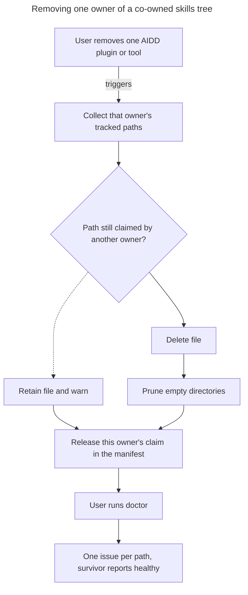

# Instruction: Shared skills tree safety

## Feature

- **Summary**: Close the real multi-owner hole. Plugin uninstall has no shared-path guard, unlike tool uninstall, so removing one owner of `.agents/skills/` deletes files another owner still needs. Also make the shared tree visible to `doctor` and `status`, which today only ever look under a tool's own directory.
- **Stack**: `Node.js >= 22.12`, `TypeScript (ESM, relative .js imports)`, `vitest`, `biome`, `pnpm`
- **Branch name**: `fix/511-shared-skills-tree-safety`
- **Parent Plan**: `./2026_07_27-511-gemini-cli-tool-master.md`
- **Sequence**: `2 of 4`
- Confidence: 9/10
- Time to implement: one session

## Why this is not what the brainstorm described

The brainstorm asserts that `aidd ai uninstall codex` deletes `.agents/skills/aidd-*` and gemini silently loses its skills. That specific path is already guarded: `uninstall-tools-use-case.ts:201-213` computes the tracked paths of every remaining installed tool and the deletion loop skips them, with a passing test for the analogous claude-plus-vscode case.

Three things are genuinely broken, and none was named:

- `uninstall-plugin-use-case.ts:62-74` deletes every tracked plugin file unconditionally, with no shared-path guard. Since skills reach a project through the plugin path and not the tool path (`contentSections` is empty in production, so the skills install use-case never runs), this is the path that actually destroys the shared tree.
- `uninstall-ide-use-case.ts:37-50` has the same unguarded shape.
- `doctor-layout-use-case.ts:26-44` compares only a tool's own `directory`, and `manifest.ts:364-372` keys installed directories on the first path segment only. A shared tree under `.agents/` is therefore invisible to the orphan check, and `status-use-case.ts` never scans it either.

## Architecture projection

### Files to modify

- `cli/src/application/use-cases/uninstall/uninstall-plugin-use-case.ts` - apply the shared-path guard before deleting a tracked plugin file
- `cli/src/application/use-cases/uninstall/uninstall-ide-use-case.ts` - same guard, same reason
- `cli/src/application/use-cases/uninstall/uninstall-tools-use-case.ts` - extract the existing shared-path computation so the three call sites share one implementation instead of three copies
- `cli/src/domain/models/manifest.ts` - expose a path-to-owners view derived on read, so consumers can iterate paths rather than tool-and-path pairs; no schema version bump
- `cli/src/application/use-cases/doctor/doctor-tracked-files-use-case.ts` - deduplicate a co-owned path so one missing file yields one issue, not one per owner
- `cli/src/application/use-cases/doctor/doctor-merge-files-use-case.ts` - same deduplication
- `cli/src/application/use-cases/doctor/doctor-layout-use-case.ts` - detect an orphaned shared tree, not only an orphaned tool directory
- `cli/src/application/use-cases/status-use-case.ts` - include the shared tree in the scanned surface
- `cli/tests/application/use-cases/uninstall-use-case.unit.test.ts` - extend beyond the current disjoint-path coverage
- `cli/tests/golden/framework-build-golden.e2e.test.ts` - add the subset invariant assertion between the codex and gemini flat cells

### Files to create

- `cli/tests/application/use-cases/uninstall/shared-path-guard.integration.test.ts` - two owners of one path, remove one, the file survives and the survivor reports healthy
- `cli/tests/domain/models/manifest-path-owners.unit.test.ts` - the derived owners view: single owner, two owners, zero owners, and hash divergence between owners

### Files to delete

None.

## Applicable rules

| Tool   | Name                     | Path                                                            | Why it applies |
| ------ | ------------------------ | --------------------------------------------------------------- | -------------- |
| claude | 0-hexagonal              | `cli/.claude/rules/00-architecture/0-hexagonal.md`              | The owners view is a domain-model concern, not a use-case one |
| claude | 0-layer-responsibilities | `cli/.claude/rules/00-architecture/0-layer-responsibilities.md` | Domain model validates invariants; use-cases orchestrate |
| claude | 0-error-handling         | `cli/.claude/rules/00-architecture/0-error-handling.md`         | A skipped deletion must surface, never be silent |
| claude | 1-exports                | `cli/.claude/rules/01-standards/1-exports.md`                   | Named exports only |
| claude | 1-naming                 | `cli/.claude/rules/01-standards/1-naming.md`                    | New test tiers must match the suffix convention |
| claude | 2-typescript             | `cli/.claude/rules/02-programming-languages/2-typescript.md`    | `readonly` on the returned map, no `any` |
| claude | 3-cli-output             | `cli/.claude/rules/03-frameworks-and-libraries/3-cli-output.md` | A retained file is a `warn`, not an `error` |
| claude | 4-biome                  | `cli/.claude/rules/04-tooling/4-biome.md`                       | All touched TypeScript must pass `biome check` |
| claude | 6-method-size            | `cli/.claude/rules/06-design-patterns/6-method-size.md`         | The guard extraction must not produce a method over 20 lines |
| claude | 7-clean-code             | `cli/.claude/rules/07-quality/7-clean-code.md`                  | Three copies of the guard is the DRY violation this part removes |

The project's `use-case`, `domain-model` and `test` skills apply per layer touched.

## User Journey

## Risk register

| Risk | Impact | Mitigation |
| --- | --- | --- |
| Guarding plugin deletion leaves orphan files when the last owner goes | Files accumulate and are never cleaned | The guard checks remaining owners, not mere co-ownership; when the last claim is released the file is deleted |
| The manifest owners view is computed per call | Repeated scans on large manifests | Derived once on read and returned as a readonly map, following the existing tracked-paths-in-directory pattern |
| Deduplicating doctor issues hides a genuine per-owner divergence | A real hash divergence between owners is swallowed | Divergence is reported explicitly as its own issue rather than collapsed into the deduplicated missing-file issue |
| Changing doctor output changes exit codes | The golden baseline stdout snapshot fails | The golden baseline is re-run and any stdout change is reviewed as intentional, not force-updated |
| No manifest schema change means co-ownership stays implicit | A future maintainer reintroduces the assumption of one owner per path | The owners view is the single accessor, and the invariant is covered by unit tests rather than by convention |

## Implementation phases

### Phase 1: One shared-path guard, three call sites

> Remove the duplication and extend the existing protection to the two unguarded uninstall paths.

#### Tasks

1. Extract the shared-path computation currently living inside tool uninstall.
2. Apply it in plugin uninstall before every tracked-file deletion.
3. Apply it in IDE uninstall.
4. Emit one warning per retained file, naming the remaining owner.
5. Extend the uninstall test suite past its current disjoint-path coverage.

#### Acceptance criteria

- [x] Two owners of one path, removing one leaves the file on disk
- [x] Removing the last owner deletes the file
- [x] Every retained file is reported on stderr; no retention is silent
- [x] The guard exists in exactly one place

### Phase 2: Make co-ownership a first-class read

> Give consumers a path-to-owners view so they iterate paths, not tool-and-path pairs. No schema change.

#### Tasks

1. Add the derived owners accessor to the manifest model.
2. Cover the single-owner, two-owner, zero-owner and divergent-hash cases.
3. Rewire the uninstall guard to consume it.

#### Acceptance criteria

- [x] The manifest version is unchanged and no migration is added
- [x] The accessor returns a readonly structure
- [x] Divergent hashes between owners are observable through the accessor rather than hidden

### Phase 3: Make the shared tree visible

> Stop doctor and status from reporting on a surface they cannot see.

#### Tasks

1. Deduplicate co-owned paths in the tracked-files and merge-files doctor checks.
2. Report a genuine inter-owner hash divergence as its own distinct issue.
3. Extend the orphan check beyond a tool's own directory to cover an abandoned shared tree.
4. Include the shared tree in the status scan surface.
5. Re-run the golden baseline and review every stdout change as intentional.

#### Acceptance criteria

- [x] One missing co-owned file produces exactly one issue
- [x] An abandoned shared tree is reported as orphaned
- [x] A hash divergence between two owners is reported, distinctly from a missing file
- [x] Golden baseline stdout changes are reviewed and justified, never blind-updated

### Phase 4: Lock the rendering invariant

> The cheapest way to keep co-ownership safe is to make the co-owned bytes identical.

#### Tasks

1. Assert in the golden suite that the gemini flat cell's shared skills tree is a byte-identical subset of the codex flat cell's.
2. Make the assertion fail loudly if the two ever diverge, naming the first differing path.

#### Acceptance criteria

- [x] The invariant is asserted in the golden suite, not merely documented
- [x] A deliberate one-byte divergence makes the suite fail with the offending path named
- [x] `cd cli && pnpm typecheck && pnpm lint && pnpm test` exits 0

## Amendments

<!-- AI-initiated changes during implementation. Each entry is prefixed with 🤖. -->

🤖 The projection's `uninstall-ide-use-case.ts:37-50` entry is stale and was dropped. `main` refactored IDE and AI tool removal onto one implementation (#553) while this plan sat unstarted, so that file is now 36 lines that delegate to `UninstallToolsUseCase`. It inherits the guard rather than needing its own. Every other line reference in the projection was re-checked and still holds, `manifest.ts:364-372` included.

🤖 Two holes the plan does not name, both inside `uninstall-tools-use-case.ts`, and both in phase 1's scope by its own acceptance criterion that the guard exist in exactly one place. `removeAllPluginFiles` deleted every plugin file of the departing tool with no guard whatsoever, which is the same destruction the plan attributes to plugin uninstall alone. And `computeSharedPaths` built its retained set from the remaining tools' own files and merge files only, never their plugins, so even the path the plan calls "already guarded" would delete a tree a surviving tool's plugin still claims. Since skills reach a project through the plugin path, an owners view that skips plugins is the bug, not a subset of it. `computeRetainedPaths` therefore spans tool files, merge files and plugin files, and the departing claim is expressed as a `(toolId, pluginName | null)` pair so one function serves both tool uninstall and plugin uninstall.

🤖 The guard returns a path-to-owners map rather than a set, because phase 1's acceptance criterion asks the warning to name the remaining owner. That is phase 2's owners view in application-layer form; phase 2 moves the derivation into the manifest model and rewires this function to consume it, as its task 3 already anticipates.

🤖 `otherToolsOwnMergeFile` (`uninstall-tools-use-case.ts:214`) still reads the installed tool ids on its own. It answers a different question, whether a merge file may be deleted outright or must be stripped of this tool's entries, so it is not a second copy of the shared-path guard. Left alone in phase 1; a candidate for phase 2's accessor.

🤖 The flat build's skills writer ignores `ArtifactContract.transform` (`flat-build-strategy.ts:160-178`): a skill file's output bytes are decided by `path`, `rewriteSkillName` and the shared relative-link rewrite alone. Worth recording, because it is why the subset invariant holds by construction rather than by discipline — gemini and codex reach the same bytes through the same primitives — and because a first attempt to mutation-check phase 4 through `transform` was silently a no-op. The real check disables gemini's `rewriteSkillName`, which does move the bytes.

## Log

<!-- APPEND ONLY. One entry per step attempt. Never rewrite. -->

- Phase 1: `application/use-cases/uninstall/shared-path-guard.ts` created as the single owner of "may this uninstall delete that file", spanning tool files, merge files and plugin files, keyed by a `(toolId, pluginName | null)` departing claim and returning a readonly path-to-owners map. Wired into all three deletion sites: the tool-file loop and `removeAllPluginFiles` in `uninstall-tools-use-case.ts` (its module-private `computeSharedPaths` deleted), and `deleteFiles` in `uninstall-plugin-use-case.ts`, which gains the `Logger` it needed to report a retention (single construction site, `uninstall-use-case.ts:35`). Every retained path emits one `warn` naming the surviving owners. New `tests/application/use-cases/uninstall/shared-path-guard.integration.test.ts`, 5 cases: co-owned file survives one owner leaving, solely-owned path still deleted, retention reported once and naming the owner, co-owned file deleted when the last owner goes, and co-owned file surviving a whole-tool uninstall. Mutation-checked: neutralizing `computeRetainedPaths` fails 3 of the 5, the two deletion assertions staying green as they should. Verified: `pnpm typecheck` (0 errors), `biome check` (clean, 2 pre-existing config infos from main's biome bump), full `pnpm test` 2195/2196 — the one failure is `auth status`, caused by an `AIDD_TOKEN` in the developer environment that the e2e sandbox does not scrub, unrelated to this work.
- Phase 2: `Manifest.getPathOwners()` added, returning a readonly path-to-owners map derived on read. An owner carries its tool id, how it claims the path (`tool`, `merge` or `plugin`), the plugin name when one applies, and the hash — `null` for a merge file, which tracks entries rather than bytes, so a divergence between two owners of one path stays visible rather than collapsing into a single entry. No schema change: `MANIFEST_VERSION` stays 6 and no migration was added, verified by diffing the model. `computeRetainedPaths` now reads the accessor instead of walking tools, merge files and plugins itself, so the departing-claim match is the only logic left in the application layer. New `tests/domain/models/manifest-path-owners.unit.test.ts`, 8 cases: single owner, two tools on one path, a plugin owning in its own right, a tool and its own plugin on the same path, zero owners, divergent hashes, the merge file's null hash, and an owner disappearing when its claim is released. Verified: `pnpm typecheck` (0 errors), `biome check` (clean), full `pnpm test` 2203/2204, the one failure being the same environment-coupled `auth status` case.
- Phase 3: doctor and status now read the owners view instead of walking tools. `DoctorTrackedFilesUseCase` checks each path once rather than once per owner, so a co-owned file yields one missing issue and one modified issue instead of two, and a genuine disagreement between owners is reported on its own (`Owners disagree on <path>`, severity error), since restoring the file cannot satisfy both. `DoctorMergeFilesUseCase` deduplicates only the missing-file issue, keys staying per-owner because each tool tracks the entries it wrote. `Manifest.getInstalledDirectories()` derives from every owner rather than tool files alone, so a directory claimed only through plugins stops looking untracked. `DoctorLayoutUseCase` gained a shared-tree orphan check: the existing one walks each registered tool's own directory and structurally cannot see `.agents/skills/`, which belongs to no single tool. `StatusUseCase` scans the tool's own directory plus every other top-level directory it actually claims files in. New `tests/application/use-cases/doctor/shared-tree-visibility.unit.test.ts` (6 cases) and one status case. Mutation-checked by stashing the source and re-running: 4 of the 6 doctor cases fail against the previous code, the 2 that survive being the negative assertions that must hold either way. The golden command-matrix baseline did not move, so nothing needed re-baselining and nothing was blind-updated. Verified: `pnpm typecheck` (0 errors), `biome check` (clean), unit and integration 2074/2074, e2e 129/130 with the same environment-coupled `auth status` failure.
- Phase 4: the co-ownership invariant is now asserted rather than assumed. `framework-build-golden.e2e.test.ts` gains a case that builds the codex and gemini flat cells and requires every `.agents/skills/**` path gemini writes to carry codex's exact hash, failing with the first offending path and both hashes rather than a bare inequality. Guarded against vacuity: the case also requires gemini to render at least one file under the shared tree. Mutation-checked by flipping gemini's `rewriteSkillName` to false, which fails the suite naming `.agents/skills/aidd-async-dev-01-setup/SKILL.md` and both divergent hashes. Verified: `pnpm typecheck` (0 errors), `biome check` (clean), full `pnpm test` 2211/2212, the one failure being `auth status`, whose exit code depends on an `AIDD_TOKEN` in the developer environment that the e2e sandbox does not scrub.

## Validation flow demonstration

1. In a fresh temporary project, install AIDD for two tools that both claim the shared skills tree.
2. Confirm both manifest entries list the same shared paths.
3. Remove one of the two.
4. Confirm the shared skill files are still on disk, and that the retention was reported on stderr.
5. Run `doctor` and confirm the surviving tool is healthy, with no duplicated issue for the shared paths.
6. Remove the second one and confirm the shared tree is now gone and no empty directory is left behind.
