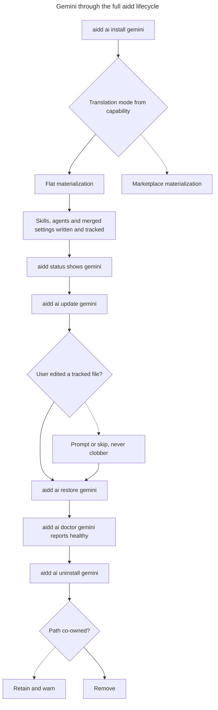

# Instruction: Gemini as a full registry citizen

## Feature

- **Summary**: Give gemini the whole lifecycle the other tools have. Two hardcoded opencode literals in the plugin translation path block this and must be derived from capabilities instead. Marketplace mode stays out of scope, so gemini follows the opencode precedent of a flat-only citizen.
- **Stack**: `Node.js >= 22.12`, `TypeScript (ESM, relative .js imports)`, `vitest`, `biome`, `bash`, `pnpm`, `Gemini CLI >= 0.28.0`
- **Branch name**: `feat/511-gemini-registry-citizen`
- **Parent Plan**: `./2026_07_27-511-gemini-cli-tool-master.md`
- **Sequence**: `3 of 4`
- Confidence: 9/10
- Time to implement: one session

## What actually blocks this

The lifecycle is overwhelmingly registry-driven: install, update, restore, doctor, status, setup, clean and the manifest all iterate the registry and need no edit. Three concrete things do not:

- `built-tree-materialization-translator.ts:64` picks the translation mode with `toolId === "opencode" ? "flat" : "marketplace"`. Gemini is flat-only, so this literal makes gemini take the marketplace branch.
- The same file, at `:120-125`, decides plugin ownership with `segments[0] === ".opencode"`.
- `plugin-remove-use-case.ts:72-80` routes to the opencode MCP unmerge on a capability shape gemini will share, which would run the opencode unmerge against `.gemini/settings.json`.

Both literals must become capability-derived. That is the refactoring cost of this part, and it improves opencode too.

## Architecture projection

### Files to modify

- `cli/src/application/use-cases/plugin/translator/built-tree-materialization-translator.ts` - derive the translation mode from the plugins capability instead of a tool-name literal, and derive plugin ownership from the tool's directory plus the shared tree instead of a hardcoded segment
- `cli/src/application/use-cases/plugin/plugin-remove-use-case.ts` - route the MCP unmerge by capability rather than assuming the opencode shape
- `cli/src/domain/models/plugin-translation-skip.ts` - parameterize the hooks-skip reason so the message names the actual tool
- `cli/src/application/use-cases/restore/restore-use-case.ts` - add the gemini config reference only if gemini restores a framework-sourced config file
- `cli/scripts/smoke-tools.sh` - add gemini to the tool list and update the two stale comments
- `cli/tests/e2e/command-matrix-ai.e2e.test.ts` - add the gemini install and uninstall pair
- `cli/tests/domain/models/plugin-distribution-translate.unit.test.ts` - add gemini as a translation target in the cross-format matrix
- `cli/tests/application/use-cases/plugin/translator/*` - extend the existing opencode translator suites to cover the now-generalized branches

### Files to create

- `cli/tests/application/use-cases/plugin/translator/install-plugin-gemini-flat.integration.test.ts` - flat materialization for gemini
- `cli/tests/application/use-cases/plugin/translator/install-plugin-gemini-mcp.integration.test.ts` - MCP merge into the shared settings file
- `cli/tests/application/use-cases/plugin/translator/remove-plugin-gemini-mcp.integration.test.ts` - MCP unmerge leaves user keys intact
- `cli/tests/application/use-cases/plugin/translator/built-tree-gemini-materialization.integration.test.ts` - built-tree path takes the flat branch

### Files to delete

None.

## Applicable rules

| Tool   | Name                     | Path                                                            | Why it applies |
| ------ | ------------------------ | --------------------------------------------------------------- | -------------- |
| claude | 0-hexagonal              | `cli/.claude/rules/00-architecture/0-hexagonal.md`              | Capability-derived routing keeps tool knowledge in the domain |
| claude | 0-layer-responsibilities | `cli/.claude/rules/00-architecture/0-layer-responsibilities.md` | Explicitly forbids tool-specific logic in use-cases, which is exactly what is being removed |
| claude | 0-error-handling         | `cli/.claude/rules/00-architecture/0-error-handling.md`         | The unmerge routing must throw a typed error on an unexpected capability shape |
| claude | 1-exports                | `cli/.claude/rules/01-standards/1-exports.md`                   | Named exports only |
| claude | 1-naming                 | `cli/.claude/rules/01-standards/1-naming.md`                    | New integration and e2e suites must match the suffix convention |
| claude | 2-typescript             | `cli/.claude/rules/02-programming-languages/2-typescript.md`    | Relative `.js` imports, no `any` |
| claude | 3-cli-lifecycle          | `cli/.claude/rules/03-frameworks-and-libraries/3-cli-lifecycle.md` | The `ai` subcommand surface now accepts gemini |
| claude | 3-cli-output             | `cli/.claude/rules/03-frameworks-and-libraries/3-cli-output.md` | Skipped hooks in flat mode are a `warn` |
| claude | 4-biome                  | `cli/.claude/rules/04-tooling/4-biome.md`                       | All touched TypeScript must pass `biome check` |
| claude | 6-method-size            | `cli/.claude/rules/06-design-patterns/6-method-size.md`         | The extracted routing helpers must stay at or under 20 lines |
| claude | 7-clean-code             | `cli/.claude/rules/07-quality/7-clean-code.md`                  | Removing the two literals is the fail-fast and DRY work this part exists for |

The project's `use-case`, `command` and `test` skills apply. `audit-remediate` is the right macro if the translator turns out to need a full layer pass rather than two surgical edits.

## User Journey

## Risk register

| Risk | Impact | Mitigation |
| --- | --- | --- |
| Deriving the translation mode changes opencode's behaviour | A working tool regresses | The existing opencode translator suites must pass unchanged; they are the regression net for this refactor |
| The MCP unmerge routing misfires on the shared settings file | User keys destroyed on plugin removal | A dedicated removal test asserts unrelated user keys survive; the routing throws on an unrecognized capability shape rather than guessing |
| Flat mode skips hooks, so an installed gemini has no hooks | Silent capability gap versus the archive | The skip is warned, and the difference between the install path and the archive path is documented in part 4 |
| Smoke tests pollute the repository or the user's global tool state | Tracked residue committed by accident, or the real user configuration mutated | Smoke runs in a fresh temporary directory with `git init`, and the tool home is sandboxed per run, as the project's testing memory requires |
| A smoke case looks covered but never executes | False confidence | Guards pick a tracked file from the manifest, which is the source of truth, never by walking the filesystem |
| The smoke coverage gate fails once gemini is added | CI blocks | Gemini leaf commands are added to the matrix in the same change as the tool entry, not after |

## Implementation phases

### Phase 1: Remove the two opencode literals

> Derive routing from capabilities so a flat-only tool is not a special case.

#### Tasks

1. Replace the tool-name comparison that picks the translation mode with a capability read.
2. Replace the hardcoded directory-segment ownership check with one derived from the tool's directory and the shared tree.
3. Parameterize the hooks-skip reason so the message names the tool it applies to.
4. Run the existing opencode translator suites unchanged as the regression net.

#### Acceptance criteria

- [x] No tool-name literal remains in the plugin translation path
- [x] Every pre-existing opencode translator test passes without modification
- [x] The hooks-skip message names the actual tool

### Phase 2: Route the MCP unmerge safely

> Plugin removal must not run one tool's unmerge against another tool's file.

#### Tasks

1. Make the unmerge selection depend on the capability shape rather than an assumed tool.
2. Throw a typed error on an unrecognized shape instead of falling through.
3. Cover removal on the shared settings file, asserting unrelated user keys survive.

#### Acceptance criteria

- [x] Removing a plugin leaves every user-authored key in the settings file intact
- [x] An unrecognized capability shape raises a typed error, not a silent fallthrough
- [x] Removal is idempotent: running it twice changes nothing the second time

### Phase 3: Wire the command matrix

> Every leaf command must work for gemini, proven against the real binary.

#### Tasks

1. Add gemini to the smoke tool list and refresh the two stale comments.
2. Add the install and uninstall pair to the command-matrix e2e suite.
3. Add gemini as a translation target in the cross-format unit matrix.
4. Write the four new integration suites: flat materialization, MCP merge, MCP unmerge, built-tree materialization.
5. Add the gemini config reference to restore only if a framework-sourced config is genuinely used; otherwise record why not.

#### Acceptance criteria

- [ ] Every `ai` leaf command runs for gemini against the built binary
- [ ] The smoke coverage gate is met
- [ ] Smoke ran in a fresh temporary directory with a sandboxed tool home, and the repository working tree is clean afterwards
- [ ] `cd cli && pnpm typecheck && pnpm lint && pnpm test && pnpm smoke` exits 0

### Phase 4: Verify install parity against the real tool

> Confirm that what install produces is what Gemini actually consumes, and record the gaps.

#### Tasks

1. Install AIDD for gemini into a fresh temporary project.
2. Probe the real binary for skills, agents and settings.
3. Record every difference between the install output and the archive output, hooks in particular.
4. Decide per difference: fix now, or document as a known flat-mode limitation.

#### Acceptance criteria

- [ ] Skills installed by the install path are discovered by the real binary
- [ ] Agents installed by the install path are accepted by the strict frontmatter schema
- [ ] Every install-versus-archive difference is either fixed or written down, none left implicit

🤖 `pnpm smoke` baseline, measured before phase 2: with the developer's `AIDD_TOKEN` set it reports 48 pass / 20 fail / coverage 86%, every failure cascading from one 401 on that token — `setup --source remote` cannot fetch the catalog, so all downstream tool and plugin assertions collapse. With the variable unset it falls back to `gh auth token` and reports **73 pass / 4 fail / coverage 100%**, all 37 leaf commands exercised. The 4 remaining failures are one stale case repeated over four corruption shapes: `setup --plugins recommended` now installs `aidd-dev`, so the fault injection that follows gets `Plugin 'aidd-dev' is already installed.` before any catalog read, and the corrupt-cache path it claims to test is never reached. The `recommended` flag comes from the published remote catalog, not from this repository, so this is data drift and not a regression; the case needs a plugin that is not recommended. Recorded, not fixed here. Worth noting separately that the script promises to SKIP remote sections without a token but FAILS on an invalid one.

## Amendments

<!-- AI-initiated changes during implementation. Each entry is prefixed with 🤖. -->

🤖 The projection omits `cli/src/domain/tools/ai/gemini.ts`, but this part cannot meet its objective without it. Part 1 declared gemini's plugins capability `{ mode: "unsupported" }`, which is what keeps the install path from materializing any plugin content — and skills and agents reach a project as plugin content. Gemini now declares `{ mode: "flat", flatNamespacePrefix: "aidd-" }`, the opencode precedent this plan already names in its summary.

🤖 That change collided with the marketplace-probe conformance guard, which part 2's repair had narrowed to exempt `mode: "unsupported"`. A flat gemini falls back under the requirement, and it cannot be satisfied: `PluginFormat` is a closed union of the five marketplace layouts aidd can *read*, and Gemini CLI has none. Adding gemini to it would make aidd advertise a format that does not exist, contradicting the master plan. Decided with the user: the guard now keys on `PluginFormat` membership rather than on the plugins mode, which is the invariant it was always reaching for — writing plugin content and ingesting a marketplace are different claims, and only the second needs a probe. `PLUGIN_FORMATS` was added beside the type as its runtime companion so the set can be iterated. Opencode keeps its requirement; gemini is out of scope of it by construction rather than by exemption.

🤖 The hooks-skip reason became `FlatPluginsParams.hooksSkipReason`, declared by the tool, rather than a branch on the tool name. A tool-name branch would have satisfied "the message names the actual tool" while violating this phase's other acceptance criterion, that no tool-name literal survives in the translation path. Opencode declares its existing wording, so its message is unchanged and its tests pass untouched; gemini declares why its hooks cannot travel through the flat install path.

🤖 Line references drifted: the translation-mode literal sits at `built-tree-materialization-translator.ts:62` and the ownership check at `:137`, not `:64` and `:120-125`. Both were found and replaced; the ownership rule now accepts the tool's own directory plus the shared `.agents/` root, with `AGENTS_SHARED_ROOT` extracted in `flat-paths.ts` beside the existing skills prefix.

🤖 Phase 2's projection names only `plugin-remove-use-case.ts`, but the same qualification drives the *merge* at install time (`mode-b-flat-materialization-translator.ts:108`), and `mergeOpencodeMcp` was hardcoded to opencode's `mcp` key exactly as the unmerge was. Leaving that half alone would have corrupted `.gemini/settings.json` on install rather than on removal, which is worse. Both sides are now parameterized by a `FlatMcpSection` carrying the JSON key and the config's name, the latter so a collision message names the file the user actually has to look at instead of always saying opencode.json.

🤖 `qualifiesForOpencodeMcpMerge` became `flatMcpSectionKey`, returning the declared key or null instead of a boolean. A boolean forced every caller to re-derive the key, which is what made the tool name necessary in the first place. It throws `McpSectionUndeclaredError` when a tool qualifies for the merge but declares no `entrySection`: a default here writes one tool's section into another tool's user-owned file, so failing loudly is the only safe answer.

🤖 `tests/domain/formats/opencode-mcp-merge.unit.test.ts` was updated, which phase 1's "passes without modification" bar does not cover — that bar is about the translator suites, and this is the renamed domain API itself. Only call names and one added argument changed; every assertion is untouched, so its regression value is intact.

## Log

<!-- APPEND ONLY. One entry per step attempt. Never rewrite. -->
- Phase 1: both opencode literals removed from `built-tree-materialization-translator.ts`. The translation mode is read from `PluginsCapability.translationMode`, which already resolves to `"flat"` for flat tools and was simply never consulted. Plugin ownership inside a flat built tree is derived from the tool's own directory plus the shared `.agents/` root instead of a hardcoded `.opencode` segment, matching a plugin-namespaced segment anywhere below the root rather than at a fixed depth, since gemini's agents sit one level shallower than opencode's skills. `FlatPluginsParams` gained `hooksSkipReason` so the skip message comes from the tool rather than a branch. Gemini switched to `{ mode: "flat" }` and the conformance guard was rekeyed on `PluginFormat` (see Amendments). Verified: `pnpm typecheck` (0 errors), `biome check` (clean), unit and integration 2081/2081, e2e 130/131 with the same environment-coupled `auth status` failure, and the grep gate for a tool-name literal under `use-cases/plugin/` returns nothing.
- Phase 2: MCP merging and unmerging are now routed by the tool's declared section key rather than by opencode's shape. `mergeFlatMcpSection` and `unmergeFlatMcpSection` take a `FlatMcpSection` (JSON key plus config name); `flatMcpSectionKey` replaces the boolean qualification and throws `McpSectionUndeclaredError` on a qualifying tool that declares no section. Both call sites, install-time merge and removal-time unmerge, pass the resolved output path as the config name so collision messages name the real file. New `remove-plugin-gemini-mcp.integration.test.ts` (4 cases: servers stripped from `mcpServers` with no stray `mcp` key created, every user key intact including `context.fileName` and `theme`, idempotence, manifest entry removed) and `flat-mcp-section-key.unit.test.ts` (5 cases covering the declared key, the three declines, and the throw). Mutation-checked by hardcoding the key back to `"mcp"`: 2 of the 4 gemini cases fail, the 2 survivors being the ones that assert user keys and manifest state, which a wrong section key does not disturb. Verified: `pnpm typecheck` (0 errors), `biome check` (clean), full `pnpm test` 2220/2221 with the same `auth status` environment failure. Smoke baseline measured separately before this phase: 73 pass, 4 fail, coverage 100%, the 4 being a stale fault-injection case unrelated to this work (see Amendments).

## Validation flow demonstration

1. In a fresh temporary directory with `git init` and a sandboxed tool home, install AIDD for gemini.
2. Run `status` and see gemini listed as installed.
3. Probe the real binary: skills are discovered, agents parse, the settings file carries the expected keys.
4. Edit one tracked file by hand, run `update`, and confirm the edit is not clobbered.
5. Run `restore` and confirm the file returns to its expected content.
6. Run `doctor` and get a healthy report with exit code 0.
7. Uninstall gemini and confirm no residue outside co-owned paths still claimed by another tool.
