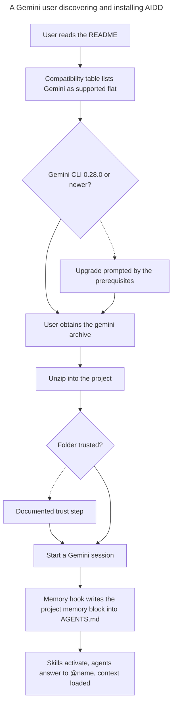

# Instruction: Gemini content and documentation

## Feature

- **Summary**: Add gemini wherever AIDD enumerates its supported tools, teach the memory hook that gemini's context file is `AGENTS.md`, publish the two prerequisites that gate the user's success, and rewrite the issue body whose surface mapping is factually wrong. This part carries the deliberate golden re-baseline that parts 1 to 3 avoided.
- **Stack**: `Markdown`, `Node.js >= 22.12`, `vitest`, `pnpm`, `gh`
- **Branch name**: `docs/511-gemini-content-and-docs`
- **Parent Plan**: `./2026_07_27-511-gemini-cli-tool-master.md`
- **Sequence**: `4 of 4`
- Confidence: 9/10
- Time to implement: one session

## Measured scope, not estimated

A full scan of `plugins/**` for Claude-specific literals returns 80 hits across 36 files. Under `plugins/*/skills/**` specifically, the classification is:

| Class | Hits | Files | Action |
| --- | --- | --- | --- |
| Multi-tool table row | 18 | 10 | Do not rewrite the claude rows. Add a gemini row to each table |
| Real runtime path | 19 | 12 | All in `aidd-orchestrator/skills/00-async-dev`. Out of scope: that plugin is excluded from the gemini target |
| Prose mention of Claude Code | 14 | 3 | Leave alone. Harmless |
| Plugin-root token | 2 | 2 | Already rewritten by the build |

This corrects the brainstorm's estimate. Its claim of four `.claude/` occurrences in one `SKILL.md` is accurate. Its "roughly 24 reference files" undercounts the total but, more importantly, mislabels the shape: only 19 hits are real paths, they are all in the one plugin now excluded from gemini, and one of them (`enabledPlugins` in `.claude/settings.json`) has no Gemini equivalent at all.

Confirmed by reading the build: `claude-root-path-rewrite.ts` rewrites only the plugin-root token inside JSON. It never rewrites a `.claude/` literal in markdown. So source edits are genuinely required for anything classified as a real path, and build-time rewriting is not an escape hatch.

## Architecture projection

### Files to modify

- `plugins/aidd-context/hooks/update_memory.js` - add gemini to the tool-to-context-file map so the project memory block is written into `AGENTS.md`
- `plugins/aidd-context/skills/00-onboard/references/state/detection.md` - add the gemini detection row
- `plugins/aidd-context/skills/02-project-memory/references/tools.md` - add the gemini row; this file and the hook must stay in sync
- `plugins/aidd-context/skills/04-skill-generate/references/tool-detect.md` - add the gemini detection row
- `plugins/aidd-context/skills/04-skill-generate/references/tool-write.md` - add the gemini skills path row
- `plugins/aidd-context/skills/05-rule-generate/references/tool-paths.md` - add the gemini rules row and its detection row
- `plugins/aidd-context/skills/06-agent-generate/references/tool-paths.md` - add the gemini agents row and its detection row
- `plugins/aidd-context/skills/07-command-generate/references/tool-paths.md` - add the gemini row, marking commands unsupported
- `plugins/aidd-context/skills/08-hook-generate/references/tool-paths.md` - add the gemini hooks column with its real event names and scopes
- `plugins/aidd-context/skills/10-learn/references/sync-arguments.md` - add the gemini context-file row
- `plugins/aidd-context/skills/11-explore/references/ai-mapping.md` - add gemini to the surfaces, hooks and plugin-location tables
- `plugins/aidd-context/skills/11-explore/scripts/list-rules.mjs` - add the gemini rules entry and its doc comment
- `README.md` - prerequisites line, compatibility table moves gemini from in progress to supported flat, and a gemini install block
- `cli/README.md` - MCP output-path table, config table, `--target` value list, flat-only note, per-tool layout matrix, flat materialization examples
- `cli/ARCHITECTURE.md` - five targets becomes six, nine build cells becomes ten
- `docs/MAINTAINERS.md` - the archive count
- `cli/.claude/rules/00-architecture/0-hexagonal.md` - the list of tool definitions under `domain/tools/ai/`
- `cli/aidd_docs/memory/architecture.md`, `codebase-map.md`, `project-brief.md`, `testing.md` - the project-memory files that enumerate five tools
- `aidd_docs/memory/architecture.md`, `codebase-map.md` - the framework-level memory files
- `cli/tests/golden/snapshots/framework-build/golden.json` - the deliberate re-baseline: every flat cell that publishes the edited reference files changes
- `cli/tests/golden/framework-build-golden.e2e.test.ts` - document this re-baseline pass in the header, as previous passes were documented
- `aidd_docs/tasks/2026_05/2026_05_06-cli-v5-cleanup-sync-matrix.md` - the manual pair matrix grows from twenty to thirty pairs
- issue #511 body - rewrite the surface mapping; its agents, hooks and `AGENTS.md` claims are wrong

### Files to create

None.

### Files to delete

None.

## Applicable rules

| Tool   | Name         | Path                                                         | Why it applies |
| ------ | ------------ | ------------------------------------------------------------ | -------------- |
| claude | 4-biome      | `cli/.claude/rules/04-tooling/4-biome.md`                    | The hook script and the rules script are linted |
| claude | 2-typescript | `cli/.claude/rules/02-programming-languages/2-typescript.md` | Applies to the scripts touched under `plugins/` and `cli/` |
| claude | 7-clean-code | `cli/.claude/rules/07-quality/7-clean-code.md`               | Named constants for the repeated tool-to-context-file mapping instead of inline literals |

Most rules are scoped to `cli/src/**` and do not apply to a documentation part. The framework-level instruction that does apply, from `CLAUDE.md`: before adding any instruction or rule, check whether an existing one already covers or contradicts it, and merge rather than adding a parallel.

## User Journey

## Risk register

| Risk | Impact | Mitigation |
| --- | --- | --- |
| A claude row is rewritten instead of a gemini row being added | Claude Code silently breaks for every user of that skill | The classification is per line and recorded above; every table edit is additive, and a diff review confirms no claude row changed |
| The memory hook and its mirror reference file drift | The hook writes to a file the documentation does not name | Both are edited in the same change, and the hook's own comment already points at the reference file |
| The golden re-baseline hides an unintended change | A real regression ships inside an approved re-baseline | The re-baseline diff is reviewed path by path, and only the edited reference files may appear in it |
| Rewriting the issue body loses the original context | Discussion history becomes unreadable | The corrected mapping is added with the original preserved, not silently overwritten |
| The two prerequisites are documented but easy to miss | Users unzip, see nothing, and conclude AIDD is broken | Both appear in the gemini install block itself, not only in a general prerequisites section |
| Minimum-version numbers were derived from source, not documented by the vendor | A stated minimum turns out wrong | Each stated version is labelled as source-derived, and the locally verified version is stated alongside it |

## Implementation phases

### Phase 1: Teach the framework about gemini

> The memory hook and the ten multi-tool tables, additively.

#### Tasks

1. Add gemini to the memory hook's tool-to-context-file map, pointing at `AGENTS.md`.
2. Add the gemini row to each of the ten multi-tool tables, without touching any existing row.
3. Add the gemini entry to the rules-listing script and its doc comment.
4. Diff-review every table edit to confirm additive-only.

#### Acceptance criteria

- [x] The memory hook writes the project memory block into `AGENTS.md` for gemini
- [x] The hook and its mirror reference file agree
- [x] The diff shows only added lines in the multi-tool tables, no modified claude row
- [x] The rules-listing script reports gemini rules when a gemini rules directory exists

### Phase 2: Publish the prerequisites and the mapping

> Document what actually gates the user's success, including the two constraints absent from the issue.

#### Tasks

1. Move gemini from in progress to supported flat in the compatibility table.
2. Add the gemini install block, stating the minimum version and the folder-trust step inside the block.
3. Update the CLI documentation tables: MCP output path, config, target values, flat-only note, layout matrix.
4. Update the architecture and maintainer counts from five targets and nine cells to six and ten.
5. Update the project-memory files at both levels.
6. Label every stated minimum version as source-derived, and name the version actually verified locally.

#### Acceptance criteria

- [x] No document still claims five supported tools or nine build cells
- [x] The minimum version and the trust step appear in the gemini install block itself
- [x] Every version claim states how it was established
- [x] The documented surface mapping matches what the code emits, table by table

### Phase 3: Re-baseline the golden snapshot deliberately

> The one place in this work where existing output is allowed to change.

#### Tasks

1. Regenerate the golden snapshot.
2. Review the diff path by path; only the edited reference files may appear.
3. Document this re-baseline pass in the golden suite header, matching how previous passes were recorded.
4. Confirm the shared-tree subset invariant from part 2 still holds after the re-baseline.

#### Acceptance criteria

- [x] Every path in the re-baseline diff traces to a reference file edited in phase 1 — vacuously: the diff is empty, see Amendments
- [ ] The re-baseline is documented in the golden suite header with its reason — no re-baseline pass occurred, so there is nothing to record there
- [x] The shared-tree subset invariant still passes
- [ ] `cd cli && pnpm typecheck && pnpm lint && pnpm test` exits 0

### Phase 4: Correct the record

> The issue and the manual matrix still carry the wrong facts.

#### Tasks

1. Rewrite the issue's surface mapping from the verified table, correcting the agents, hooks and `AGENTS.md` claims, and preserving the original.
2. State in the issue that the ticket is no longer purely additive and why.
3. Extend the manual pair matrix from twenty pairs to thirty.

#### Acceptance criteria

- [x] The issue no longer says agents have no known equivalent, that hooks need investigation, or that Gemini reads `AGENTS.md` by default
- [x] The issue records the two prerequisites and the excluded plugin
- [ ] The manual matrix covers all thirty pairs — impossible, the commands it exercises no longer exist; see Amendments

## Amendments

<!-- AI-initiated changes during implementation. Each entry is prefixed with 🤖. -->

🤖 The additive-only criterion needed reading rather than counting. Two tables in `08-hook-generate/references/tool-paths.md` gain a Gemini *column*, which rewrites every row in the diff: 18 lines removed, 24 added. No Claude cell changed value — each row simply grew one column — so the intent of the rule holds even though `git diff` shows deletions. The only other removals are the sentence "Agents are supported on all five tools", now six, and one doc-comment line in the rules script. Every other file is pure insertion.

🤖 Two limits found in part 3's phase 4 belong in this part's user-facing documentation, and neither was known when this plan was written. The install path never writes `.gemini/settings.json`, so an installed gemini has no hooks and no `AGENTS.md` context wiring — only the archive carries those. And a plugin installed from a raw local path (no marketplace) lands skills at a nesting depth the real binary discovers nothing from. Both are recorded in phase 2's documentation tasks rather than left to the reader to discover.

🤖 `aidd_docs/memory/architecture.md` and `codebase-map.md` at the framework level enumerate no tools at all, so nothing there needed changing. Only the CLI-level memory files did.

🤖 The README already carried a Gemini footnote this plan predates: an upstream `gemini-cli` bug (google-gemini/gemini-cli#14437) blocking end-to-end validation on Gemini 3 Pro models. It is kept and folded into the expanded footnote rather than replaced, and `Gemini · Mistral` was split so Mistral keeps its in-progress status while Gemini moves to supported flat.

🤖 There is no golden re-baseline to perform, and the plan's central premise for this phase is wrong. The golden suite builds from `cli/tests/fixtures/framework-real`, a committed 211-file copy of a subset of the plugins, not from the live `plugins/` tree. Regenerating with `UPDATE_GOLDEN=1` after all of phase 1's content edits produces an empty diff, and the suite stays green including part 2's subset invariant. The fixture is deliberately frozen — that is what makes the golden a test of build behaviour rather than of plugin content — so refreshing it from source on every documentation edit would defeat its purpose. Left as it is. The consequence to record is narrow but real: the fixture's copy of `update_memory.js` no longer matches the source, and any future check that the two agree would now fail.

🤖 The manual pair matrix cannot be extended, because the mechanism it records was removed. `cli/aidd_docs/tasks/2026_05/2026_05_06-cli-v5-cleanup-sync-matrix.md` — the projection places it at the framework level, it is under `cli/` — is a dated record of a manual run from 2026-05-06 against binary v4.1.0-beta.11, exercising `plugin sync --source <a> --target <b>` and `ai sync`. Neither command exists in the CLI today: `plugin --help` lists only list, install and doctor, `ai --help` has no sync, and nothing registers one in `application/commands/`. Only `sync-conflict-resolver-use-case.ts` survives, serving update. The master plan already recorded "there is no sync command" when dismissing a brainstorm risk, without carrying that conclusion into this task. Adding ten gemini rows would mean writing PASS beside runs that cannot be performed, so the document is left untouched: it remains an accurate record of what was true in May.

## Log

<!-- APPEND ONLY. One entry per step attempt. Never rewrite. -->
- Phase 1: gemini added to the memory hook's tool-to-context-file map (`AGENTS.md`) and to eleven reference tables across `aidd-context`: onboarding detection, project-memory tools, skill-generate detection and write targets plus its strict frontmatter row, rule-generate (unsupported, with the AGENTS.md fallback), agent-generate (path, strict-schema frontmatter, detection), command-generate (unsupported, steer to a skill), hook-generate (support row, a full event column, the settings file shape, and the trust-gated scope), learn's sync arguments, explore's four mapping tables, and the rules-listing script. Hook event names are the verified `GEMINI_HOOK_EVENT_MAP` read from the 0.52.0 bundle, including the two Claude moments that both fold onto `AfterAgent`. Verified: `node update_memory.js gemini` exits 0 and writes the memory block into `AGENTS.md`, where it previously exited 1 with `unknown tool gemini`; `node --check` passes on the rules script. The golden snapshot is knowingly red from here until phase 3 re-baselines it, which is this part's whole point.
- Phase 2: Gemini moves to supported flat in the README compatibility table, with an install block that carries both gating constraints inside it — the 0.28.0 minimum (labelled source-derived, verified against 0.52.0) and the folder-trust step, since an untrusted folder yields an empty skill list with no explanation. The block also states that `aidd-orchestrator` is absent from the archive, and steers users to the archive over `aidd ai install gemini` because the install path writes no `.gemini/settings.json` and so has neither hooks nor the `AGENTS.md` context wiring — the gap part 3's phase 4 measured. `cli/README.md` gains gemini in the `--target` list, the flat-only note, the per-tool layout matrix and the settings-file table; `cli/ARCHITECTURE.md` goes from five targets and nine cells to six and ten; `docs/MAINTAINERS.md` from nine archives to ten; the hexagonal rule and four CLI memory files list the sixth tool.
- Phase 3: no re-baseline was needed or performed. `UPDATE_GOLDEN=1` regenerated the snapshot after phase 1's twelve content edits and produced a byte-identical file, because the golden builds from the frozen `framework-real` fixture rather than from `plugins/` (see Amendments). Golden suite green, 6 tests, subset invariant included. Full validation: `pnpm typecheck` (0 errors), `biome check` (clean), `pnpm test` 2236/2237 with the same environment-coupled `auth status` failure.
- Phase 4: issue #511's body updated. The original mapping is kept verbatim and explicitly superseded rather than overwritten, so the thread still shows what was assumed against what was measured. The added section carries the verified six-row mapping with the evidence for each row, the three named corrections (agents have an equivalent, hooks need no investigation, `AGENTS.md` is not read by default), the two silent-failure prerequisites, why the ticket stopped being purely additive, and the install-path limitation part 3 measured. Verified after posting: the four new sections are present and the original "to be confirmed" mapping still is too. The pair matrix was left alone, see Amendments.

## Validation flow demonstration

1. Read the README as a new Gemini user: the compatibility table lists Gemini as supported, and the install block states both the minimum version and the trust step.
2. Follow the block: obtain the archive, unzip it, trust the folder.
3. Start a Gemini session and confirm the project memory block was written into `AGENTS.md`.
4. Open any multi-tool table in the shipped skills and find the gemini row next to an unchanged claude row.
5. Read issue #511 and find a surface mapping that matches what the build actually produces.
