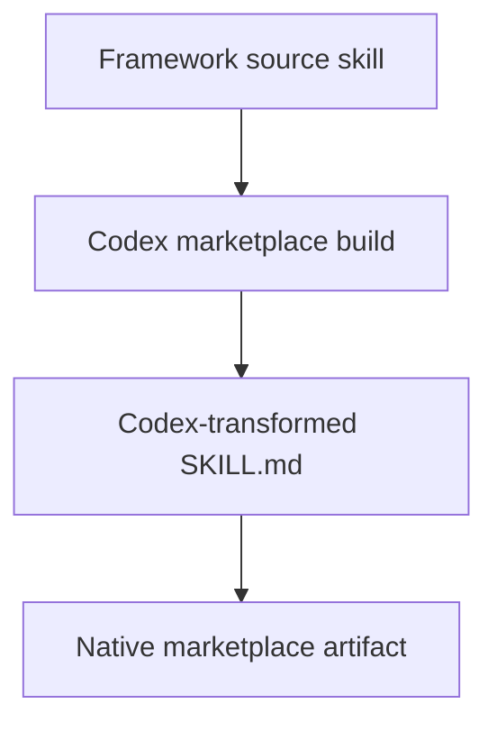

# Instruction: Apply and prove skill transformation

## Architecture projection

> Tree of the final files. ✅ create · ✏️ modify · ❌ delete

```txt
.
✏️ cli/src/application/use-cases/framework/strategies/marketplace-build-strategy.ts
✏️ cli/src/application/use-cases/framework/strategies/marketplace-strategy-helpers.ts
✏️ cli/src/application/use-cases/framework/strategies/tool-contracts.ts
✏️ cli/src/domain/tools/ai/codex.ts
✏️ cli/tests/application/use-cases/framework/marketplace-build-strategy.codex.integration.test.ts
```

## User Journey



## Tasks to do

### `1)` Reuse the Codex skill converter during marketplace builds

> Route markdown skill files through the target artifact transform after link rewriting.

1. Extend the marketplace skill-tree writer to receive and apply the skill artifact transform.
2. Expose or extract the existing Codex frontmatter allowlist as the build transform's source of truth.
3. Configure the Codex marketplace contract to transform skill markdown while preserving non-markdown assets and existing link rewriting.

### `2)` Lock the regression with an integration test

> Assert the native Codex marketplace artifact omits `model` and unsupported frontmatter.

1. Add a fixture-backed test covering a skill with Claude model metadata.
2. Assert supported Codex frontmatter remains and `model` is absent.

## Test acceptance criteria

| Task | Acceptance criteria |
| --- | --- |
| 1 | A Codex marketplace build emits every markdown skill using the Codex frontmatter allowlist, while source skills remain unchanged. |
| 2 | The build integration suite fails if a native Codex marketplace `SKILL.md` contains `model`. |
