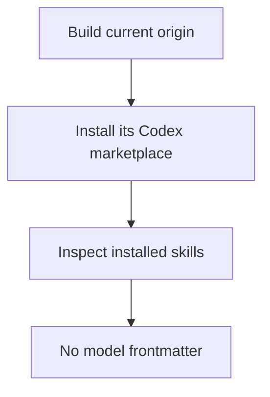

# Instruction: Verify installed origin marketplace

## Architecture projection

> Tree of the final files. ✅ create · ✏️ modify · ❌ delete

```txt
.
```

## User Journey



## Tasks to do

### `1)` Build and test the current origin

> Run the targeted regression suite and create a fresh Codex marketplace output from this worktree.

1. Run the Codex marketplace integration tests.
2. Build a fresh Codex marketplace from the worktree.
3. Scan the generated `SKILL.md` files for a `model` frontmatter key.

### `2)` Install and identify the local origin artifact

> Use Codex to install the marketplace generated from this worktree in an isolated Codex home, then inspect installed skills and marketplace metadata.

1. Install from a local artifact or an origin-addressable ref that names this repository, never the upstream repository.
2. Assert installed skill files contain no `model` frontmatter key.
3. Assert installation metadata identifies this origin artifact, not `ai-driven-dev/framework`.

## Test acceptance criteria

| Task | Acceptance criteria |
| --- | --- |
| 1 | The current-worktree Codex marketplace build and targeted integration tests succeed, and generated skills have no `model` key. |
| 2 | An isolated Codex installation sourced from this origin artifact has no `model` key in installed `SKILL.md` files and carries origin-specific marketplace identity. |
