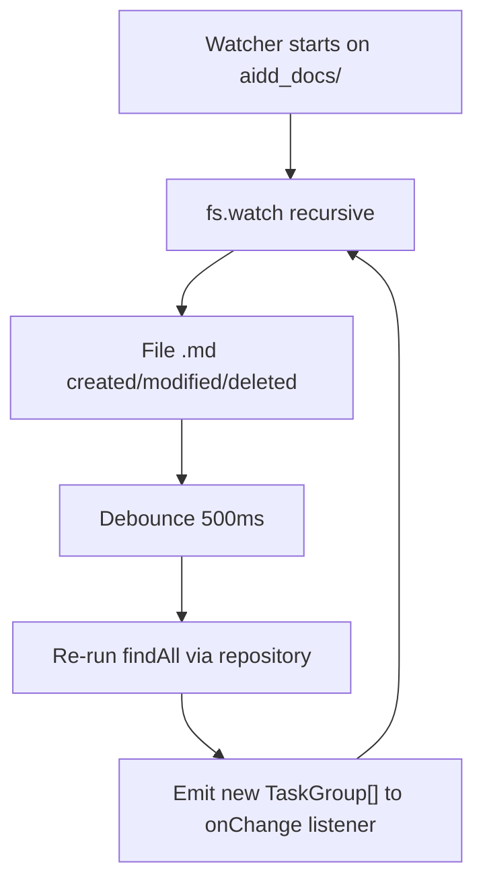
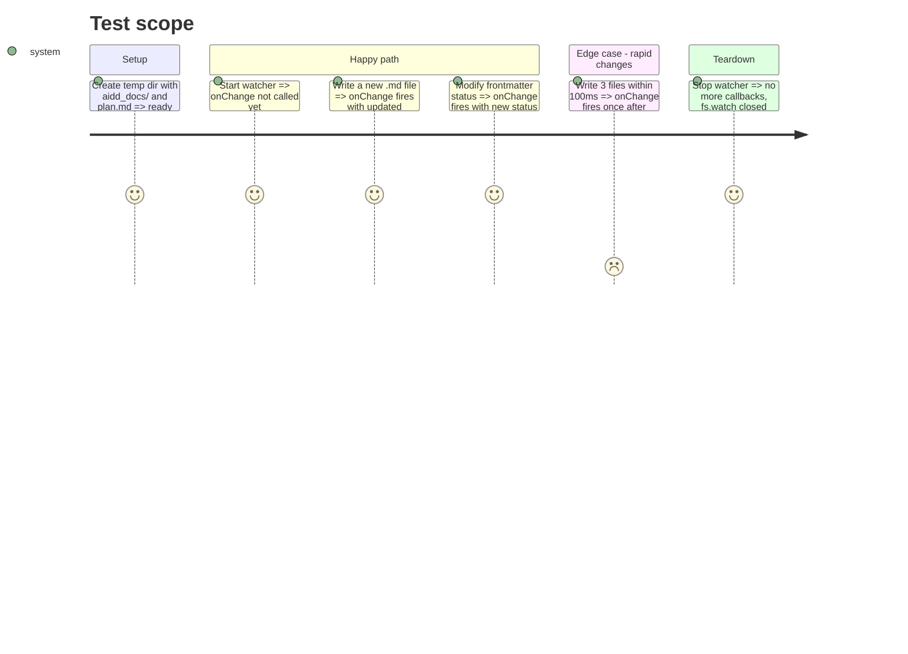

# Instruction: Filesystem watcher adapter

## Architecture projection

> Tree of the final files. ✅ create · ✏️ modify · ❌ delete

```txt
kanban/
├── src/
│   ├── domain/
│   │   └── ports/
│   │       └── ✅ task-document-watcher.ts
│   └── infrastructure/
│       └── filesystem/
│           └── ✅ filesystem-task-document-watcher.ts
└── tests/
    └── infrastructure/
        └── ✅ filesystem-task-document-watcher.test.ts
```

## User Journey



## Test Scope



## Tasks to do

### `1)` Define the watcher port

> Interface contract for watching task document changes.

1. Create `task-document-watcher.ts` in `domain/ports/`
2. Export `TaskDocumentWatcher` interface with `start(projectPath: string): void`, `stop(): void`, and `onChange(callback: (groups: TaskGroup[]) => void): void`

### `2)` Implement the filesystem watcher adapter

> Adapter that watches `aidd_docs/` and re-scans on changes.

1. Create `filesystem-task-document-watcher.ts` in `infrastructure/filesystem/`
2. Use `fs.watch` with `{ recursive: true }` on `<projectPath>/<docsDirectoryName>`
3. Filter for `.md` file events only
4. Debounce 500ms before re-scanning
5. On debounce trigger, call `taskDocumentRepository.findAll()` then `groupTaskDocumentsByDirectory()`, then invoke the onChange callback with the new TaskGroup[]
6. `stop()` closes the watcher and clears pending timers

### `3)` Test the watcher

> Integration test with real filesystem operations.

1. Create temp directory with `aidd_docs/tasks/` structure
2. Start watcher, write a file, assert onChange fires with correct data
3. Test debounce: multiple rapid writes produce a single callback
4. Test stop: no callbacks after stop

## Test acceptance criteria

| Task | Acceptance criteria                                                          |
| ---- | ---------------------------------------------------------------------------- |
| 1    | `TaskDocumentWatcher` interface exists with start, stop, onChange methods     |
| 2    | Writing a .md file under the watched dir triggers onChange within 1s         |
| 2    | Rapid successive writes produce a single onChange call after debounce        |
| 2    | Calling stop() prevents further callbacks and releases the fs.watch handle   |
| 3    | All tests pass with `vitest run`                                             |
