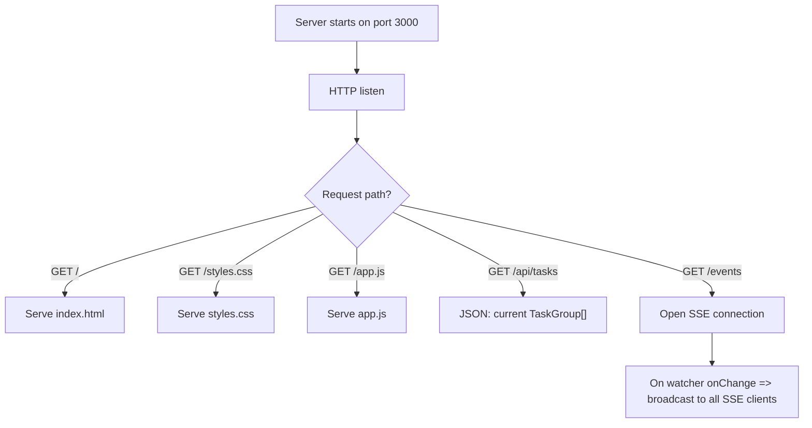
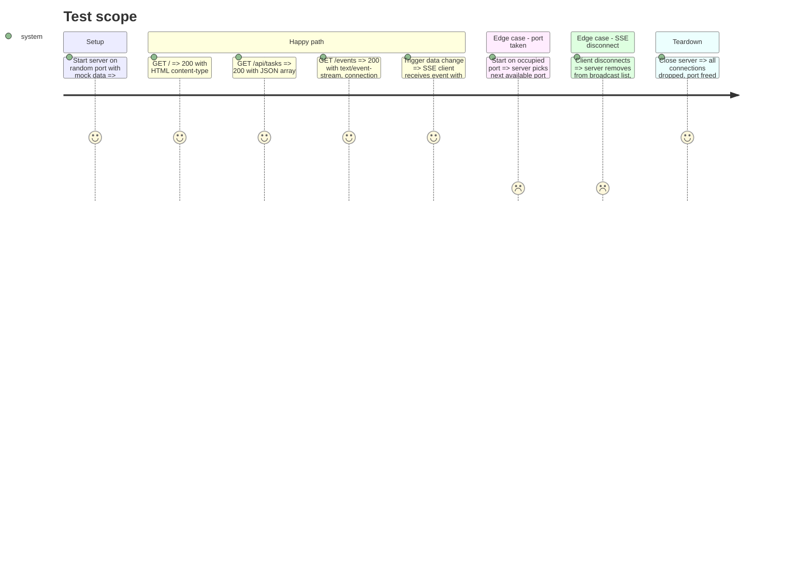

# Instruction: HTTP server and SSE streaming

## Architecture projection

> Tree of the final files. ✅ create · ✏️ modify · ❌ delete

```txt
kanban/
├── src/
│   └── presentation/
│       └── web/
│           ├── ✅ http-server.ts
│           └── ✅ sse-manager.ts
└── tests/
    └── presentation/
        └── ✅ http-server.test.ts
```

## User Journey



## Test Scope



## Tasks to do

### `1)` Build the SSE manager

> Manage SSE client connections and broadcast events.

1. Create `sse-manager.ts` in `presentation/web/`
2. `addClient(res: ServerResponse)`: set SSE headers (`text/event-stream`, `no-cache`, `keep-alive`), push to client list, remove on `close` event
3. `broadcast(data: TaskGroup[])`: write `data: JSON\n\n` to every connected client
4. `closeAll()`: end every response, clear list

### `2)` Build the HTTP server

> Lightweight Node native HTTP server serving the frontend and API.

1. Create `http-server.ts` in `presentation/web/`
2. Export `KanbanWebServer` class taking constructor deps: `port`, `projectPath`, `docsDirectoryName`, `taskDocumentRepository`, `taskDocumentWatcher`
3. Route `GET /` => serve index.html (imported as string via tsup text loader)
4. Route `GET /styles.css` => serve CSS
5. Route `GET /app.js` => serve JS
6. Route `GET /api/tasks` => scan and return TaskGroup[] as JSON
7. Route `GET /events` => register SSE client via SseManager
8. On watcher onChange => `sseManager.broadcast(newGroups)`
9. `start()`: create http server, start watcher, listen. Print URL to output
10. `stop()`: stop watcher, close all SSE clients, close server

### `3)` Test the server

> Integration test with real HTTP requests.

1. Start server on port 0 (random)
2. Test GET / returns HTML
3. Test GET /api/tasks returns valid JSON
4. Test GET /events opens SSE stream
5. Test broadcast sends data to connected SSE client
6. Test server stops cleanly

## Test acceptance criteria

| Task | Acceptance criteria                                                              |
| ---- | -------------------------------------------------------------------------------- |
| 1    | SSE clients receive JSON-encoded TaskGroup[] on broadcast                        |
| 1    | Disconnected clients are removed without crashing the server                     |
| 2    | GET / returns 200 with content-type text/html                                    |
| 2    | GET /api/tasks returns 200 with content-type application/json and a valid array  |
| 2    | GET /events returns 200 with content-type text/event-stream                      |
| 2    | Server prints its URL to the output channel on start                             |
| 3    | All tests pass with `vitest run`                                                 |
