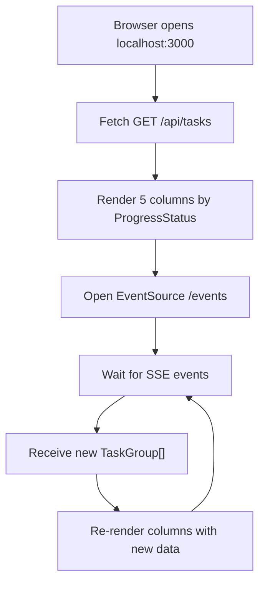
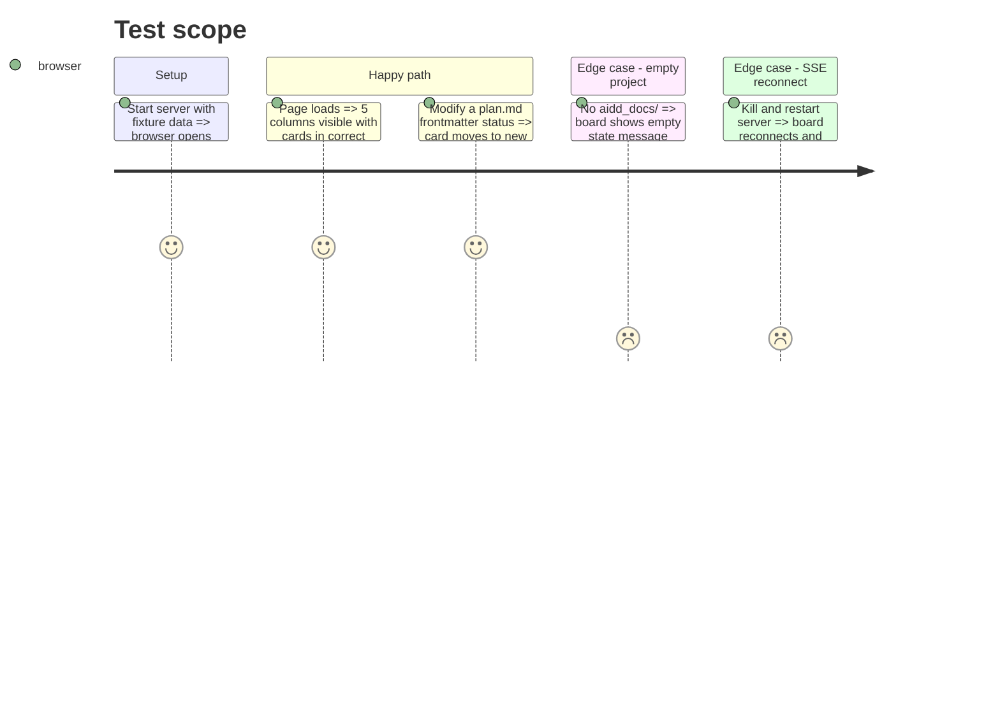

# Instruction: Frontend kanban board

## Architecture projection

> Tree of the final files. ✅ create · ✏️ modify · ❌ delete

```txt
kanban/
└── src/
    └── presentation/
        └── web/
            └── frontend/
                ├── ✅ index.html
                ├── ✅ styles.css
                └── ✅ app.js
```

## User Journey



## Wireframe

```txt
┌──────────────────────────────────────────────────────────────────┐
│ (1) Header: "aidd kanban" · project path · connection status     │
├────────────┬────────────┬────────────┬────────────┬─────────────┤
│ (2) TODO   │ (3) IN     │ (4) DONE   │ (5) BLOCKED│ (6) UNKNOWN │
│            │ PROGRESS   │            │            │             │
│ ┌────────┐ │ ┌────────┐ │ ┌────────┐ │            │             │
│ │(7) Card│ │ │  Card  │ │ │  Card  │ │            │             │
│ │ name   │ │ │ name   │ │ │ name   │ │            │             │
│ │ status │ │ │ status │ │ │ status │ │            │             │
│ │ 2/4 sub│ │ │ 1/3 sub│ │ │ 3/3 sub│ │            │             │
│ └────────┘ │ └────────┘ │ └────────┘ │            │             │
│ ┌────────┐ │            │            │            │             │
│ │  Card  │ │            │            │            │             │
│ └────────┘ │            │            │            │             │
├────────────┴────────────┴────────────┴────────────┴─────────────┤
│ (8) Footer: task count · last update timestamp                   │
└──────────────────────────────────────────────────────────────────┘
```

1. Header: title, project path, green/red dot for SSE connection state
2. TODO: cards with ProgressStatus `todo`
3. IN PROGRESS: cards with ProgressStatus `in-progress`
4. DONE: cards with ProgressStatus `done`
5. BLOCKED: cards with ProgressStatus `blocked`
6. UNKNOWN: cards with ProgressStatus `unknown`, column hidden when empty
7. Card: TaskGroup parent name, literal status badge, sub-document count with done ratio
8. Footer: total task count, last-updated timestamp

## Test Scope



## Tasks to do

### `1)` Build index.html

> Single-page HTML shell with header, board container, footer.

1. Create `index.html` in `presentation/web/frontend/`
2. Semantic structure: header, main (board), footer
3. Link styles.css, defer app.js
4. Meta viewport for responsive layout

### `2)` Build styles.css

> Dark-theme-first CSS for the kanban board.

1. Create `styles.css` in `presentation/web/frontend/`
2. CSS custom properties for colors (dark theme default, `prefers-color-scheme: light` override)
3. Flexbox layout: header fixed top, columns flex-row equal-width, cards as column items
4. Card styles: border, padding, name bold, status as colored badge, sub-doc count dimmed
5. Column header: uppercase label, item count badge
6. Connection indicator: green/red dot in header
7. Responsive: columns stack vertically below 640px

### `3)` Build app.js

> Vanilla JS: fetch initial data, connect SSE, render and update the board.

1. Create `app.js` in `presentation/web/frontend/`
2. On load: `fetch('/api/tasks')`, render columns
3. `renderBoard(taskGroups)`: clear board, for each ProgressStatus create column, place cards by parent's progressStatus
4. Card rendering: parent name, status badge (colored by progressStatus), sub-document progress bar ("N/M done")
5. `EventSource('/events')`: on message, parse JSON, call `renderBoard()`
6. Connection status: update header dot on EventSource open/error events
7. Footer: update task count and "Last updated: HH:MM:SS"
8. Hide UNKNOWN column when it has zero cards

### `4)` Manual browser verification

> Confirm the board renders and updates live.

1. Start the server with the framework's own `aidd_docs/tasks/`
2. Verify columns display correctly in the browser
3. Edit a `plan.md` frontmatter status, confirm the card moves within 1s
4. Check dark and light themes

## Test acceptance criteria

| Task | Acceptance criteria                                                                  |
| ---- | ------------------------------------------------------------------------------------ |
| 1    | index.html loads without console errors in a browser                                 |
| 2    | Cards are visually grouped in columns, readable on a 1280px-wide screen              |
| 2    | Light theme activates when OS preference is light                                    |
| 3    | On page load, columns reflect the current TaskGroup data from /api/tasks             |
| 3    | When a .md file is modified, the board updates within 1s without page reload         |
| 3    | SSE disconnect shows a red indicator; reconnect restores the green dot               |
| 3    | UNKNOWN column is hidden when no task has unknown progress status                    |
| 4    | Visual check passes on the framework's own aidd_docs/tasks/ data                     |
