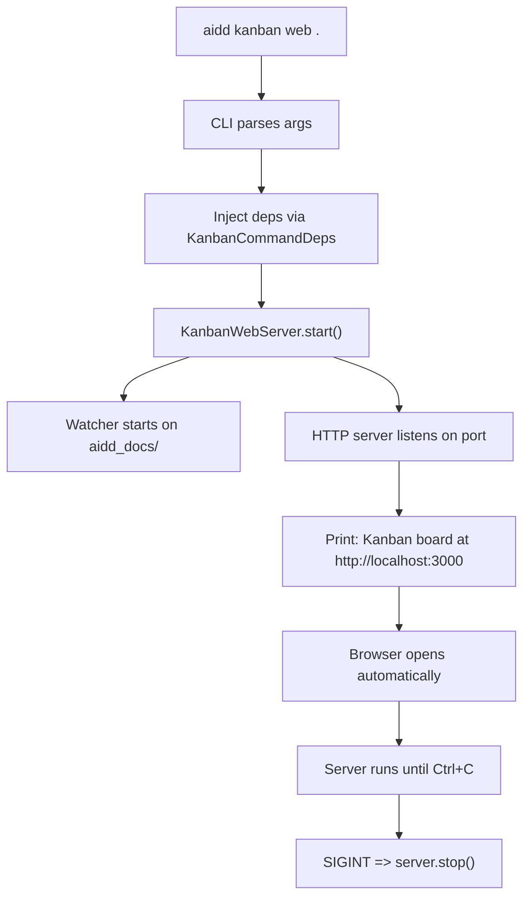
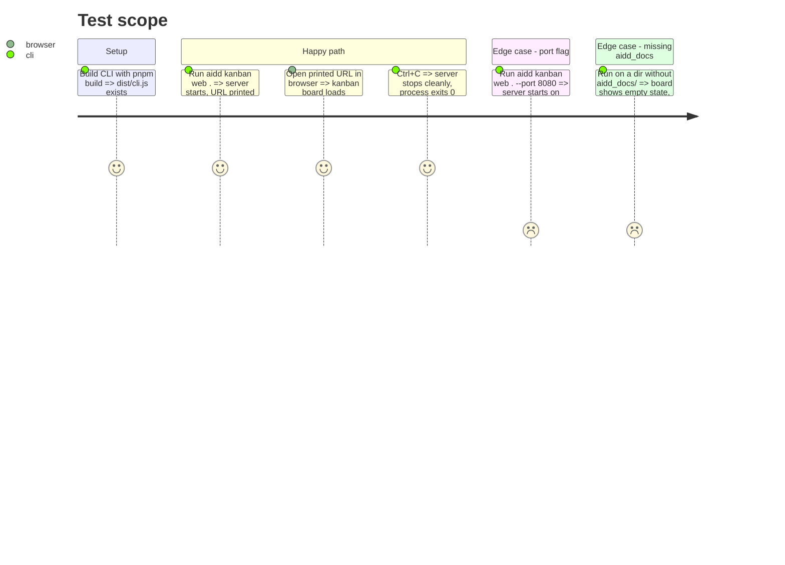

# Instruction: CLI command and bundling

## Architecture projection

> Tree of the final files. ✅ create · ✏️ modify · ❌ delete

```txt
kanban/
└── src/
    └── presentation/
        └── commands/
            └── ✅ web-command.ts

cli/
├── src/
│   └── application/
│       └── commands/
│           └── ✏️ kanban.ts
└── ✏️ tsup.config.ts
```

## User Journey



## Test Scope



## Tasks to do

### `1)` Create the web command registration

> Register `aidd kanban web [path]` as a subcommand.

1. Create `web-command.ts` in `kanban/src/presentation/commands/`
2. Accept `[path]` argument (default: cwd) and `--port <number>` option (default: 3000)
3. Instantiate `FilesystemTaskDocumentRepository`, `FilesystemTaskDocumentWatcher`, `KanbanWebServer`
4. Call `server.start()`
5. On SIGINT, call `server.stop()` and exit cleanly
6. Open browser automatically via `child_process.exec` (`xdg-open` / `open` / `start` by platform)

### `2)` Mount the web command in the CLI

> Wire the new subcommand into the existing kanban command group.

1. In `cli/src/application/commands/kanban.ts`, import `registerWebCommand`
2. Add `registerWebCommand(kanban.command("web"), deps)` alongside existing interactive and list registrations

### `3)` Configure tsup to bundle frontend assets

> Make HTML, CSS, and JS importable as strings.

1. In `cli/tsup.config.ts`, add `.html` and `.css` to the esbuild `loader` map (same as `.md` => `text`)
2. Verify `pnpm build` succeeds and the frontend files are inlined in `dist/cli.js`

### `4)` End-to-end smoke test

> Verify the full chain works from CLI to browser.

1. `pnpm build` in cli/
2. Run `node dist/cli.js kanban web .` from the framework root
3. Verify the URL is printed
4. Open the URL, verify the board renders with the framework's own tasks
5. Ctrl+C, verify clean exit

## Test acceptance criteria

| Task | Acceptance criteria                                                                |
| ---- | ---------------------------------------------------------------------------------- |
| 1    | `aidd kanban web .` starts a server and prints the URL                             |
| 1    | `--port 8080` makes the server listen on 8080                                      |
| 1    | Ctrl+C stops the server and exits with code 0                                      |
| 2    | `aidd kanban --help` does not show `web` (hidden like the parent kanban command)    |
| 2    | `aidd kanban web --help` shows path argument and port option                        |
| 3    | `pnpm build` succeeds, `dist/cli.js` contains the HTML string                      |
| 4    | Browser loads the board from the built CLI binary                                   |
