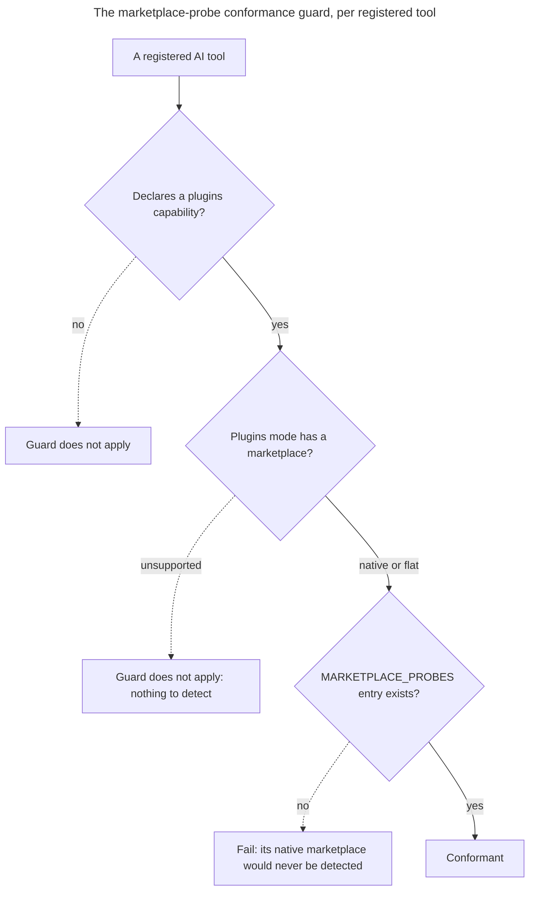

# Instruction: close the registry conformance gap

Main added exhaustive guards while the branch was away: every registered AI tool must appear in the build target/mode table, in the conformance suite's own registration list, and, when it declares a plugins capability, in the marketplace probe table. `gemini` was in none of them. The first two are already fixed in the working tree; the third is the open decision.

## Architecture projection

> Tree of the final files. ✅ create · ✏️ modify · ❌ delete

```txt
.
└── cli/
    ├── src/domain/models/framework-build.ts                    ✏️ gemini:flat entry in FRAMEWORK_BUILD_TARGET_MODES (applied)
    └── tests/domain/tools/
        └── registry-conformance.unit.test.ts                    ✏️ gemini side-effect import (applied) + narrow the marketplace-probe guard to plugin modes that have a marketplace
```

## User Journey



## Tasks to do

### `1)` Narrow the marketplace-probe guard to the modes that have a marketplace

> The guard must ask whether a marketplace exists, not merely whether the capability is declared.

1. In `registry-conformance.unit.test.ts`, replace the `"plugins" in capabilities` presence check with one that also reads the capability's `mode`.
2. Exempt `mode: "unsupported"`, keep `native` and `flat` under the requirement.
3. Extend the failure message so it says which mode was expected to carry a probe entry, and keep it pointing at `domain/models/plugin-format.ts`.
4. Access the mode through the `PluginsCapability` public `readonly mode` field, without widening the test's `AiTool<unknown>` typing to `any`.

### `2)` Prove the guard still bites

> An exemption that swallows the real case is worse than the gap it closes.

1. Confirm the five pre-existing tools still run the assertion rather than skip it, `opencode` in particular, since it is the only non-native tool that does carry a probe entry.
2. Confirm the assertion still fails when a probe entry is removed, by temporary local mutation, reverted before finishing.

### `3)` Run the suite against a freshly built binary

> The e2e tests execute `dist/cli.js`. A stale bundle silently produces a verdict about code that is not the code under test.

1. Build first and check the bundle's timestamp is from this run, not an earlier one.
2. Run typecheck, lint and the full suite.
3. Compare the failure set against the two failures part-1's amendments already document as coupled to the local `gh` session.

## Test acceptance criteria

| Task | Acceptance criteria |
| ---- | ------------------- |
| 1 | `gemini` passes the conformance suite without any entry being added to `MARKETPLACE_PROBES` |
| 2 | Removing `opencode`'s probe entry still fails the guard, so the exemption is scoped to the unsupported mode alone |
| 3 | `aidd framework build --target gemini --flat` succeeds and `--target gemini` alone exits 1, both against a bundle built in the same run |
| 3 | The whole suite passes except `auth status`, whose exit code depends on the machine's `gh` session and is documented as such |
| 3 | The ten-cell framework-build golden matrix passes, the nine pre-rebase cells included |
