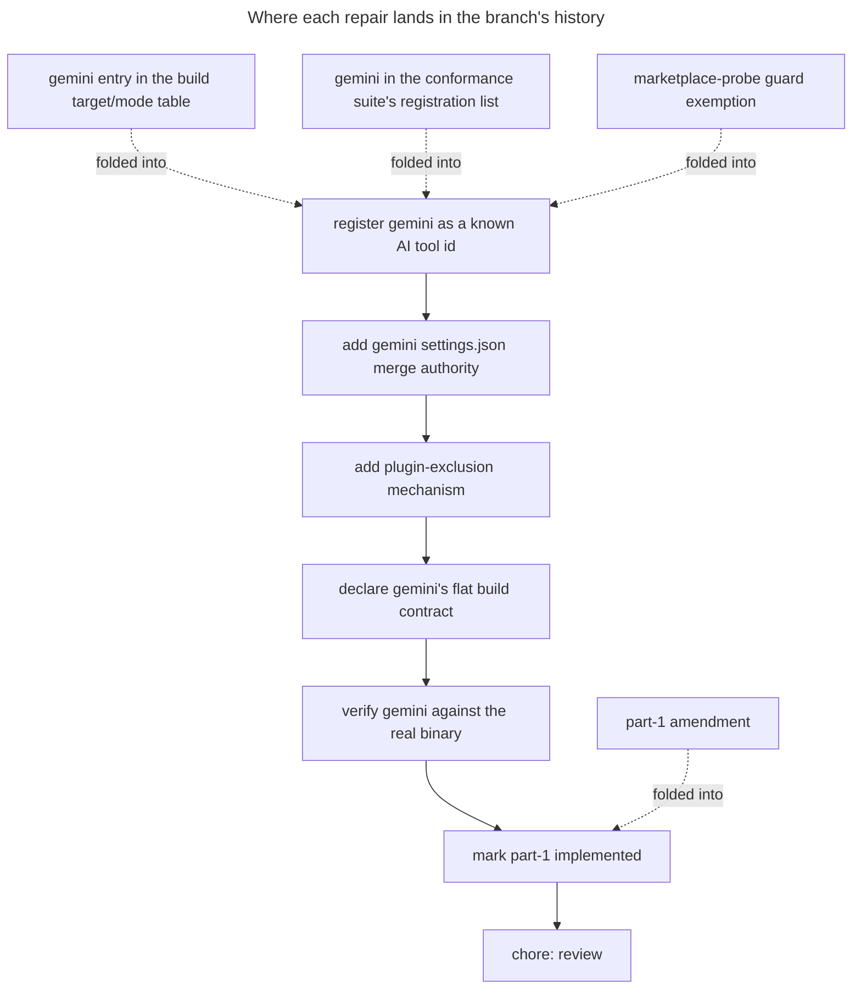

# Instruction: land the repair in history

The branch is seven commits of a plan whose part-1 document claims every acceptance criterion held. That claim was true before the rebase and false after it. This phase makes the history match the claim again.

## Architecture projection

> Tree of the final files. ✅ create · ✏️ modify · ❌ delete

```txt
.
├── aidd_docs/tasks/2026_07/2026_07_27_gemini-cli-build-target/
│   └── 2026_07_27-511-gemini-cli-tool-part-1.md                 ✏️ amendment recording what the rebase invalidated and how
└── cli/                                                          ✏️ no new edits; phase 1's changes are redistributed across existing commits
```

## User Journey



## Tasks to do

### `1)` Fold each repair into the commit that opened its gap

> All three gaps open the moment `gemini` becomes a registered tool id, so they belong there, not at the tip.

1. Rebase interactively onto the merge base with main, editing the tool-id registration commit.
2. Apply the build target/mode entry, the conformance registration import, and the guard narrowing into that commit.
3. Leave the other six commits untouched, and confirm the branch still holds seven commits.

### `2)` Record the amendment in part-1's plan

> Part-1 is marked implemented on evidence gathered against a main that has since moved. The document has to say so.

1. Add an amendment entry naming the three guards main introduced after part-1's verification run and what each required.
2. State that the golden re-verification was re-run after the rebase, and against a freshly built bundle.
3. Leave the acceptance criteria ticked, since they hold again; the amendment records the interruption, not a regression of scope.

### `3)` Check the branch bisects clean

> The point of folding rather than appending is that every commit stands on its own. Verify it rather than assume it.

1. Run typecheck and the unit suite at the tool-id registration commit.
2. Run them again at the tip.
3. Where a middle commit fails for a reason the phase order makes unavoidable, record it rather than reshuffle the branch.

## Test acceptance criteria

| Task | Acceptance criteria |
| ---- | ------------------- |
| 1 | The working tree is clean and the branch carries no separate fixup commit |
| 1 | The branch still applies onto main without conflict, and its commit count is unchanged |
| 2 | Part-1's amendments name the three guards and how each was satisfied |
| 3 | The tool-id registration commit passes typecheck and the unit suite on its own |
| 3 | The tip passes typecheck, lint and the full suite, except the documented `gh`-session failure |
