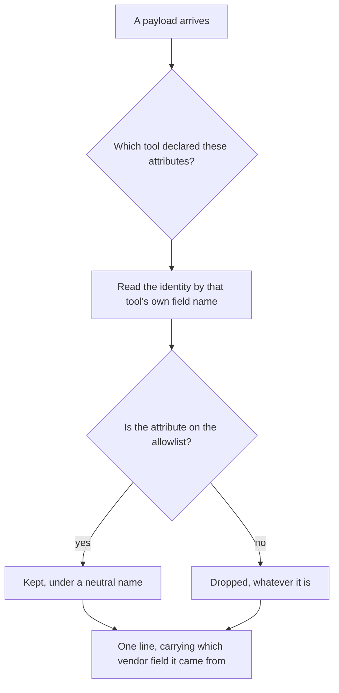
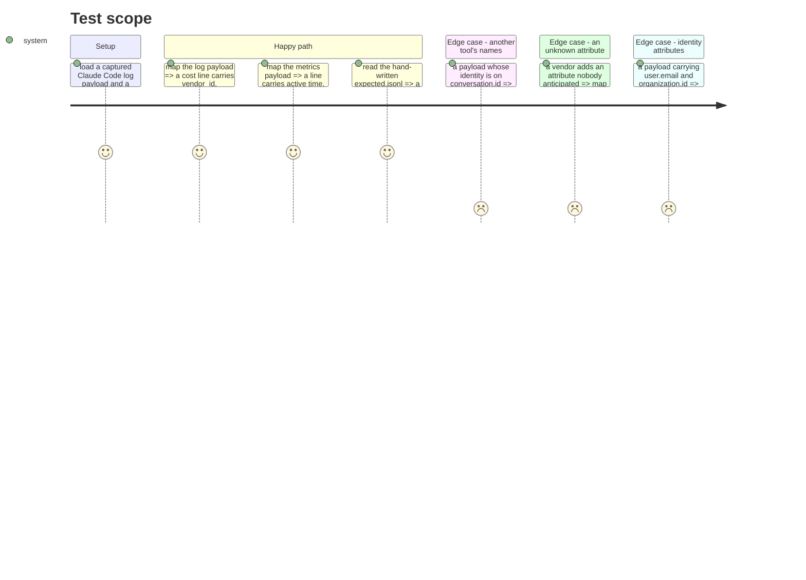

# Instruction: the format, and what never enters it

## Architecture projection

```txt
.
├── cli/src/domain/capabilities/
│   └── telemetry-capability.ts         ✏️ each tool declares the attributes its export carries
├── cli/src/domain/tools/ai/
│   ├── claude.ts                       ✏️ session.id, prompt.id
│   ├── codex.ts                        ✏️ conversation.id
│   ├── copilot.ts                      ✏️ gen_ai.conversation.id, on a span
│   ├── cursor.ts                       ✏️ cursor.conversation.id
│   └── opencode.ts                     ✏️ declared as unmeasured until it is
├── cli/src/domain/models/
│   └── telemetry-sink-record.ts        ✅ the tool-neutral stored shape and the allowlist
├── cli/tests/domain/models/
│   └── telemetry-sink-record.unit.test.ts  ✅
└── cli/tests/fixtures/telemetry-sink/
    ├── otlp-logs-claude-code.json      ✅ a real captured payload
    ├── otlp-metrics-claude-code.json   ✅ a real captured payload
    └── expected.jsonl                  ✅ hand-written, never generated
```

## User Journey



## Test Scope



## Tasks to do

### `1)` A tool-neutral line

> The stored shape must not be shaped like whichever tool was measured first.

1. Identity is recorded as `vendor_id` **plus `vendor_field`**, the name it came from — the same pair the run journal already uses, for the same reason: a join is only defensible when its provenance is stated.
2. `sink_schema_version` on every line, so the reader fails loudly on a shape it does not know.
3. `kind` distinguishes what the line records: a billed request, or a session-level measure.

> Measured 2026-08-13 and recorded in `aidd_docs/specs/2026_08/2026_08_13-work-tracking-linkage.md`: the identity attribute is `session.id` on Claude Code, `conversation.id` on Codex, `gen_ai.conversation.id` on Copilot, `cursor.conversation.id` on Cursor. A format naming the field `session_id` would be Claude's format wearing a neutral label.

### `2)` Each tool declares its own names

1. Extend the telemetry capability each tool already carries with the attribute names its export uses.
2. A tool whose export has not been measured declares that, rather than being guessed at. **OpenCode is unmeasured; Cursor's export is a team setting nobody here can enable.**

> The capability is where per-tool knowledge already lives, so the mapper stays free of tool identifiers — the rule that took a whole refactor to establish in #646.

### `3)` Metrics are not redundant, and must not be dropped

1. Store session-level measures from `/v1/metrics` as their own `kind`.

> Measured on a real export: `claude_code.active_time.total` is **9.714 s**, and no log record carries it. Cost and tokens appear in both; **active time appears only in metrics**. Dropping metrics would lose the "time" third of what this whole layer exists to answer. Their datapoints carry no turn identifier, so they join to a session and never to a turn — recorded as such rather than silently mixed with per-turn figures.

### `4)` The allowlist

1. Keep, under neutral names: the vendor identity and its field name, the turn identifier and its field name when the tool has one, `project_id`, `user_id`, `cost_usd`, input, output and cache token counts, `model`, `effort`, `speed`, `query_source`, `agent_name`, `duration_ms`, active time, and the event timestamp.
2. Drop everything else **by construction** — the mapper builds a new object, it never deletes from the incoming one.
3. Named in the test as attributes that must never appear: `user.email`, `user.account_id`, `user.account_uuid`, `organization.id`, `terminal.type`, `request_id`, `client_request_id`.

> Measured: `user.email` rides on 52 log records out of 52, and on every metric datapoint too. It is not confined to the cost metric, which is what the ticket assumed.

### `5)` Prove the reader is not coupled to the writer

1. `expected.jsonl` is written by hand, never generated from the mapper.
2. A test parses it and asserts the fields a report needs.

## Test acceptance criteria

| Task | Acceptance criteria |
| ---- | ------------------- |
| 1 | A line names both the identity and the vendor field it came from |
| 1 | An unknown `sink_schema_version` is rejected rather than guessed |
| 2 | Every AI tool declares its export attribute names, or declares them unmeasured — asserted for all five |
| 2 | The mapper contains no tool identifier; a payload from a second tool maps with no new branch |
| 3 | Active time reaches a stored line, from a captured metrics payload |
| 3 | A session-level line is distinguishable from a per-turn line at read time |
| 4 | Every allowlisted field survives a real captured payload |
| 4 | Each named identity attribute is absent from the output, asserted by name |
| 4 | An attribute absent from the allowlist is dropped without the mapper knowing it exists |
| 5 | A hand-written fixture the mapper never produced parses into the fields a report needs |
