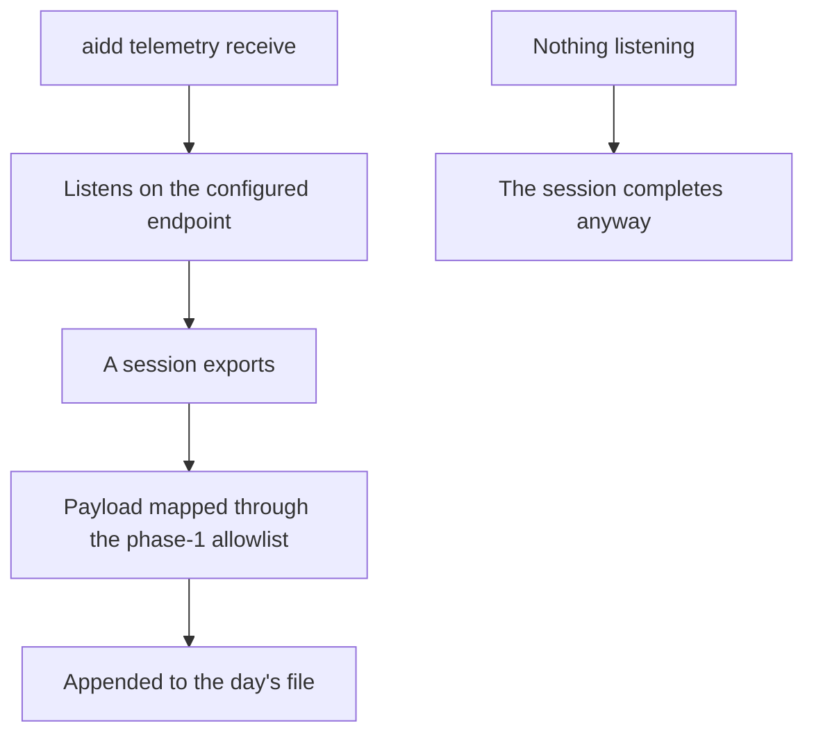
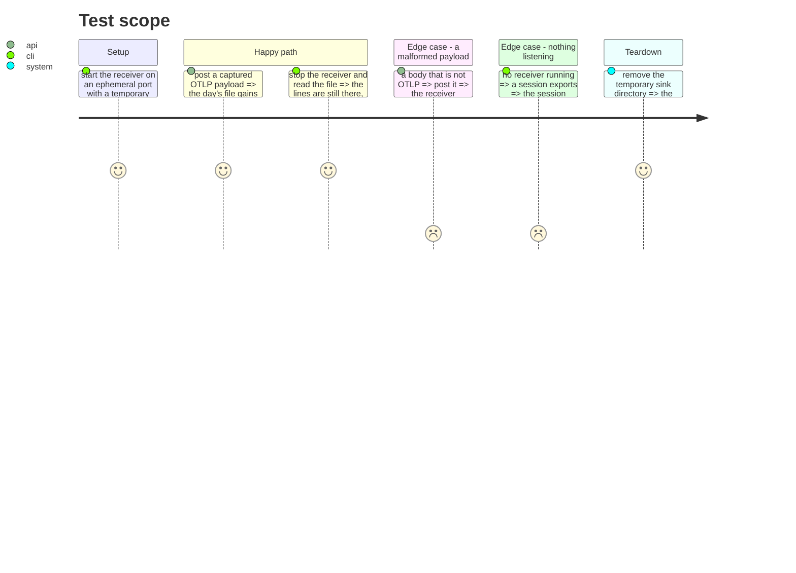

# Instruction: the receiver

## Architecture projection

```txt
.
├── cli/src/application/use-cases/telemetry/
│   └── receive-telemetry-use-case.ts   ✅ accept a payload, map it, append it
├── cli/src/infrastructure/adapters/
│   └── otlp-http-receiver-adapter.ts   ✅ the listening surface, node:http only
├── cli/src/application/commands/
│   └── telemetry.ts                    ✏️ a `receive` subcommand
└── cli/tests/application/use-cases/telemetry/
    └── receive-telemetry-use-case.unit.test.ts  ✅
```

## User Journey



## Test Scope



## Tasks to do

### `1)` Listen, map, append

> The receiver owns no judgement about content — phase 1 does.

1. OTLP/HTTP, `POST /v1/logs`, `/v1/metrics` **and `/v1/traces`**, `http/json` — the protocol `aidd telemetry on` already configures.

> Measured 2026-08-13: Copilot puts its conversation identity on a **span**, `gen_ai.conversation.id` on `invoke_agent`. A receiver listening only to logs and metrics would answer 404 to the one payload that identifies a Copilot session. Traces may be stored or answered-and-dropped, but the endpoint must exist — an exporter that gets a 404 retries, and then reports an error the user sees.
2. Answer 200 with an empty JSON object, as an OTLP endpoint must, so the exporter does not retry a payload already stored.
3. Append through the phase-1 mapper. Never rewrite a file — the same rule the run journal now follows, for the same reason.

### `2)` Where it writes

1. `AIDD_USER_CONFIG_DIR ?? ~/.config/aidd`, then `telemetry/`, then one file per day.
2. Machine-level, because one receiver serves every project. `project_id` is on each line, so a reader separates them.
3. The command prints the resolved absolute path before listening, never after.

### `3)` Failing is allowed, lying is not

1. A malformed payload is answered, dropped, and logged to the receiver's own output — it never takes the receiver down.
2. An unwritable sink directory stops the receiver with a clear message at startup, not silently at the first payload.

### `4)` Absence must stay free

1. Nothing supervises the receiver, nothing restarts it, nothing waits for it.

> Measured: a session exporting to a dead port completes — 8.3 s without export against 9.3 s to a closed one, one sample each. The exporter's own retry is the entire cost, and it is bounded by the vendor, not by us.

## Test acceptance criteria

| Task | Acceptance criteria |
| ---- | ------------------- |
| 1 | A posted payload becomes lines on disk, readable after the receiver exits |
| 1 | The endpoint answers 200 so the exporter does not resend what was stored |
| 1 | No code path reads a sink file in order to write it again |
| 2 | The written path honours `AIDD_USER_CONFIG_DIR`, proven by writing somewhere else entirely |
| 2 | Two projects exporting to one receiver stay separable by `project_id` |
| 2 | The resolved path appears before the first byte is written |
| 3 | A malformed body leaves the receiver up and the file untouched |
| 3 | An unwritable directory fails at startup with a message naming the path |
| 4 | A session whose endpoint refuses connections still completes |
