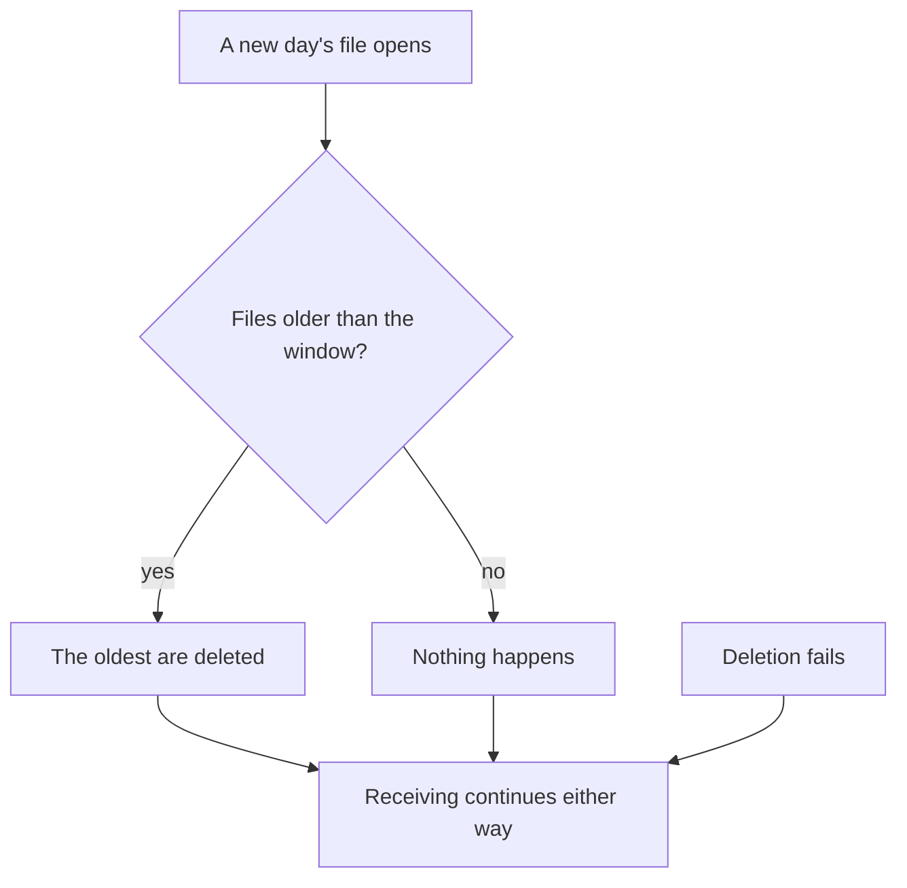
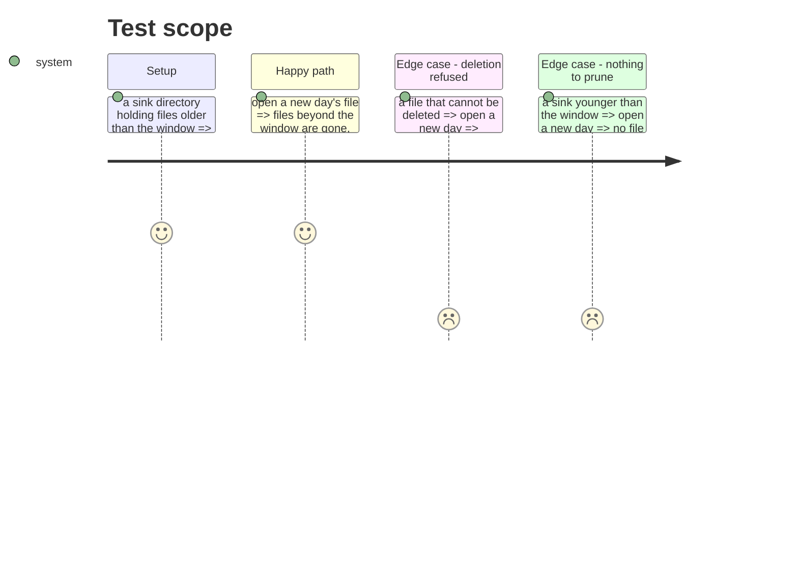

# Instruction: retention

## Architecture projection

```txt
.
├── cli/src/domain/models/
│   └── telemetry-sink-retention.ts     ✅ which files a retention window keeps, pure
├── cli/src/application/use-cases/telemetry/
│   └── receive-telemetry-use-case.ts   ✏️ prune on rollover, never on the write path
└── cli/tests/domain/models/
    └── telemetry-sink-retention.unit.test.ts  ✅
```

## User Journey



## Test Scope



## Tasks to do

### `1)` A window, not a size

> A developer machine runs this for months. What matters is that it never grows without bound.

1. Keep whole days, deleting the oldest first. A default measured in days, overridable.
2. Decide the default from a real payload's size on disk — one billed request is roughly one line, so a working day is measurable rather than guessed.

### `2)` Pruning may never cost a payload

1. Prune when a new day's file opens, never on the path that stores an incoming payload.
2. A deletion that fails is reported to the receiver's output and changes nothing else. **Exceeding retention drops the oldest data; it never drops the newest, and never refuses to receive.**

## Test acceptance criteria

| Task | Acceptance criteria |
| ---- | ------------------- |
| 1 | Files beyond the window are gone and the window's files remain, asserted on real files |
| 1 | The default is stated with the measurement it came from |
| 2 | A payload arriving during a failed prune is still stored |
| 2 | The newest file is never a candidate for deletion, whatever the window |
| 2 | A sink younger than the window loses nothing |
