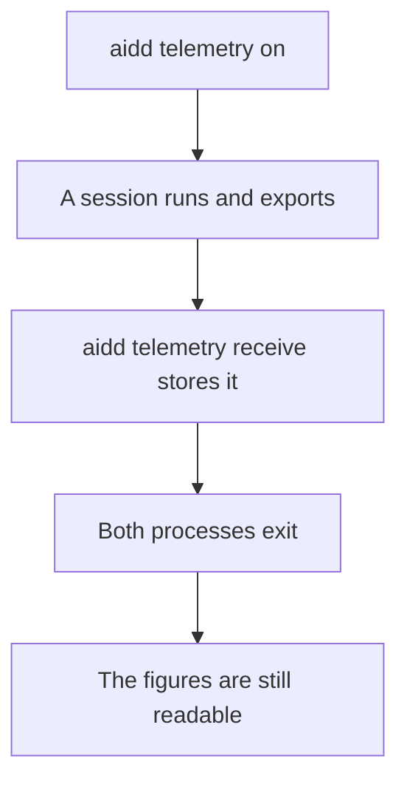
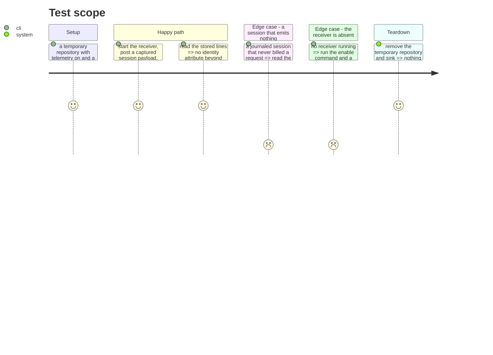

# Instruction: the journeys

## Architecture projection

```txt
.
└── cli/tests/e2e/
    └── telemetry-sink.e2e.test.ts      ✅ the real binary, a real session's payload, a real restart
```

## User Journey



## Test Scope



## Tasks to do

### `1)` Survive the process

1. Store a payload, stop the receiver, read the figures back. That single journey is what the whole ticket exists for.

### `2)` Prove the redaction where it counts

1. Assert on the **stored file**, not on the mapper's return value. A unit test proves the function; only the file proves the product.

### `3)` The two absences

1. A journaled session that billed nothing must be distinguishable from a session that was never journaled — the run journal has a `session_start` line, the sink has none.
2. A missing receiver blocks nothing.

### `4)` Strip the git environment

1. Every child process runs without `GIT_*`.

> Not a precaution. The journal's own tests shipped with this bug: git exports `GIT_DIR` inside a hook, so a temporary repository's git calls operated on the real one. It is caught by a regression test now, and the same trap applies to any suite spawning processes.

## Test acceptance criteria

| Task | Acceptance criteria |
| ---- | ------------------- |
| 1 | Figures survive the receiver's exit, read from disk by a separate process |
| 2 | No identity attribute beyond `user_id` appears in the stored file |
| 3 | A billed-nothing session and a never-journaled session are told apart at read time |
| 3 | With no receiver, enabling telemetry and running a session both succeed |
| 4 | The suite passes with `GIT_DIR` exported |
