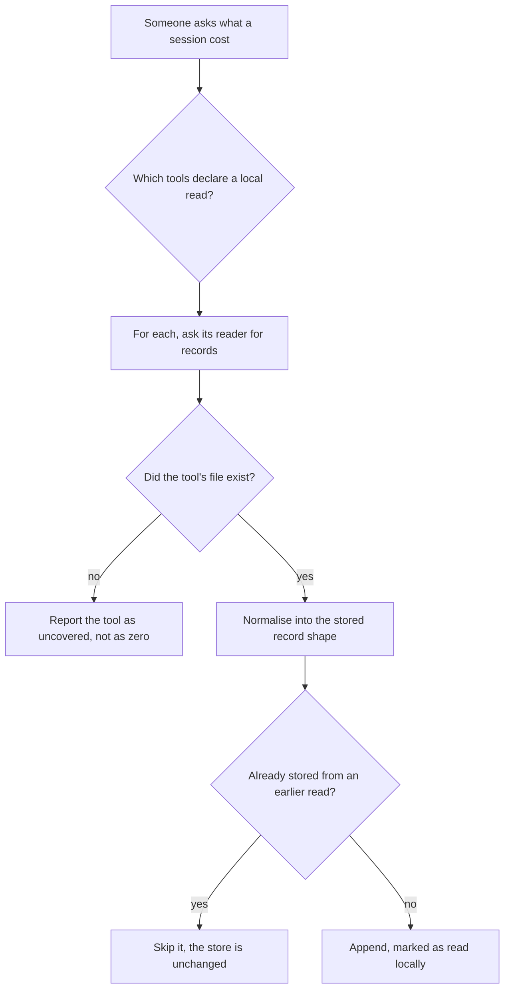
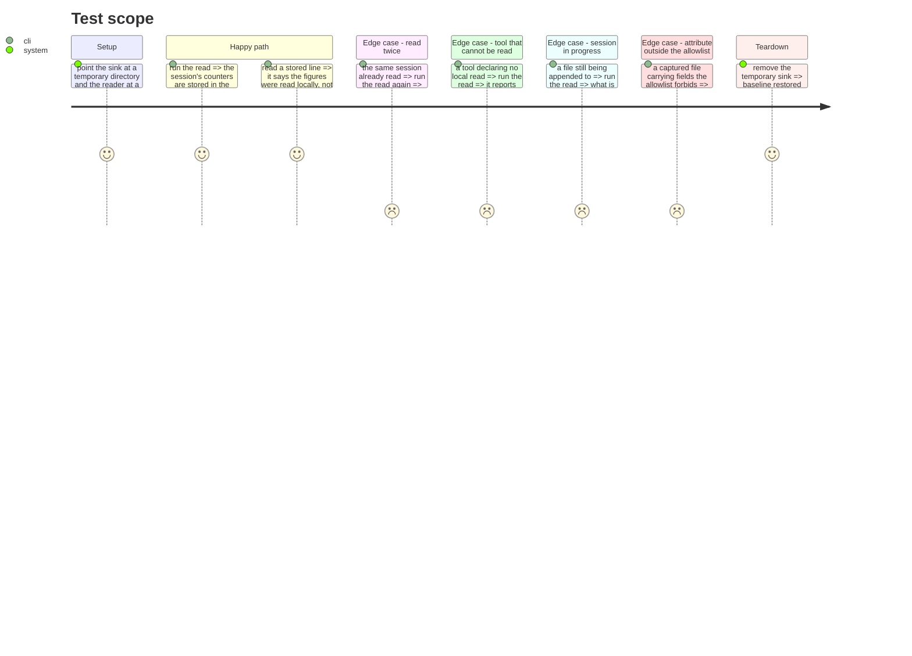

# Instruction: One shape, whichever route it took

## Architecture projection

> Tree of the final files. ✅ create · ✏️ modify · ❌ delete

```txt
.
└── cli/
    ├── src/
    │   ├── domain/
    │   │   ├── models/telemetry-sink-record.ts        ✏️ provenance, and the identity a re-read matches on
    │   │   ├── ports/session-cost-reader.ts           ✅ what a per-tool reader promises
    │   │   └── capabilities/telemetry-capability.ts   ✏️ a tool declares whether it can be read locally
    │   ├── application/
    │   │   ├── use-cases/telemetry/read-local-cost-use-case.ts  ✅ asks the registry, never a tool by name
    │   │   ├── commands/telemetry.ts                  ✏️ one subcommand
    │   │   └── display/telemetry-display.ts           ✏️ covered, uncovered, and nothing found are three things
    │   └── infrastructure/deps.ts                     ✏️ wires readers to the tools that declare one
    └── tests/…                                        ✅ ✏️
```

## User Journey



## Test Scope



## Tasks to do

### `1)` Say where a figure came from

> A figure read from a transcript and a figure received from an export are not interchangeable. Today nothing on the record distinguishes them, because there was only one route.

1. Add a provenance field to the stored record, with a value for each route, and take the stored schema version to 2 in the same change.
2. Set it on the existing mapper too, so an exported record is as explicit as a read one. A default that means "the old route" would make the field unreadable the day a third appears.
3. No migration is written. The sink is delivered but unmerged, so no day file exists outside this branch — this is the one moment where bumping costs nothing, and after a release it would not be.
4. Assert it against a captured export as well as a captured transcript.

### `2)` Give a re-read something to match on

> The tool's file keeps growing, so the same session is read again and again by design. Reading twice must leave the store as the first read left it.

1. Carry the tool's own request identifier onto the record, where the tool has one.
2. Match a candidate against what is already stored on that identifier, not on a hash of the line — a hash changes the moment the tool appends anything to the same record.
3. Where a tool has no request identifier, say so in the reader's contract rather than inventing one; a synthesised key that is not stable across reads is worse than an absent one.
4. Prove it with a real file read twice, asserting the store is unchanged the second time.

### `3)` Declare which tools can be read at all

> The registry already carries what a tool's export looks like. Whether its files can be read is the same kind of fact and belongs beside it.

1. Extend the tool declaration with the local-read shape, following how the export shape is already declared — measured, or explicitly unmeasured, never guessed.
2. Copilot and Cursor declare that they cannot be read, each with the reason. Those are facts established by probe, not gaps waiting to be filled.
3. The use-case asks the registry which tools declare one. It never names a tool.

### `4)` One port, one reader per tool

> Three tools, three genuinely different formats. What they share is what they promise, not how they do it.

1. Define the port: given a session identity, return records in the stored shape, or nothing when the tool wrote no file.
2. Wire the implementations to the tools that declare a local read, at the composition root. That is the one place allowed to know which adapter serves which tool.
3. No adapter is written in this phase. The next two write them.

### `5)` Report three states, not two

> A tool that cannot be read and a tool that ran and consumed nothing must not print the same line. That confusion is the reason the diagnostic ticket exists.

1. Covered and found, covered and empty, and not covered are three outcomes.
2. The reason a tool is uncovered comes from its declaration, never from a string in the display.

## Test acceptance criteria

| Task | Acceptance criteria                                                                                       |
| ---- | ------------------------------------------------------------------------------------------------------------ |
| 1    | Every stored record says which route produced it, including records produced by the existing export path      |
| 1    | No record relies on a default to mean "the old route"                                                         |
| 1    | The stored schema version reads 2, and a line at version 1 is refused rather than guessed at                  |
| 2    | Reading the same captured file twice leaves the store byte-identical to after the first read                  |
| 2    | A tool with no request identifier is declared as such, and no key is synthesised for it                       |
| 3    | Adding a readable tool is a declaration; the use-case changes not at all                                      |
| 3    | Copilot and Cursor each declare why they cannot be read                                                       |
| 4    | The use-case names no tool, and only the composition root maps a tool to an adapter                           |
| 5    | Uncovered, empty and found produce three distinguishable outcomes                                             |
| 5    | Nothing outside the existing allowlist reaches a stored line, asserted against a real captured file           |
