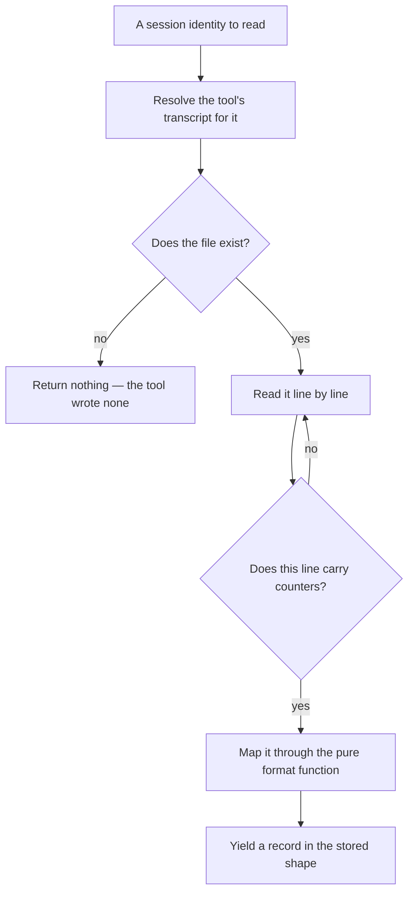
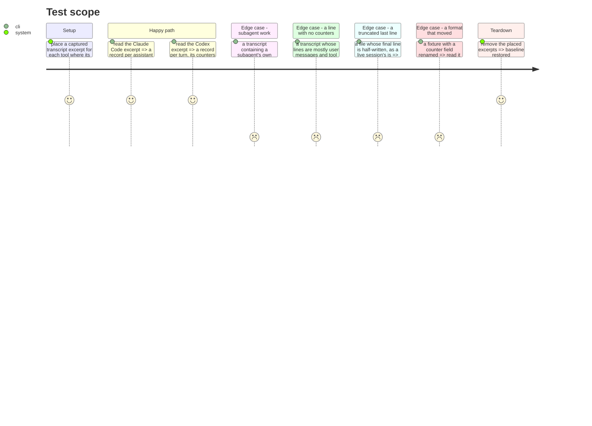

# Instruction: The two transcript readers

## Architecture projection

> Tree of the final files. ✅ create · ✏️ modify · ❌ delete

```txt
.
└── cli/
    ├── src/
    │   ├── domain/formats/
    │   │   ├── claude-code-transcript.ts        ✅ pure: a transcript line -> a stored record
    │   │   └── codex-rollout.ts                 ✅ pure: a rollout line -> a stored record
    │   ├── domain/tools/ai/{claude,codex}.ts    ✏️ each declares its local read
    │   └── infrastructure/adapters/
    │       └── transcript-cost-reader-adapter.ts ✅ the only part that opens a file
    └── tests/
        ├── fixtures/local-cost/                 ✅ captured transcript excerpts, redacted
        └── …                                    ✅
```

## User Journey



## Test Scope



## Tasks to do

### `1)` Two pure format functions

> Opening files is one job. Understanding what is in them is another, and only the second is worth testing exhaustively.

1. Claude Code: an assistant message carries `message.usage` with `input_tokens`, `cache_creation_input_tokens`, `cache_read_input_tokens`, `output_tokens`, alongside `model`, `sessionId`, `requestId` and `isSidechain`. One record per such message.
2. Codex needs two event types paired, and this is measured, not inferred. A `token_count` event carries `total_token_usage` **and** `last_token_usage`; on a real rollout the totals run 19813 → 42625 → 77062 while the increments run 19813, 22812, 34437, and 19813 + 22812 = 42625. So `total_token_usage` is cumulative and **`last_token_usage` is the increment**. Sum the increments, or take the final total — never sum the totals.
3. A Codex `token_count` event carries **no model and no request identifier**. Its keys are exactly `last_token_usage`, `model_context_window`, `total_token_usage`. The model, the effort and a `turn_id` come from the `turn_context` events that precede it. So the Codex reader pairs each `turn_context` with the counted events that follow it, and produces one record per turn, keyed on `turn_id`.
4. Both take a string and return records. No `fs`, no path resolution, no I/O.
5. Map onto the allowlisted field names the stored record already uses. Do not introduce a parallel vocabulary for the same quantity.

### `2)` One adapter that opens files

> Two formats, one I/O concern. The difference between them is the pure function, not the reading.

1. Resolve the tool's transcript from the session identity, using what the tool declares rather than a path built in the adapter.
2. Stream the file rather than reading it whole. A long session's transcript is large, and this must not depend on it being small.
3. A file that does not exist returns nothing. That is a tool which wrote none, not an error.
4. A final line that is half-written is skipped, not fatal. A live session is being appended to while this reads.

### `3)` Resolve Codex's session by the right identifier

> Two id fields, and the obvious-looking one is the wrong one. On a fresh session they hold the same value, which is exactly how this ships green and breaks in production.

1. A rollout's `session_meta` payload carries both `id` and `session_id`. The hook's `session_id` matches **`session_meta.id`** — verified against the captured probe rollout, where the hook saw `01a01450-dc0f-71a3-ae06-7f1698ef866b` and `session_meta.id` held that value.
2. On a resumed or forked session the two diverge: `session_id` then holds the parent thread and `id` holds this rollout. A reader keyed on `session_id` joins to the wrong rollout, or to nothing, and only for resumed sessions.
3. Cover it with a fixture where the two differ. A fixture where they agree proves nothing, and every fresh session agrees.

### `4)` Fixtures that are recordings

> The formats are internal and undocumented. A hand-written fixture would encode the assumption being tested rather than what the tool actually writes.

1. Take excerpts from real transcripts already on disk, redacting absolute paths, addresses and any prompt or response text.
2. Keep at least one Claude Code excerpt containing subagent messages, since separating that work is one of the few things this data makes possible.
3. Assert no fixture carries content — no prompt, no response, no file body — with a test that scans the directory rather than a named list.

### `5)` Make a moved format fail loudly

> This is the cost of leaving the standard wire format, and it has to be paid on purpose.

1. Assert the counters against the captured fixture, by value, not by presence.
2. Assert that a record whose counter field is absent produces no record rather than a zero. A zero that means "not found" is exactly the false figure this layer exists to prevent.
3. Say in each format file which tool version the fixture came from, so a future reader knows what moved.

## Test acceptance criteria

| Task | Acceptance criteria                                                                                          |
| ---- | --------------------------------------------------------------------------------------------------------------- |
| 1    | A Claude Code assistant message yields one record with all four counters and the model, by value                 |
| 1    | A Codex turn yields one record whose counters do not double when turns are summed                                |
| 1    | A Codex record carries the model and effort from its turn context, not from the counted event                    |
| 1    | Neither format function touches the filesystem                                                                   |
| 2    | A missing transcript returns nothing and is not an error                                                         |
| 2    | A half-written final line is skipped and nothing throws                                                          |
| 2    | The transcript path comes from the tool's declaration, not from the adapter                                      |
| 3    | A rollout whose `session_meta.id` and `session_id` differ resolves by `id`, matching what the hook saw            |
| 4    | Every fixture is an excerpt of a real transcript, and none carries prompt, response or file content              |
| 4    | Subagent work is attributable rather than merged into the main line                                              |
| 5    | Renaming a counter field in a fixture turns a test red                                                           |
| 5    | An absent counter yields no record, never a zero                                                                 |
