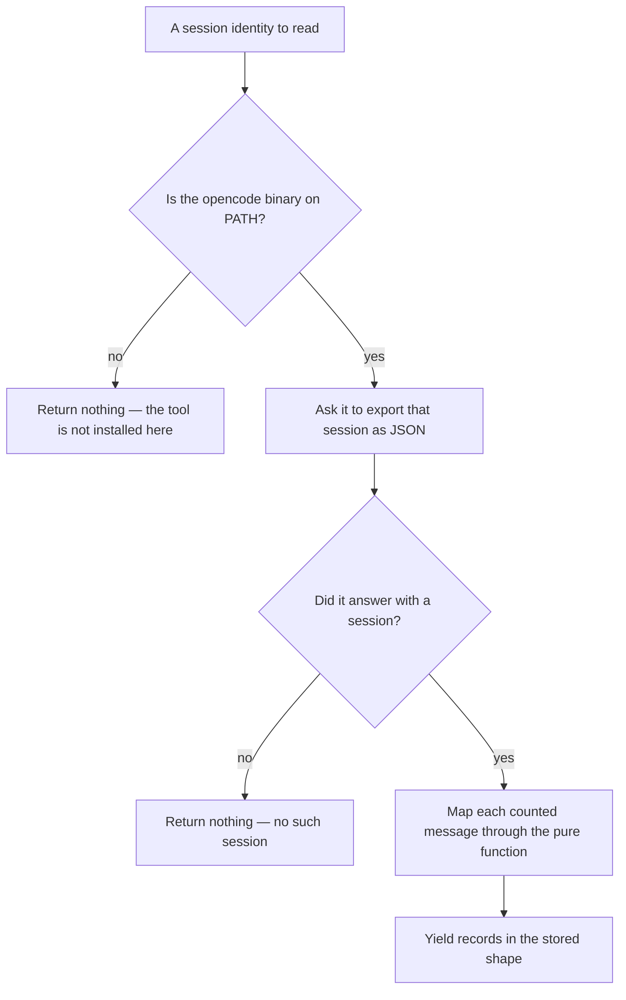
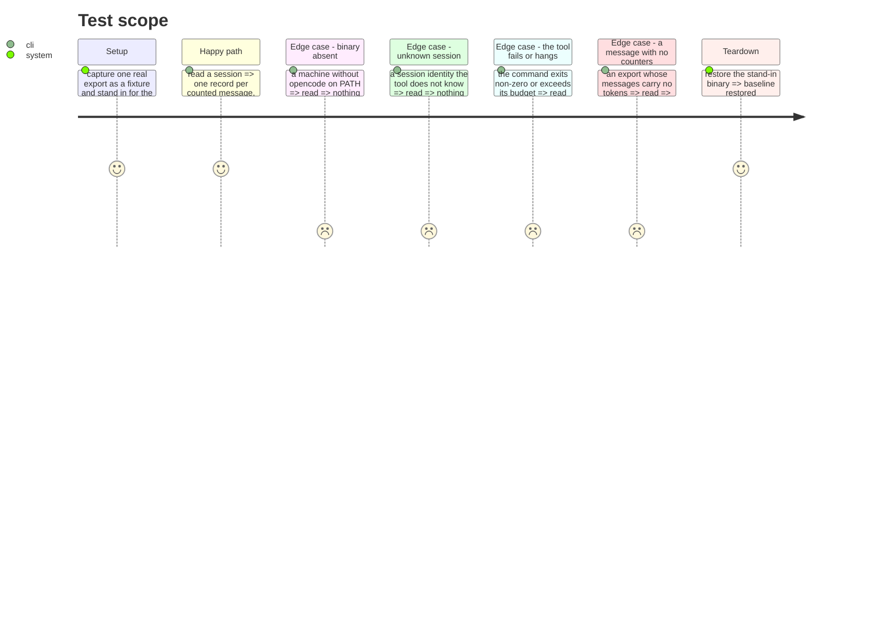

# Instruction: The one that answers for itself

## Architecture projection

> Tree of the final files. ✅ create · ✏️ modify · ❌ delete

```txt
.
└── cli/
    ├── src/
    │   ├── domain/formats/opencode-export.ts            ✅ pure: the exported JSON -> stored records
    │   ├── domain/tools/ai/opencode.ts                  ✏️ declares its local read
    │   └── infrastructure/adapters/
    │       └── opencode-cost-reader-adapter.ts          ✅ the only part that spawns anything
    └── tests/…                                          ✅
```

No change to `package.json`. No dependency, no engine floor.

## User Journey



## Test Scope



## Tasks to do

### `1)` Ask the tool instead of reading its database

> Measured 2026-08-20 on opencode 1.14.20: `opencode export <sessionID>` answers with `{info, messages}`, and `messages[].info` carries `tokens` as `{total, input, output, reasoning, cache:{read, write}}` alongside `modelID` and `providerID`. That is everything a database query would have found.

1. Spawn `opencode export <sessionID> --sanitize`, capture stdout, parse it. `--sanitize` redacts transcript and file content at the source; nothing here needs that content, and asking for less is the cheaper guarantee than filtering more.
2. Resolve the binary on PATH the way `AbstractNativePluginCliAdapter` already does — a filesystem check, not a `--version` probe, which is flake-prone under load.
3. Give the command a timeout. It is the tool's process, not ours, and it must not hold a read open.
4. Absent binary, unknown session, non-zero exit and timeout all return nothing. None of them is an error: they mean this machine has no OpenCode data for that session.

### `2)` A pure function over the exported JSON

> Same separation as the transcript readers: understanding the payload is the part worth testing.

1. One record per message whose `info.tokens` is present. `cache.read` and `cache.write` are the same quantities the other tools call cache-read and cache-creation; use the field names the stored record already has, not OpenCode's.
2. Do not read `info.cost`. It is `0` in every message captured, its denomination is not established, and a figure whose meaning is unknown is worse than an absent one. Say so in a comment — the field is right there and the next reader will wonder.
3. A message with no counters yields no record. Never a zero.
4. No spawning, no `fs`. It takes the parsed payload.

### `3)` Say what the session identity is, and what it cannot yet do

> The other two tools join on an identity a hook already saw. This one has not been established.

1. The identity is OpenCode's own `ses_…`. Whether a hook or plugin payload would carry that value has never been captured, because no OpenCode plugin payload exists on disk.
2. Until it is, this reader answers only what it can answer alone: what a given OpenCode session consumed. Joining it to a run journal entry belongs with #676, which owns whether a plugin can write the journal at all.
3. Put that limit in the tool's declaration, so a consumer sees it rather than getting an empty join and guessing why.

### `4)` Do not let a test depend on a real session

> A test that needs OpenCode installed, with a session that happens to exist, passes on one machine and fails in CI for a reason that has nothing to do with the code.

1. Capture one real export as a fixture, redacting absolute paths and any content the export still carries.
2. Test the pure function against the fixture, by value.
3. Test the adapter against a stand-in binary, so absent, failing, slow and well-behaved are all reachable without OpenCode being installed.

## Test acceptance criteria

| Task | Acceptance criteria                                                                                   |
| ---- | -------------------------------------------------------------------------------------------------------- |
| 1    | `package.json` is unchanged: no dependency added, no engine floor moved                                  |
| 1    | An absent binary returns nothing and is not an error                                                     |
| 1    | A non-zero exit or a timeout returns nothing, stores nothing, and reaches the caller rather than passing silently |
| 2    | A captured export yields one record per counted message, by value, under the existing field names        |
| 2    | `info.cost` is not read, and the reason is stated where the next reader will look                        |
| 2    | A message with no counters yields no record, never a zero                                                |
| 3    | The declaration states that this reader cannot yet join to a run journal entry, and why                  |
| 4    | Every test passes on a machine where OpenCode is not installed                                           |
