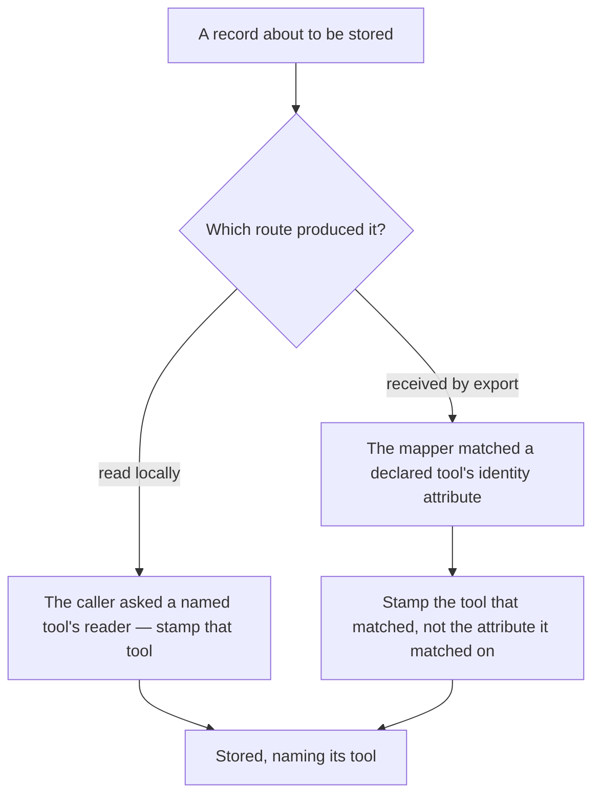
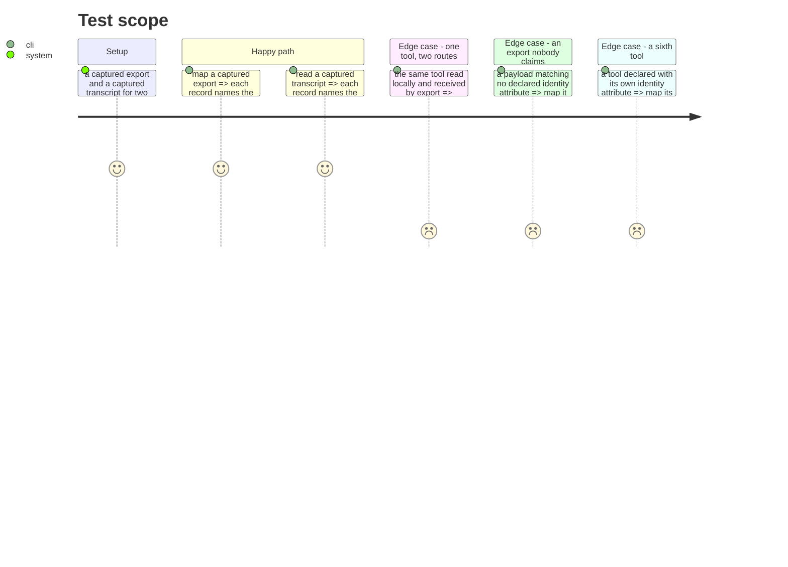

# Instruction: A record that names its tool

## Architecture projection

> Tree of the final files. ✅ create · ✏️ modify · ❌ delete

```txt
.
└── cli/
    ├── src/domain/
    │   ├── models/telemetry-sink-record.ts   ✏️ the tool, on every record, both routes
    │   └── ports/session-cost-reader.ts      ✏️ a reader no longer has to be told who it is
    ├── src/application/use-cases/telemetry/read-local-cost-use-case.ts  ✏️ stamps the tool it asked
    └── tests/…                               ✅ ✏️
```

## User Journey



## Test Scope



## Tasks to do

### `1)` Carry the tool through the export mapper

> The mapper already resolves which declared tool an export belongs to — it matches each record's attributes against every declared identity attribute. It then throws that answer away and keeps only the attribute name.

1. The vendor identity the mapper is handed already comes from a per-tool declaration. Carry the tool's own identifier alongside the attribute it declares.
2. Stamp the matched tool onto the record. `vendor_field` stays as it is; it says which attribute carried the identity, which is a different and still useful fact.
3. A payload matching no declared identity is still dropped. Nothing is attributed to a guessed tool.

### `2)` Stamp the tool on the local-read path

> Here the answer is not inferred at all: the caller asked a specific tool's reader. The information exists at the call site and is currently dropped.

1. The use-case iterates tools and asks each declared reader. It knows which tool it asked; stamp that.
2. A reader does not stamp its own tool, for the same reason it cannot stamp its own provenance — a reader that could name itself could name another.
3. Prove that one tool read by both routes yields two records naming the same tool, with different `vendor_field` values. That difference is the reason this field exists.

### `3)` Make a consumer's job checkable

> The point of the field is that nobody downstream parses `vendor_field` to work out the tool. That is only true if it is true for every route.

1. Assert, over a captured export and a captured transcript, that every stored record names a tool.
2. Assert that the tool named is a declared one, not a free string.
3. Adding a tool is a declaration. Assert that the mapper and the use-case contain no tool name.

## Test acceptance criteria

| Task | Acceptance criteria                                                                                    |
| ---- | --------------------------------------------------------------------------------------------------------- |
| 1    | A record mapped from a captured export names the tool whose identity attribute matched                     |
| 1    | `vendor_field` is unchanged and still says which attribute carried the identity                            |
| 1    | An export matching no declared identity produces no record and no guessed tool                             |
| 2    | A record read locally names the tool whose reader was asked                                                |
| 2    | A reader cannot set the tool itself, structurally                                                          |
| 2    | One tool by both routes yields the same tool name and different `vendor_field` values                      |
| 3    | Every stored record names a tool, over both a captured export and a captured transcript                    |
| 3    | The tool named is a declared identifier, not a free string                                                 |
| 3    | Neither the mapper nor the use-case contains a tool name                                                   |
