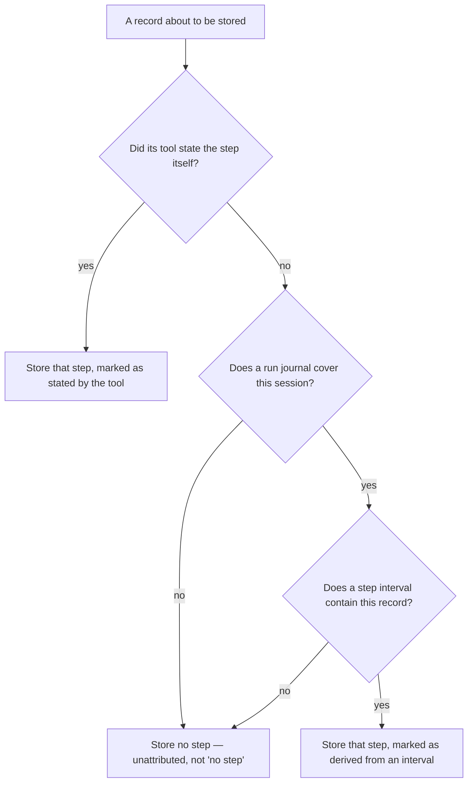
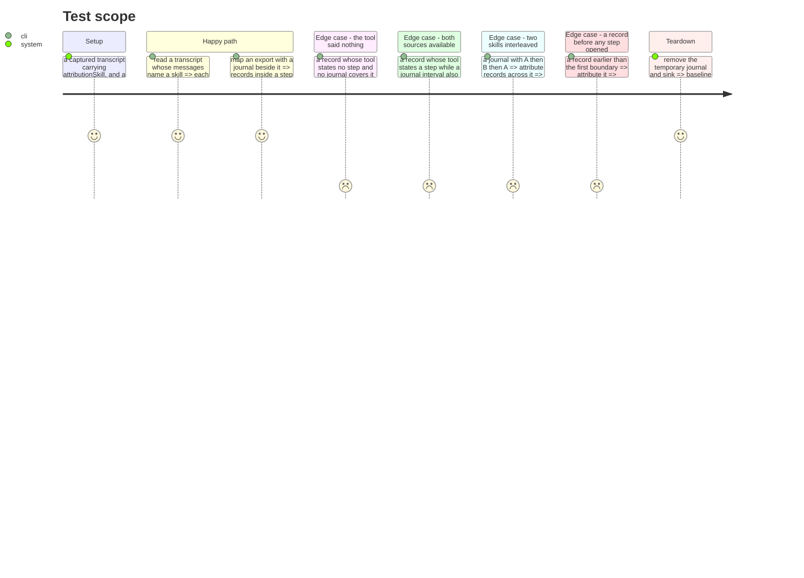

# Instruction: The step, from whichever knows it

## Architecture projection

> Tree of the final files. ✅ create · ✏️ modify · ❌ delete

```txt
.
└── cli/
    ├── src/domain/
    │   ├── models/telemetry-sink-record.ts        ✏️ the step, and how strongly it is attributed
    │   ├── models/step-attribution.ts             ✅ pure: journal lines + records -> intervals
    │   ├── formats/claude-code-transcript.ts      ✏️ read the field the tool already writes
    │   └── ports/run-journal-reader.ts            ✅ what the journal side promises
    ├── src/infrastructure/adapters/run-journal-reader-adapter.ts  ✅ reads aidd_docs/runs
    ├── src/application/use-cases/telemetry/read-local-cost-use-case.ts  ✏️ attributes what it stores
    └── tests/…                                    ✅ ✏️
```

## User Journey



## Test Scope



## Tasks to do

### `1)` Read the step the tool already wrote

> Claude Code's transcript carries `attributionSkill` per assistant message — the real name, no flag, on the same line as the counters. It is exact where an interval is an inference, so where it exists it wins.

1. Take it from the transcript line, alongside `attributionPlugin` when present.
2. **Its absence means unattributed, never "no skill ran".** Measured across twelve versions: the key is omitted rather than nulled when no skill runs, and it did not exist at all before roughly 2.1.220. Nothing on the record separates those two cases, so neither may be asserted.
3. Mark a step taken from this source as stated by the tool. That mark is what lets a consumer tell a measurement from an inference.
4. Do not fill it on the export path from the vendor's own attribute. That attribute reads `third-party` for every framework skill, which is why the journal exists.

### `2)` Derive an interval where nothing states it

> Four tools out of five have no equivalent field, and neither does Claude Code's export path. There, the journal's boundaries are all there is.

1. Read the session's run journal: `step_start` lines with their moment, `turn_end` lines that close a turn.
2. A step covers the half-open interval from its own start to the next start or the end of the turn, exactly as #663 defined it. A record whose moment falls inside is attributed to it.
3. A record before the first boundary is unattributed. Folding it into the first step would be assuming work began when a marker was written.
4. Mark a step derived this way as derived. Two skills that interleave produce three intervals and two names, and a consumer must be able to see that this was inferred rather than stated.
5. This is pure: journal lines and records in, attributions out. Reading the journal from disk is the adapter's job.

### `3)` Say how strong an attribution is, on every record

> An attribution the tool stated and one taken from an interval answer differently when steps interleave. A single field would let a consumer treat them as the same claim, which is precisely the failure this layer exists to prevent.

1. Three states: stated by the tool, derived from an interval, unattributed. Never two.
2. Unattributed is a value, not an absent field. An absent field would be read as "no step", which is the assertion that cannot be made.
3. Where both sources have an answer, the tool's wins, and the record still says which one it used.

### `4)` Do not let the journal become a requirement

> A session with no journal must still yield priced-able metrics. Attribution is an addition, not a precondition.

1. A session with no run journal at all yields records as it does today, all unattributed.
2. Reading the journal never fails the read. A missing, unreadable or truncated journal costs attribution, not the figures.
3. Assert it: the same transcript read with and without a journal beside it yields the same counters either way.

## Test acceptance criteria

| Task | Acceptance criteria                                                                                        |
| ---- | ------------------------------------------------------------------------------------------------------------- |
| 1    | A transcript message naming a skill yields a record carrying it, marked as stated by the tool                  |
| 1    | A message with no such field yields an unattributed record, never one asserting no step ran                    |
| 1    | The export path never fills the step from the vendor's own attribute                                           |
| 2    | A record whose moment falls in a step interval carries that step, marked as derived                            |
| 2    | A record before the first boundary is unattributed, not folded into the first step                             |
| 2    | A journal with A then B then A yields three intervals and two names                                            |
| 2    | The interval logic touches no filesystem                                                                       |
| 3    | Every record reads as exactly one of the three states                                                          |
| 3    | Unattributed is a stored value, not an absent field                                                            |
| 3    | With both sources answering, the tool's answer is stored and the record says so                                |
| 4    | The same transcript yields identical counters with and without a journal                                       |
| 4    | A missing or truncated journal costs attribution and never the figures                                         |
