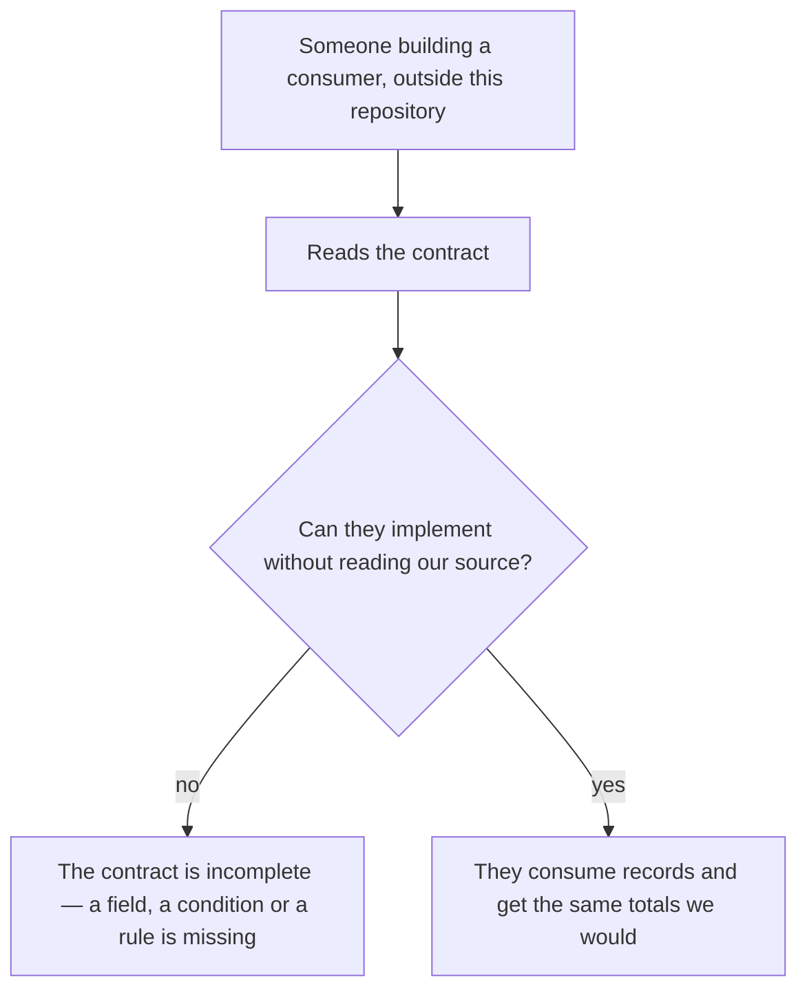
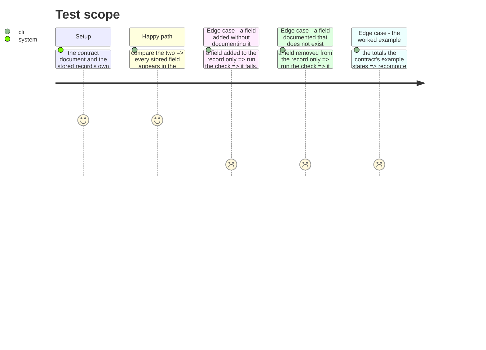

# Instruction: The contract, written down

## Architecture projection

> Tree of the final files. ✅ create · ✏️ modify · ❌ delete

```txt
.
├── aidd_docs/product/metrics-contract.md   ✅ what a consumer outside this repository reads
└── cli/tests/…                             ✅ the document is checked against the code, not trusted
```

## User Journey



## Test Scope



## Tasks to do

### `1)` Write what a consumer needs, and nothing about how we do it

> A consumer cannot import a TypeScript interface from this repository. The document is the deliverable; the type is only how this side enforces it.

1. Every field: its name, what it means, whether it is always present or conditional, under what condition, and **what its absence means**. An absent counter and a zero counter are different facts.
2. Both record kinds, and what each measures.
3. The identity fields, and what joins to what — session to session, turn to turn, and which tool writes which.

### `2)` State the two ways to double count

> Both were found by measurement here, and both would be rediscovered the hard way by anyone implementing against the shape without being told.

1. **The two kinds overlap.** Records of one kind carry per-request figures; records of the other carry periodic deltas of the same quantities. Summing both counts the same tokens twice. Say which quantity to take from which kind, and that time is only available from one of them.
2. **A re-read appends.** Local reading re-reads a growing file by design; records are matched on the turn identifier so a second read stores nothing new. A consumer aggregating raw appends without that matching double counts a re-read.
3. Give each rule a worked example with numbers, not a sentence. The measured case — one session's per-request lines totalling one figure and its periodic lines another — is the example.

### `3)` State what each tool can and cannot say

> Coverage is not uniform, and a consumer that assumes it is will read silence as zero.

1. Per tool: whether its consumption can be read at all, whether it can be attributed to a step, and by which of the two strengths.
2. The two tools that cannot be read say so with their measured reason, so a consumer prints "not covered" rather than a zero.
3. **Unattributed is not "outside any step".** State it here in the same words the records use, because this is the one place a consumer will look for permission to collapse them, and they must not.

### `4)` Check the document against the code

> A contract that drifts from the shape is worse than none: it is trusted and wrong.

1. A test compares the documented field set with the stored record's own definition, both ways. A field added to one and not the other fails, naming it.
2. The worked examples' totals are recomputed from their own sample records and asserted to agree. An example that no longer adds up is how a reader loses trust in the whole document.
3. The check runs with the rest of the suite, not as a separate thing someone remembers to run.

## Test acceptance criteria

| Task | Acceptance criteria                                                                                     |
| ---- | ---------------------------------------------------------------------------------------------------------- |
| 1    | Every field carries its meaning, its presence condition, and what its absence means                        |
| 1    | Both record kinds are described, with what each measures                                                   |
| 2    | Both double-count rules are stated, each with a worked example carrying numbers                            |
| 3    | Every tool has a row saying what it can and cannot supply, with the reason where it cannot                 |
| 3    | The document states that unattributed is not "outside any step"                                            |
| 4    | A field in the record but not the document fails a test, naming the field                                  |
| 4    | A field in the document but not the record fails a test, naming the entry                                  |
| 4    | The worked examples' totals are recomputed and agree                                                       |
