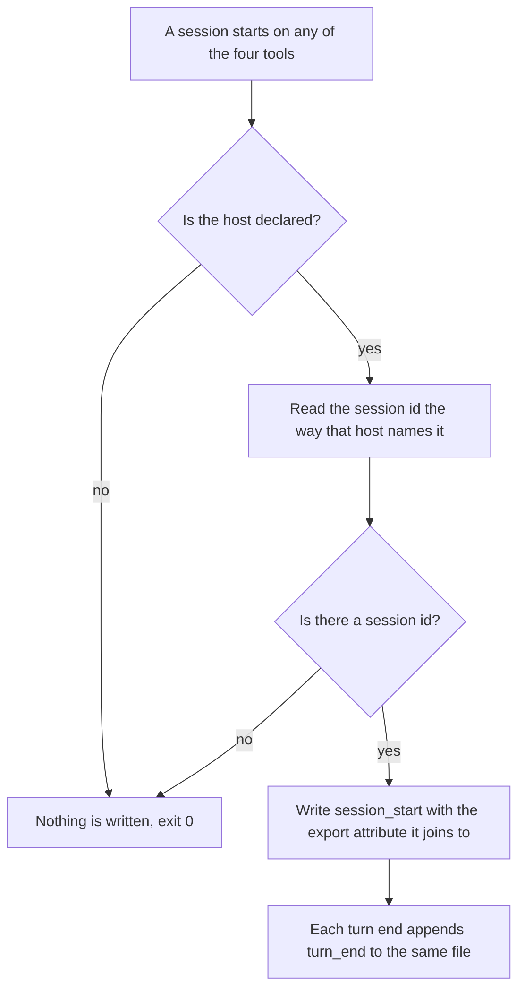
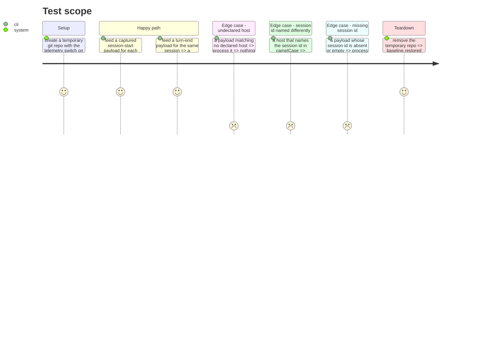

# Instruction: The journal serves four hosts

## Architecture projection

> Tree of the final files. ✅ create · ✏️ modify · ❌ delete

```txt
.
├── plugins/aidd-telemetry/hooks/
│   ├── journal.js                          ✏️ drop the single-host gate, dispatch by declaration
│   └── lib/
│       ├── host.js                         ✏️ export the declared host list, one source of truth
│       ├── record.js                       ✏️ per-host session-id reader and vendor field
│       └── repo.js                         ✏️ per-host working-directory reader
└── scripts/__tests__/
    ├── aidd-telemetry-journal.test.js      ✏️ one session-start and turn-end case per host
    └── fixtures/
        ├── codex-post-tool-use.json        ✅ captured payload, redacted
        └── cursor-post-tool-use.json       ✅ captured payload, redacted
```

## User Journey



## Test Scope



## Tasks to do

### `1)` Make the host list a declaration

> Today `journal.js` compares against one literal string. A fifth host must be a table entry, never an edit to the dispatcher.

1. Read `plugins/aidd-telemetry/hooks/journal.js` line 40 and `lib/record.js` `VENDOR_FIELD_BY_HOST`.
2. Give each declared host one entry holding: the export attribute its session id joins to, and how to read that id from a payload.
3. Replace the literal comparison with a lookup in that table. An unknown host returns without writing, exactly as today.
4. Keep `detectHost` as the only place that decides which host a payload came from.

### `2)` Read the session id the way each host names it

> `journal.js` reads `payload.session_id`. That is one host's spelling, promoted to a rule.

1. Move the session-id read behind the host declaration from task 1.
2. Keep the existing guard: a missing or empty id writes nothing, so a line never reaches the file without the key every later join depends on.
3. Leave the guard's reason in place, do not restate it.

### `3)` Capture real payloads as fixtures

> All four hosts now have a captured payload under the probe scratchpad. A synthetic fixture proves the parser, not the integration, so use the captures.

1. Add the captured payload for each host, redacting `user_email`, `workspace_roots`, `transcript_path` and any absolute path outside the repo.
2. Record in the fixture README which probe produced each capture, so a shape that drifts can be re-measured rather than guessed at.
3. Assert in a test that no fixture contains an address, a token, or a path outside the fixture tree. Run it over every fixture in the directory, including the four session-start fixtures already there, which were never checked.

### `4)` Read the working directory the way each host names it

> Missed when this phase was drawn. `resolveRunsDir` takes `payload.cwd`, and Cursor's captured `sessionStart` has no `cwd` at all - only `workspace_roots`. So Cursor is declared and still writes nothing, which is worse than not declaring it.

1. `getRepoRoot(cwd)` returns null for a non-string argument, so a Cursor payload produces no run file however well the rest is declared.
2. Add a per-host working-directory reader beside the session-id reader from task 2. Same table, same dispatch.
3. Cursor delivers `workspace_roots`, an array. Resolve the first entry that is a git repository rather than assuming index zero is the one - a multi-root workspace has more than one, and only some are repositories.
4. Every other host delivers `cwd`; their reader stays what it is today.

### `5)` Say what each host cannot yet do

> Two hosts are blocked by defects outside this ticket. Silence would read as coverage.

1. On Copilot, the journal cannot write until #681 lands. Assert the current behaviour - a Copilot-shaped payload writes no line - and name #681 in the assertion message as the ticket that changes the expectation. Never write a test that goes red when someone fixes the defect.
2. On Cursor, turn-end does not fire headless until #680 lands. Record `session_start` there and leave `turn_end` absent rather than substituting a different event.
3. State both in the fixture README, next to the fixtures they concern.

## Test acceptance criteria

| Task | Acceptance criteria                                                                                                    |
| ---- | ------------------------------------------------------------------------------------------------------------------------ |
| 1    | Adding a host to the table produces a run file for that host with no change to the dispatcher                            |
| 1    | A payload from an undeclared host writes nothing and exits 0                                                             |
| 2    | A host that names its session id differently still produces a run file carrying that id                                  |
| 2    | A payload with an absent or empty session id produces no run file                                                        |
| 3    | Every fixture is a payload shape the tool actually emits, or is marked synthetic with the capture that would replace it  |
| 3    | No fixture contains an email address, a token, or a path outside the fixture tree                                        |
| 4    | A Cursor session-start payload carrying no `cwd` still produces a run file                                                |
| 4    | A workspace whose first root is not a git repository resolves to the root that is                                        |
| 5    | The Copilot gap is asserted by a test describing current behaviour, whose message names the ticket that will change it   |
| 5    | A Cursor session leaves `session_start` and no fabricated turn boundary                                                  |
