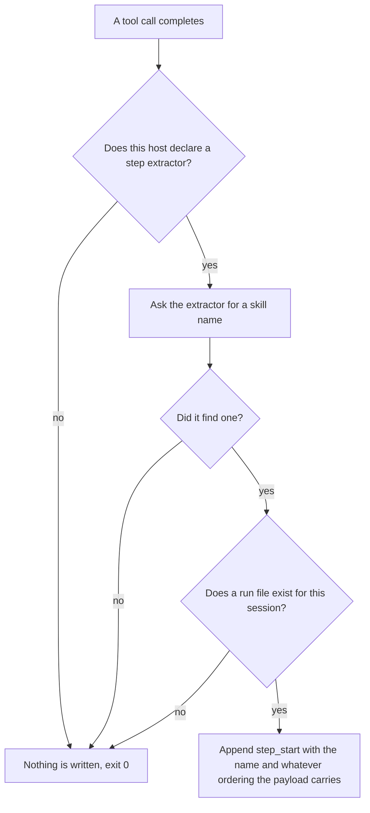
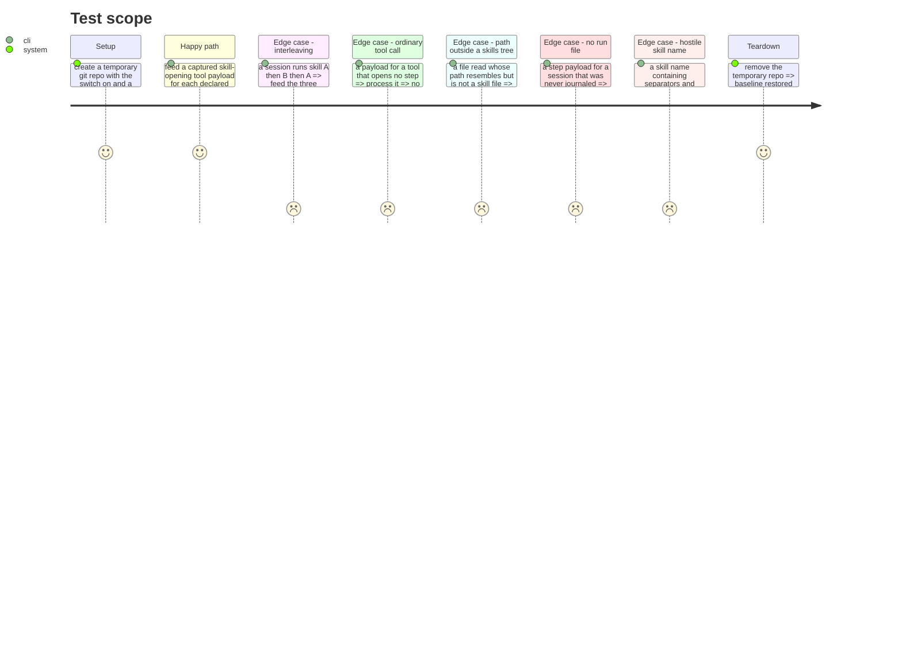

# Instruction: A started step is a fact

## Architecture projection

> Tree of the final files. ✅ create · ✏️ modify · ❌ delete

```txt
.
├── plugins/aidd-telemetry/hooks/
│   ├── journal.js                          ✏️ route the existing tool event to the step handler too
│   └── lib/
│       ├── step-starts.js                  ✅ which tool calls open a step, and the name each carries
│       └── record.js                       ✏️ the step_start line
└── scripts/__tests__/
    ├── aidd-telemetry-journal.test.js      ✏️ one step case per host, plus the interleaving case
    └── fixtures/
        ├── claude-code-post-tool-use-skill.json   ✅
        ├── copilot-post-tool-use-skill.json       ✅
        ├── codex-post-tool-use-skill-read.json    ✅
        └── cursor-post-tool-use-skill-read.json   ✅
```

## User Journey



## Test Scope



## Tasks to do

### `1)` Two extractors, not four

> Three hosts name the skill in a tool argument. Two leave only a `SKILL.md` path. That is two implementations, and the table decides which a host uses.

1. Model the extractor table on `WRITTEN_PATH_EXTRACTOR_BY_HOST` in `lib/file-writes.js`. Same shape, same dispatch, no branch on a host name anywhere else.
2. Argument family: given the tool name that opens a step and the field holding the name, return that name. Covers Claude Code, where the captured payload is `tool_name: "Skill"` with `tool_input: {"skill": "<name>"}`, and Copilot, where it is `toolName: "skill"` with `toolArgs` holding a **JSON string**, not an object. Parse it.
3. Path family: scan the payload's string values for a skills-tree `SKILL.md` path and take the folder name. Covers Cursor, whose path sits in `tool_input.file_path`, and Codex, whose captured payload is `tool_name: "Bash"` with the path inside `tool_input.command` - and where the path is **relative**, not absolute.
4. Anchor the path pattern on a skills directory segment, so an ordinary file whose name ends in `SKILL.md` opens nothing.
5. Exactly one family runs per host. An argument-family payload can also carry a `SKILL.md` path in another field, so running both would yield two candidates for one call. The table names the family; it is not a fallback chain.
6. Order the guards cheapest first, as `handleFileWritten` already does: no git shellout before the payload has been rejected.

### `2)` Write the step, write nothing else

> The journal records what happened. When the step ended is not something any tool said.

1. Add a `step_start` line: the moment, the skill name, and the turn identifier when the payload carries one. Claude Code's captured `Skill` payload carries `prompt_id`, which is the same value the sink stores as the turn key, so there the join to cost is exact rather than ordinal.
2. Do not write an end, a duration, or a parent. All three are the reader's derivation from the lines that follow.
3. Sanitise the skill name as a value, not as a path segment, and prove a name carrying separators or traversal cannot escape its field.
4. Reuse the existing append primitive. One line, appended, never re-read.

### `3)` Route the event without widening the surface

> `PostToolUse` is already declared and already fires for every tool call. A step needs no new hook.

1. Dispatch the already-wired tool event to the step handler in addition to the file-written handler.
2. The two handlers share the event and nothing else. `handleFileWritten` returns early unless the path looks like a task folder; a skill call has no task path, so threading step detection through that guard chain drops every step. Keep the two guard chains separate.
3. Confirm against the four captured fixtures that the event carrying a skill's opening call is the one already declared, and record it in the fixture README if any host needs a different one.
4. Do not add a hook declaration unless a fixture proves the current one cannot see the call.

### `4)` Prove the interleaving claim rather than asserting it

> The reason this ticket exists is that the provider's own attribution is sticky. A test that only runs one skill proves nothing about that.

1. Feed A, then B, then A within one session and assert three lines in order with two distinct names.
2. Assert that the lines carry an ordering that survives two of them sharing a millisecond.
3. Assert that a step still open when the session ends is distinguishable, from the stored lines alone, from one followed by a turn boundary.

## Test acceptance criteria

| Task | Acceptance criteria                                                                                                   |
| ---- | ----------------------------------------------------------------------------------------------------------------------- |
| 1    | Each of the four hosts produces a step_start naming the skill, from a payload that host actually emits                  |
| 1    | A tool call that opens no step produces no line                                                                         |
| 1    | A file whose name ends in `SKILL.md` but sits outside a skills tree produces no line                                    |
| 1    | Adding a fifth host is a table entry; no dispatcher or extractor changes                                                |
| 1    | A payload carrying both a named skill argument and a `SKILL.md` path yields exactly one step_start                      |
| 2    | No line carries an end, a duration, or a parent                                                                         |
| 2    | A skill name containing separators or traversal is stored without escaping its field                                    |
| 2    | A step payload for a session with no run file writes nothing and exits 0                                                |
| 3    | A skill call produces a step_start even though it has no task-folder path                                               |
| 3    | No hook declaration is added unless a fixture shows the declared event cannot see the call                              |
| 4    | A→B→A in one session yields three ordered lines with two distinct names                                                 |
| 4    | Two lines sharing a millisecond remain ordered                                                                          |
| 4    | Where the host delivers a turn identifier, the line carries it and the join needs no ordering                           |
| 4    | A step open at session end reads differently from one closed by a turn boundary                                         |
