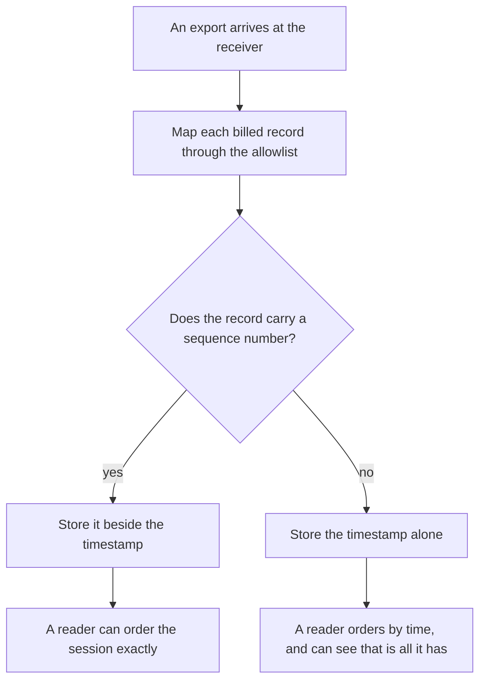
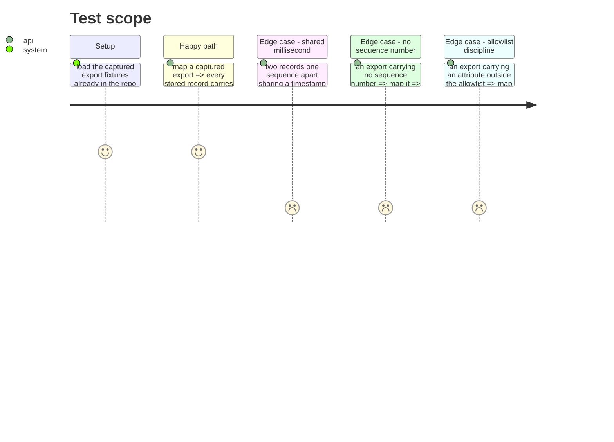

# Instruction: The sink carries the order

## Architecture projection

> Tree of the final files. ✅ create · ✏️ modify · ❌ delete

```txt
.
├── cli/src/domain/models/
│   └── telemetry-sink-record.ts                                    ✏️ the ordering attribute joins the allowlist
└── cli/tests/domain/models/
    └── telemetry-sink-record.unit.test.ts                          ✏️ ordering survives a shared millisecond
```

## User Journey



## Test Scope



## Tasks to do

### `1)` Let the ordering through

> The mapper stores an allowlist and nothing else. The attribute that orders a session is not on it, so today it is discarded on arrival and cannot be recovered later.

1. Add the export's sequence attribute to the allowlist in `cli/src/domain/models/telemetry-sink-record.ts`, beside the timestamp already there.
2. Keep it numeric, like the other counted fields.
3. Change nothing else about what is stored. The reader that consumes the order is #629, not this phase.

### `2)` Prove it settles what the timestamp cannot

> The reason for this phase is a measured collision, so the test must reproduce the collision.

1. Assert against the captured export fixtures that a record one sequence apart from another, sharing a millisecond, is ordered unambiguously from the stored lines alone.
2. Assert that an export carrying no sequence number stores the timestamp and invents nothing.
3. Assert the allowlist still holds: an attribute outside it is absent from the stored line.

## Test acceptance criteria

| Task | Acceptance criteria                                                                              |
| ---- | -------------------------------------------------------------------------------------------------- |
| 1    | Every stored record carries the sequence number its export sent                                     |
| 1    | Nothing else about the stored shape changes                                                         |
| 2    | Two records sharing a millisecond are ordered unambiguously from stored data alone                  |
| 2    | An export with no sequence number stores the timestamp and no substitute                            |
| 2    | An attribute outside the allowlist never reaches a stored line                                      |
