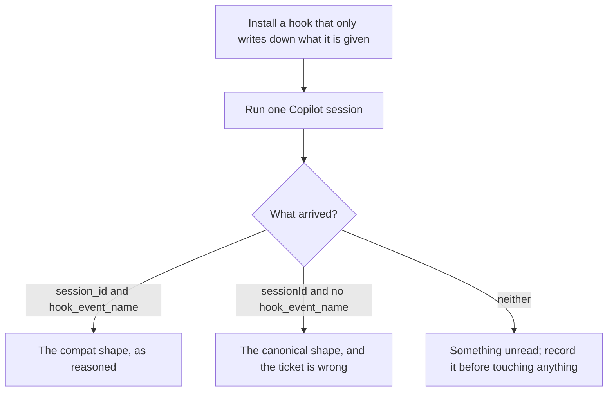
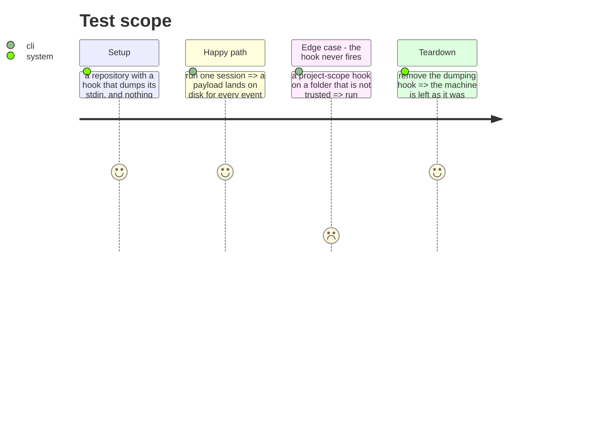

# Instruction: Capture what Copilot actually sends

## Architecture projection

> Tree of the final files. ✅ create · ✏️ modify · ❌ delete

```txt
.
└── scripts/__tests__/fixtures/
    ├── copilot-session-start.json      ✏️ replaced by a capture from a current runtime
    └── copilot-post-tool-use.json      ✏️ same, and a Stop payload beside them
```

## User Journey



## Test Scope



## Tasks to do

### `1)` Watch, before changing anything

> Every claim in #681 comes from reading a bundle two minor versions behind what is installed. The reasoning is good and it has never met a payload.

1. Register a hook that writes its stdin to a file and exits, for the three events the journal subscribes to.
2. Register it the way the framework does — **PascalCase**, unchanged — since that is the spelling under test.
3. Run one session, small enough to cost a single request.

### `2)` Record the shape, not a summary of it

> A fixture is what turns "we think it sends this" into something a test can fail against.

1. Capture the whole payload per event, redacted the way every fixture here is: no email, no token, no absolute path outside the fixture tree.
2. Keep the key set exactly as it arrived, including keys nothing reads. A key nobody expected is the most useful thing a capture can carry.
3. Record the runtime version beside it, since that is what the capture is evidence about.

### `3)` Answer the second open question while a session is running

> #681 raises it and leaves it open: Copilot defers project-scope hooks past session creation, and whether `SessionStart` still fires afterwards decides whether the journal ever gets a first line.

1. Note whether a `SessionStart` payload arrives at all in non-interactive mode.
2. If it does not, note what makes it — folder trust, an environment variable — and treat that as a finding for phase 3 rather than a step to work around here.

## Test acceptance criteria

| Task | Acceptance criteria |
| ---- | ---------------------------------------------------------------------------- |
| 1    | A hook registered exactly as the framework registers its own produces a file  |
| 2    | A fixture per event holds the payload as it arrived, redacted, with its version |
| 2    | No key is dropped from the capture because nothing reads it yet               |
| 3    | Whether `SessionStart` fires in non-interactive mode is recorded either way   |
