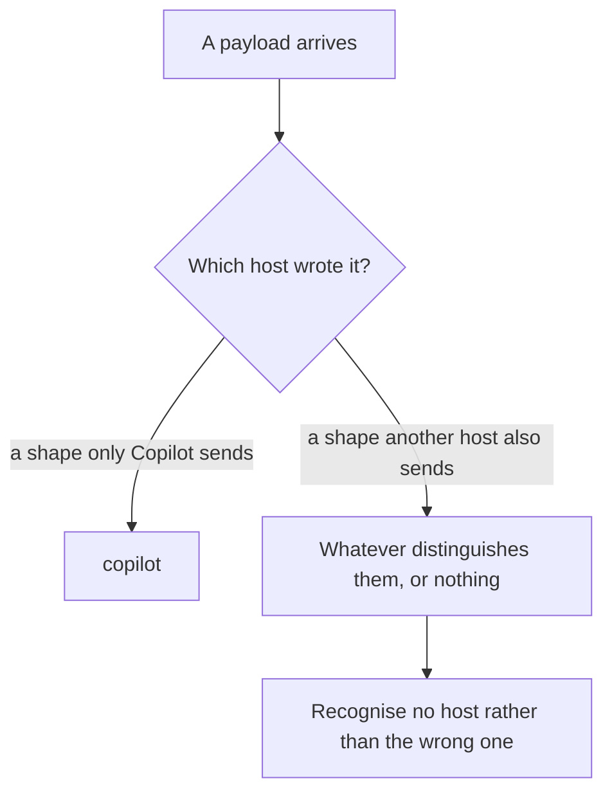
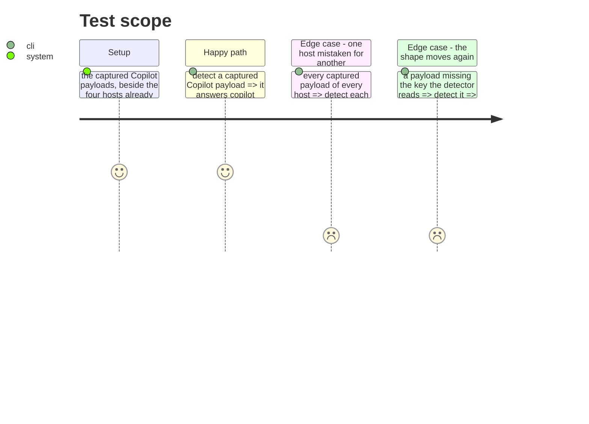

# Instruction: Recognise the host it really is

## Architecture projection

> Tree of the final files. ✅ create · ✏️ modify · ❌ delete

```txt
.
├── plugins/aidd-telemetry/hooks/lib/host.js   ✏️ detect whichever shape arrives
└── scripts/__tests__/                          ✏️ against the captured payloads
```

## User Journey



## Test Scope



## Tasks to do

### `1)` Detect on what the capture shows, not on what was reasoned

> The current rule reads *has `sessionId` and no `hook_event_name`*. Whether that describes what arrives is exactly what phase 1 settles.

1. Recognise the captured shape.
2. If both a compat and a canonical shape can arrive, recognise both. Copilot takes either spelling in one hooks file, so both builders are reachable.
3. Read the session identity behind the host's own declaration, as every host already does. The compat shape spells it `session_id` where the canonical one spells it `sessionId`, and one spelling promoted to a rule is what broke Codex.

### `2)` Keep every other host detecting as it did

> Five hosts share one detector, and a rule loosened for one can swallow another. Claude Code and Codex are told apart only by the shape of `transcript_path`.

1. Every captured payload of every host answers its own host, over the fixtures already in the repository.
2. A payload matching no declared host answers none, rather than the nearest.
3. Assert it as a table over every fixture, so a sixth host added later inherits the check.

### `3)` Make the silence impossible to ship again

> `detectHost` answering `null` costs nothing visible — no error, no line, no signal. That is why this went unnoticed.

1. A test fails when a captured payload stops being recognised, naming the fixture.
2. The failure names the host and the key that moved, not just that something differs.

## Test acceptance criteria

| Task | Acceptance criteria |
| ---- | ---------------------------------------------------------------------------- |
| 1    | A captured Copilot payload is recognised as Copilot                          |
| 1    | Where two shapes exist, both are recognised                                  |
| 1    | The session identity is read behind the host's declaration, not by one spelling |
| 2    | Every captured payload of every host answers its own host and no other       |
| 2    | A payload of no declared host answers none                                   |
| 3    | A shape that stops being recognised fails a test naming the fixture          |
