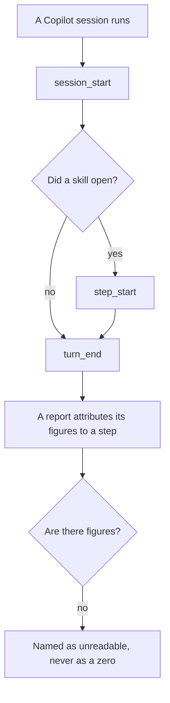
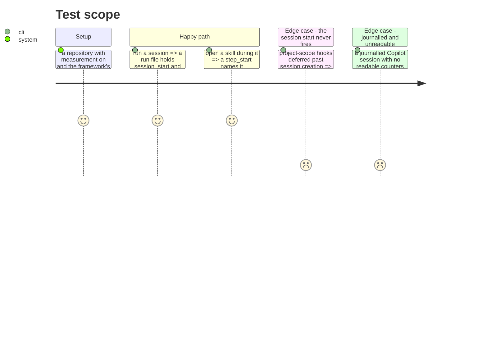

# Instruction: Prove a session leaves a journal

## Architecture projection

> Tree of the final files. ✅ create · ✏️ modify · ❌ delete

```txt
.
├── plugins/aidd-telemetry/hooks/lib/record.js  ✏️ if the identity spelling differs
├── docs/telemetry-limits.md                    ✏️ what Copilot can and cannot supply now
└── plugins/aidd-telemetry/README.md            ✏️ the coverage table
```

## User Journey



## Test Scope



## Tasks to do

### `1)` Run it, do not infer it

> Two phases of reasoning end here. A live session is what turns them into a fact.

1. Install the framework's hooks in a scratch repository, turn measurement on, run one session.
2. Read the run file. `session_start`, `turn_end`, and a `step_start` if a skill opened.
3. If `SessionStart` never fires — phase 1 will have said so — decide whether the journal may open on the first event that does, or whether that is a limit to record rather than a hole to paper over.

### `2)` Say what changed, and what did not

> Copilot gaining a journal does not give it token counts. Its own file carries output tokens per turn and nothing per request, and that is unaffected by anything here.

1. Update the coverage table: journal yes, step yes, tokens still no.
2. `journal_attributable` becomes true for Copilot, and the capability block says so on its own.
3. State plainly that a journalled Copilot session still reports **not covered** for figures — a session that is attributable and unmeasured is a real state, and it is not a zero.

### `3)` Leave the next host cheaper

> Cursor is the same shape of problem, and #680 is next.

1. Record what the capture cost and what it settled, so the same probe on Cursor is a repetition rather than an investigation.
2. If the detector gained a general rule rather than a Copilot branch, say which, so the next host tests it rather than adding to it.

## Test acceptance criteria

| Task | Acceptance criteria |
| ---- | ---------------------------------------------------------------------------- |
| 1    | A live Copilot session leaves a run file holding at least two line kinds      |
| 1    | A skill opened during it leaves a `step_start` naming it                      |
| 1    | If the session start cannot fire, that is recorded as a limit rather than worked around |
| 2    | The coverage table and the capability block agree with what a live run produces |
| 2    | A journalled Copilot session reports not covered for figures, never zero      |
| 3    | What the capture settled is written where #680 will read it                   |
