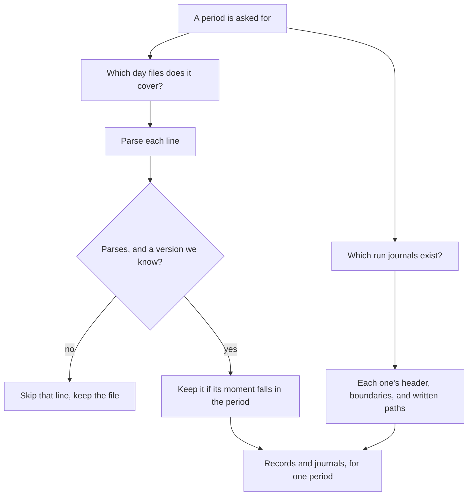
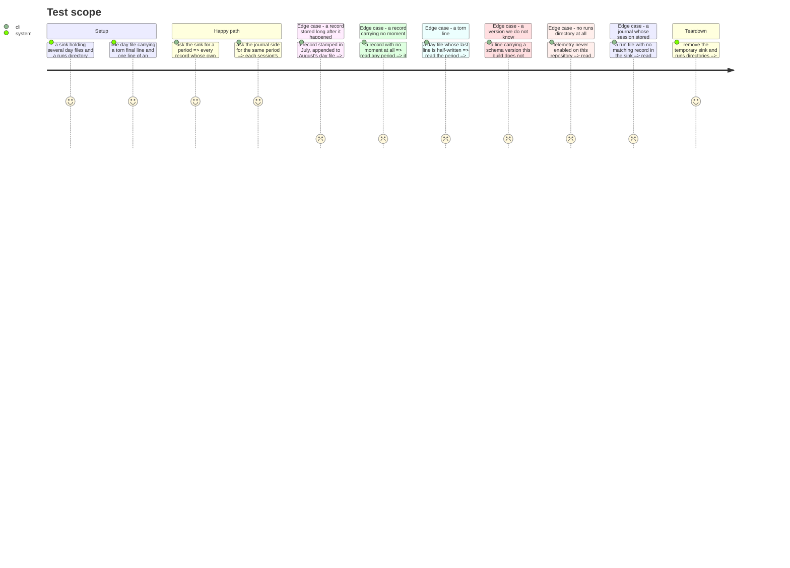

# Instruction: Two reads that do not exist yet

## Architecture projection

> Tree of the final files. ✅ create · ✏️ modify · ❌ delete

```txt
.
└── cli/
    ├── src/domain/ports/
    │   ├── telemetry-sink.ts                 ✏️ every record in a period, not one session's
    │   └── run-journal-reader.ts             ✏️ the session's own header, and what it wrote
    ├── src/infrastructure/adapters/
    │   ├── telemetry-sink-adapter.ts         ✏️ walk the day files a period covers
    │   └── run-journal-reader-adapter.ts     ✏️ list the runs directory, read the new line kinds
    └── tests/…                               ✅ ✏️
```

## User Journey



## Test Scope



## Tasks to do

### `1)` Read a period out of the sink

> `readRecordsForVendor` answers about one session. A report is about a stretch of time, and the day files are already named for it.

1. A read over an inclusive range of UTC days, selecting on **each record's own moment**. The day file's name selects nothing: a session read locally days after it ran is appended to today's file while its records carry their own, older moments, so the file name says when we heard about the work rather than when it happened.
2. A line that does not parse, or carries a schema version this build does not know, is skipped and counted. It never fails the read.
3. A record carrying no moment belongs to no period. Hand it back separately rather than placing it: the only other moment available is the day the line was appended, and substituting one for the other is the derivation this layer refuses.
4. Give every route a moment of its own, taken from what it already writes, so the selection has something to stand on. Without it a whole route silently vanishes from every period.
5. Return the skipped count alongside the records. A reader that silently drops lines produces a total that looks complete.
6. Deriving which day a record belongs to is pure and shared, not the adapter's private business: every double that stands in for the sink has to agree with it, and two implementations of "which day is this" diverge on exactly the inputs nobody writes a fixture for.

### `2)` Surface the journal lines the interval logic did not need

> The port's own comment excludes `session_start` and `file_written` on the ground that they carry no boundary. True for #687, and the wrong test here.

1. A session's `session_start`: `run_id`, `project_id`, `tool`, `vendor_id`. This is how a stored record's session is named as belonging to a tool and a project.
2. Its `file_written` lines, each with its path and moment. Paths only — no derivation here.
3. Amend the port's comment so it states the new scope. Leaving a comment that says these lines are not surfaced, next to code surfacing them, is how the next reader is misled.
4. A way to enumerate the sessions a period covers, not only to read one by name. Today's `read(sessionId)` cannot answer "which sessions ran last week".

### `3)` Remove the dependency on Codex's two spellings agreeing

> The journal hook writes `payload.session_id`. The rollout reader resolves a session by `session_meta.id`. Measured: 124 of 330 local rollouts are resumed sessions where those two values differ, so a report could silently drop them and still look healthy. The fix is not to measure which spelling a hook reports — it is to stop depending on the two coinciding.

1. The Codex hook payload carries `transcript_path`, the rollout file the session is writing. Read the session identity from that path's own filename, which `codex-rollout.ts` already records as always equal to `session_meta.id` — the value the reader resolves on. Writer and reader then agree by construction rather than by coincidence.
2. Fall back to `payload.session_id` when no `transcript_path` is present, and exercise that path in a test rather than leaving it hypothetical.
3. The filename parse exists twice, once in the hook and once in the reader, for the same reason `sanitizePathSegment` does: the hook is a zero-dependency script copied verbatim by the build. Pin the two to each other with a test, exactly as that precedent does. A second parser that drifts is how the join breaks silently later.
4. Assert the two sides agree end to end: a resumed Codex session read locally and journalled names the same identity in both places. Testable against the captured rollouts, with no Codex session run.
5. A Codex session resolving to no rollout file reports as not-found, distinctly from one that resolved and held nothing.
6. Record the measurement that licensed this beside the declaration, with its date and the command that produced it.

## Test acceptance criteria

| Task | Acceptance criteria                                                                                       |
| ---- | ------------------------------------------------------------------------------------------------------------ |
| 1    | A period read returns every record whose own moment falls inside it, and none outside                         |
| 1    | A record stamped in one month and stored in another is placed by its moment, not by its day file              |
| 1    | A record with no moment belongs to no period and comes back named as undated                                  |
| 1    | Every route gives its records a moment, so no route silently vanishes from every period                       |
| 1    | The real sink and every double stand in for each other on which day a record falls, malformed moments included |
| 1    | A torn final line is skipped, the file's other lines are returned, and nothing throws                         |
| 1    | A line of an unknown schema version is skipped and counted, and the count is returned to the caller           |
| 2    | A session's tool, project and run identifier are readable from its journal                                    |
| 2    | A session's written paths are readable, as paths, with no task derived at this level                          |
| 2    | The sessions a period covers can be enumerated without knowing their identifiers in advance                   |
| 2    | No comment in the port still claims these line kinds are unsurfaced                                           |
| 3    | A resumed Codex session names the same identity in its journal and in its stored records                      |
| 3    | The identity is derived from the transcript path, and the no-transcript-path fallback is exercised by a test   |
| 3    | The hook's filename parse and the reader's are pinned to each other by a test                                 |
| 3    | A session resolving to no rollout file is distinguishable from one resolving to a file holding nothing        |

## What the measurement settled

The Codex identity question closed without running a session, and closed harder than measuring it would have.

`plugins/aidd-telemetry/hooks/lib/host.js` already reads `transcript_path` to tell Codex from Claude Code — the two hosts hand a SessionStart hook the same five keys, so the path's `/sessions/YYYY/MM/DD/rollout-` segment is the only thing that separates them. A Codex payload therefore always carries the rollout it is writing, and `detectHost` returning `"codex"` is itself the proof. The field list shipped in the codex-cli 0.145.0 binary agrees: `session_id transcript_path hook_event_name reason permission_mode source turn_id agent_transcript_path agent_type last_assistant_message`.

So the identity is taken from that path rather than from a spelling that can disagree with the reader's:

```txt
payload.session_id     019f69d0-…   the parent, on a resumed session
transcript_path        …/rollout-2026-07-29T17-12-26-019fae6f-….jsonl
vendor_id written      019fae6f-…   the rollout's own id, which the reader resolves on
```

Run against the hook with a real payload shape, the journal file lands as
`01M0HDYAEYJQD448PRP0QGBYKQ__019fae6f-2009-7cd3-86b2-b8f83481b160.jsonl`, and
`aidd telemetry read --session 019fae6f-…` reads that same rollout: two records, both naming that session. Asking for the parent id instead returns one record carrying the parent's own turn — a different session's cost, which is exactly what the old spelling would have attributed to this one, silently.

## Two things the brief did not anticipate

**A period was about to mean the wrong thing.** The first cut of the period read selected day files by name, and its test appended each fixture on the day it was stamped — so the test could not see the gap. A session read locally days after it ran is appended to today's file while its records carry their own, older moments: run against a real Codex rollout, two records read `2026-07-29` out of `2026-08-21.jsonl`. Every route now carries a moment of its own, taken from what it already writes — `timeUnixNano` on both OTLP kinds, `time.created` on OpenCode — and the read selects on that. A record with no moment at all belongs to no period and comes back separately, because the only other moment available is when we heard about the work rather than when it happened.

**`file_written` fires on Claude Code alone,** and it looked up its run file by `payload.session_id` rather than by the identity the rest of the hook had already resolved. On Claude Code the two agree, so nothing was wrong yet; on Codex that spelling names the parent of a resumed session, so the first day a second host gained a written-path extractor the lookup would have found another session's file. Fixed, and pinned by a test that fails in both directions. The single-host coverage is now stated in the contract rather than left to be discovered as a session that touched nothing.
