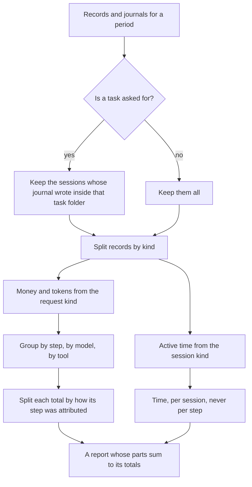
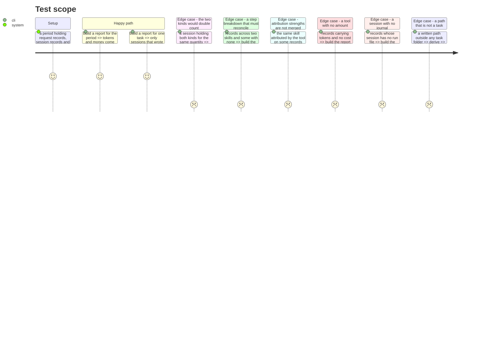

# Instruction: What a piece of work cost

## Architecture projection

> Tree of the final files. ✅ create · ✏️ modify · ❌ delete

```txt
.
└── cli/
    ├── src/domain/models/
    │   ├── task-identity.ts                  ✅ pure: a written path -> the task it belongs to
    │   └── cost-report.ts                    ✅ pure: records + journals -> one reconciled report
    ├── src/application/use-cases/telemetry/
    │   └── report-cost-use-case.ts           ✅ asks the two reads, hands them to the pure part
    └── tests/…                               ✅
```

## User Journey



## Test Scope



## Tasks to do

### `1)` Derive the task from what a session wrote

> The journal deliberately stores no task identity, because a derivation frozen at write time cannot be revised. Deriving it here is the other half of that decision.

1. A repository-relative path inside a task folder yields that folder's identity. Anything else yields none.
2. A session belongs to every task it wrote into, and to none if it wrote into none. Exploratory work that touched no task folder is still fully reportable by period.
3. Pure: a path in, an identity or nothing out. No filesystem, no configuration.

### `2)` Aggregate under the contract's own rules

> The reporter is the first thing that can commit the double count the contract warns about, and a wrong total here looks exactly like a right one.

1. Money and the four token counters come from `kind: "request"` records only.
2. `active_time_s` comes from `kind: "session"` records only, and stays a per-session figure. No percentage in a per-step breakdown is ever time.
3. Group by step, by model, by tool. The grouping code names no tool and no skill.
4. A quantity absent from a record is absent, never zero. A tool whose records carry tokens and no amount contributes tokens and contributes nothing to the amount.

### `3)` Make every breakdown reconcile, and prove it

> A breakdown whose parts do not sum to its whole is a bug that reads as a rounding artefact.

1. Every group's parts sum to the total they belong to, exactly, on integers.
2. The step breakdown splits three ways by attribution strength: what the tool stated, what an interval derived, what nothing could attribute. The three sum to the total.
3. Unattributed is its own line and carries that name. It is never a residual bucket, and never printed as work that ran outside every step.
4. The same skill reached by both strengths appears once per strength, not merged. Merging them presents an inference as a measurement.
5. Assert the reconciliation in the tests as an equality on the numbers, not as a comparison against a recorded expected output.

### `4)` Keep the use case thin

> The reads are phase 1's. The rules are this phase's pure part. What is left is orchestration.

1. Ask for the period's records and the period's journals, filter by task when one is asked, hand both to the pure aggregation.
2. A period with nothing in it produces an empty report, not an error.
3. Carry the skipped-line count through, so the presentation layer can say the read was incomplete.

## Test acceptance criteria

| Task | Acceptance criteria                                                                                       |
| ---- | ------------------------------------------------------------------------------------------------------------ |
| 1    | A path inside a task folder yields that task; a path outside yields none                                      |
| 1    | A session that wrote into no task folder is still counted in a period report                                  |
| 1    | The derivation touches no filesystem                                                                          |
| 2    | Money and tokens come only from request records, proven against a period holding both kinds                   |
| 2    | Active time comes only from session records and never appears in a per-step breakdown                         |
| 2    | An absent quantity stays absent and never becomes a zero                                                      |
| 2    | The aggregation contains no tool name and no skill name                                                       |
| 3    | Every breakdown's parts sum exactly to their total                                                            |
| 3    | Tool-stated, interval-derived and unattributed sum to the step total                                          |
| 3    | Unattributed appears under that name, distinct from any residual                                              |
| 3    | One skill attributed both ways appears twice, once per strength, never merged                                 |
| 4    | An empty period yields an empty report and no error                                                           |
| 4    | The count of unreadable lines reaches the caller                                                              |
