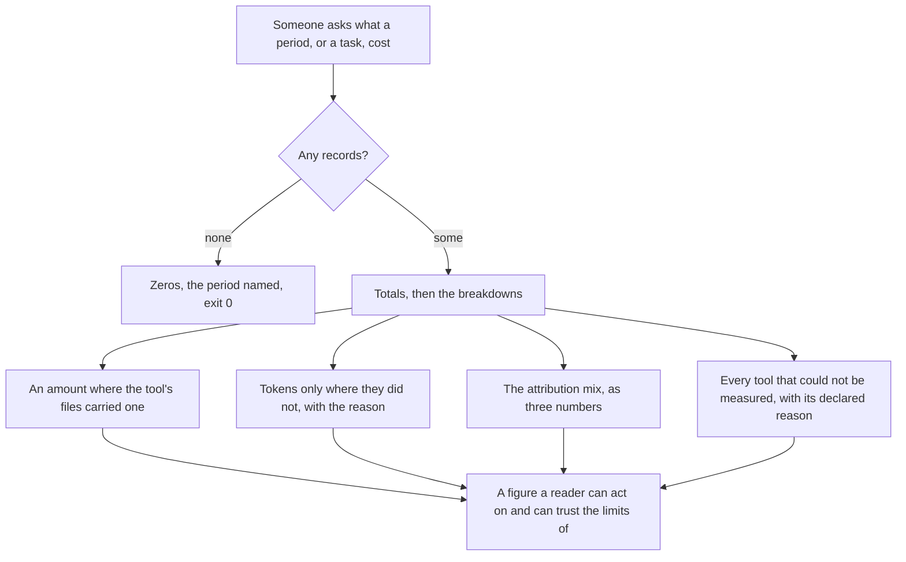
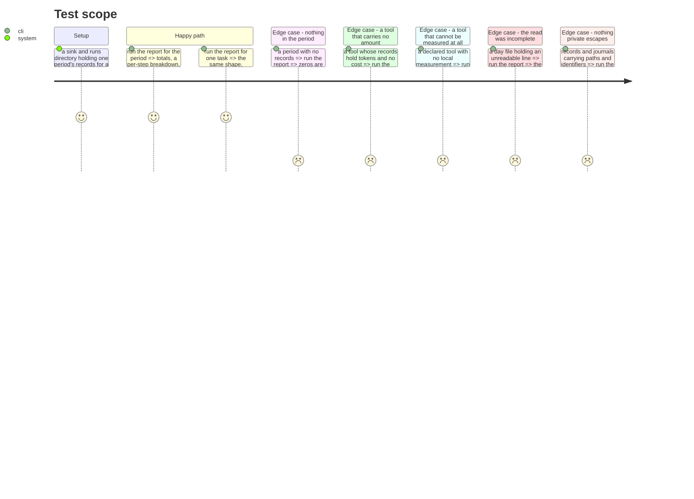

# Instruction: Print it, and print what it cannot say

## Architecture projection

> Tree of the final files. ✅ create · ✏️ modify · ❌ delete

```txt
.
└── cli/
    ├── src/application/commands/telemetry.ts        ✏️ a `report` subcommand beside `read`
    ├── src/application/display/telemetry-display.ts ✏️ how a report is rendered
    └── tests/…                                      ✅ ✏️
```

## User Journey



## Test Scope



## Tasks to do

### `1)` Print totals, then how they break down

> The first line answers the question. Everything after it explains the answer.

1. Sessions, tokens with the cache share, an amount where one exists, and active time labelled as per-session and not attributable to steps.
2. Per step, per model, per tool. Sorted by size, so the largest thing is the first thing read.
3. Numbers align, and the same quantity is the same width everywhere in the output.

### `2)` Print the attribution mix as numbers

> Three percentages say what a caveat sentence gestures at, and unlike the sentence they can be checked.

1. What share of the broken-down total the tool itself stated, what share an interval derived, what share nothing could attribute.
2. Unattributed appears under that name. The output never says work ran outside every step, because nothing measured supports it.
3. The three shares are visible together, not one line buried per breakdown.

### `3)` Never let a limit look like a zero

> Silence read as zero is the failure the epic exists to make impossible, and the output is where it would happen.

1. A tool whose records carry no amount prints its tokens and an explicit unknown for the amount.
2. A declared tool with no local measurement is listed as not covered, with the reason from its own declaration. It is not omitted, and it is not zero.
3. A tool that was covered and simply did nothing in the period is distinguishable from both of the above.
4. A read that skipped lines says so, with the count.

### `4)` Keep the output free of content

> #629 required it, and the reporter reads paths and identifiers that would breach it by accident.

1. No prompt, no code, no diff, no file path in any output line.
2. A task is named by its identity, never by the paths it was derived from.
3. Assert it over a period whose fixtures deliberately carry paths and identifiers.

## Test acceptance criteria

| Task | Acceptance criteria                                                                                       |
| ---- | ------------------------------------------------------------------------------------------------------------ |
| 1    | The totals line answers the question before any breakdown is read                                             |
| 1    | Active time is labelled per-session and appears in no per-step breakdown                                      |
| 1    | Breakdowns are ordered by size                                                                                |
| 2    | The three attribution shares are printed together and sum to the broken-down total                            |
| 2    | The word unattributed is used, and no output line asserts work ran outside every step                         |
| 3    | A tool with no amount prints tokens and an explicit unknown, never 0                                          |
| 3    | A tool that cannot be measured is listed with its declared reason                                             |
| 3    | A covered tool that did nothing is distinguishable from one that could not be read                            |
| 3    | A period whose read skipped lines reports the count                                                           |
| 4    | No prompt, code, diff or path appears in the output, asserted against fixtures that carry them                |
| 4    | An empty period prints zeros, names the period, and exits 0                                                   |
