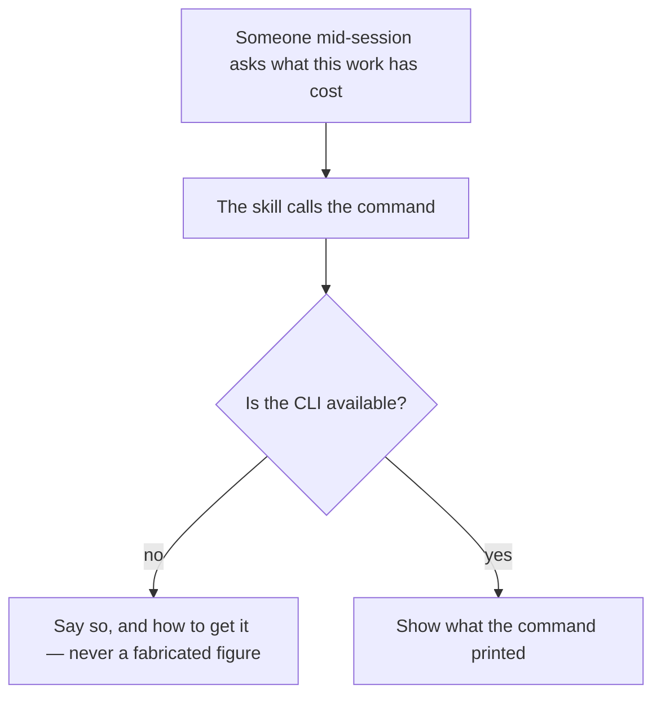
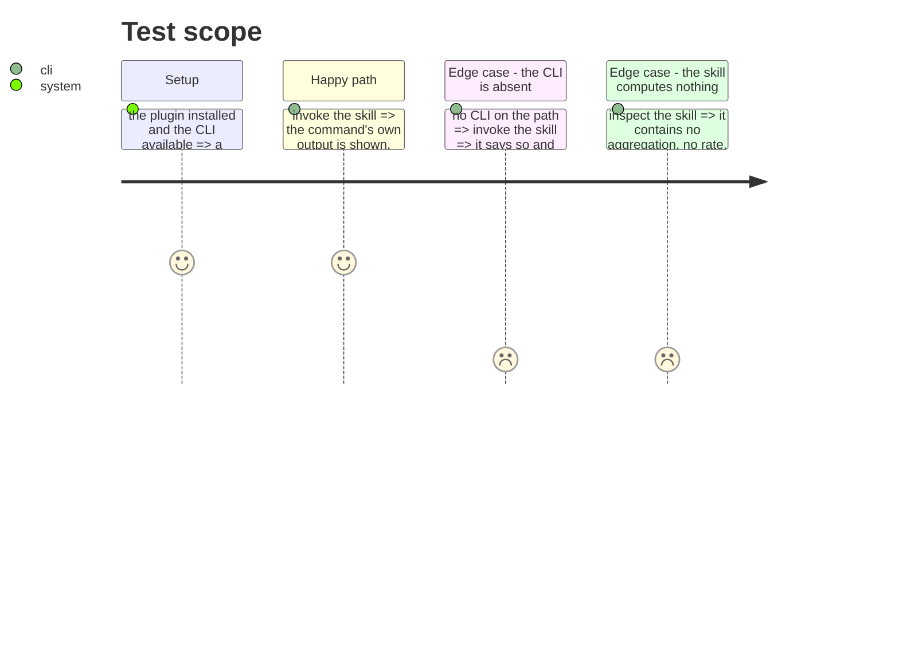

# Instruction: Asked from inside a session

## Architecture projection

> Tree of the final files. ✅ create · ✏️ modify · ❌ delete

```txt
.
├── plugins/aidd-telemetry/skills/…    ✅ the skill that asks the question, and nothing more
└── docs/…                             ✏️ the known limits, named where a user will look
```

## User Journey



## Test Scope



## Tasks to do

### `1)` A skill that asks, and does not compute

> #629 asked for a skill because no command existed when it was written. One exists now, and a skill holding its own arithmetic would be a second way to compute the same number.

1. The skill calls the command and shows what it printed. No aggregation, no rate, no arithmetic of its own.
2. A missing CLI is said plainly. A figure a skill invented is worse than no figure.
3. Assert the skill body carries no arithmetic over records.

### `2)` Write down what this cannot measure

> Two limits were measured and keep being rediscovered. They belong in documentation, not in a backlog that implies they are pending work.

1. Cursor writes no token count in any file, and its export is behind a setting a normal user cannot enable. It is uncovered by both routes, and that is a limit, not a gap.
2. Copilot's local file carries output tokens per turn; input, cache and reasoning arrive once at shutdown for the whole session, so it has no per-step breakdown by the local route.
3. Both are stated where a user looks before asking why a figure is missing, and each names the route it is missing on.

## Test acceptance criteria

| Task | Acceptance criteria                                                                                       |
| ---- | ------------------------------------------------------------------------------------------------------------ |
| 1    | Invoking the skill shows the command's output unchanged                                                       |
| 1    | With no CLI available the skill says so and prints no figure                                                  |
| 1    | The skill contains no aggregation, rate, or arithmetic over records                                           |
| 2    | Cursor's and Copilot's limits are documented, each naming the route it applies to                             |
| 2    | The documentation is reachable from where a user asks why a figure is missing                                 |
