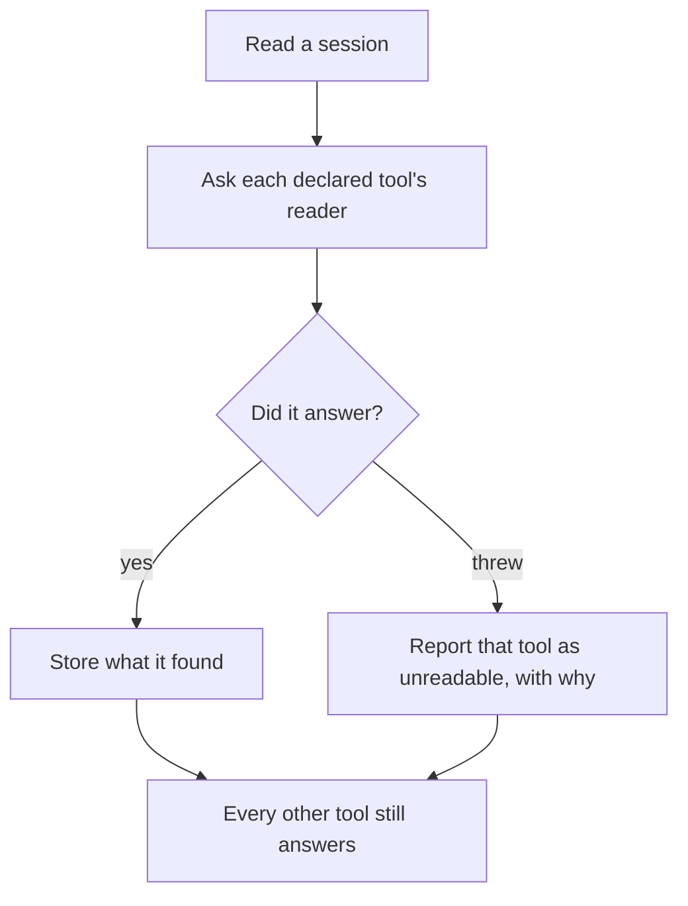
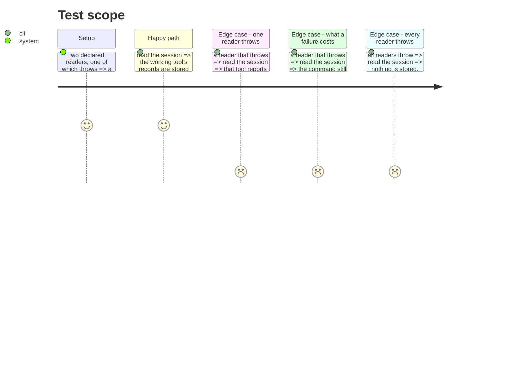

# Instruction: A reader that fails does not fail the read

## Architecture projection

> Tree of the final files. ✅ create · ✏️ modify · ❌ delete

```txt
.
└── cli/
    ├── src/application/use-cases/telemetry/read-local-cost-use-case.ts  ✏️ contains one reader's failure
    ├── src/application/display/telemetry-display.ts                     ✏️ a fourth answer: could not be read
    └── tests/…                                                          ✅ ✏️
```

## User Journey



## Test Scope



## Tasks to do

### `1)` Contain a reader's failure to its own tool

> The use case asks each declared tool's reader in turn. `OpencodeCostReaderAdapter` throws for any failure that is not the exact string "session not found" — a timeout included — and nothing catches it, so one slow tool loses every other tool's figures.

1. A reader that throws costs that tool's figures and no others'. The records the other readers already produced are stored.
2. This is the one place the architecture's "use-cases throw, never catch" rule bends, and the bend must be argued in a comment rather than assumed: a fan-out over independent sources is not one operation that failed, it is several of which one did.
3. The reason travels to the caller. A tool that could not be read is not a tool that read nothing.

### `2)` Make the failure a fourth answer, not a silence

> `found`, `empty`, `not-found` and `not-covered` already say four different things. A reader that threw is a fifth, and printing it as any of the others would be the false zero this layer exists to prevent.

1. A distinct status, with the reason from the exception.
2. The human output prints it as itself, next to the tool's name.
3. Assert that a tool that threw is distinguishable from all four existing answers.

### `3)` Never let a failure turn into a figure

> The danger is not the crash. It is the report that comes back looking complete.

1. Every reader throwing yields nothing stored and no tool claiming to have cost zero.
2. Reading a session again after a reader recovers stores what was missed, since nothing was recorded as read.

## Test acceptance criteria

| Task | Acceptance criteria                                                                                     |
| ---- | ---------------------------------------------------------------------------------------------------------- |
| 1    | One reader throwing leaves every other tool's records stored                                               |
| 1    | The reason the reader gave reaches the caller                                                              |
| 2    | A tool whose reader threw is distinguishable from covered-and-empty, not-found, and not-covered            |
| 2    | The human output names it, with its reason                                                                 |
| 3    | Every reader throwing stores nothing and claims no zero                                                    |
| 3    | A later read, after recovery, stores what the failed one missed                                            |
